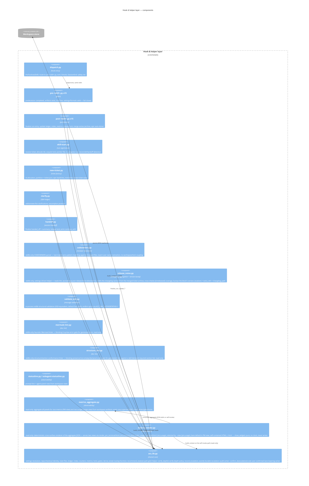

# C4 Level 3 — Components (hook & helper layer)

The container with the most internal structure is the deterministic layer.
(C4 level 4 — code — is deliberately out of scope; `acs_lib.py` and its tests
serve that level.)

## Skill-side anatomy (per hooked skill)

Every coordinator follows the same protocol components (defined once in
`plugins/acs/docs/INTERNALS.md`): Start (skill-start) → Resume/reconcile →
work loop (XML tasks → phase artifacts → validation → persistence) →
User interaction (clarification ledger) → Context pressure (handoff) →
Finish (result document → post-hook → completion report).

The work loop has two shapes. The **twelve triad-keeping skills** (create-prd,
create-architecture, create-project, create-quality, create-operations,
create-principles, create-standards, create-design, create-spec, code,
standardize-project, create-requirements) run the full plan→execute→verify
reflection loop, spawning a separate planner, executor, and verifier subagent
per phase — so **12 active triads (36 agents in triads)**. The **three
apply-work skills** (create-ticket, create-pr, merge-pr) run **inline**
(MAR-60): the coordinator performs the work
directly or delegates to **at most one** executor subagent, and **never
spawns a planner or verifier** in any lane. Their correctness is gated
otherwise — create-ticket by its schema plus the Step-2 user-confirmation
gate, create-pr/merge-pr verifier-gated upstream by `/code`'s verifier
(`code-state.json` `states.verifier_passed == true`). With the 3 reachable
apply-work executors that is **39 reachable agents**; the 6 plan/verify
files of the apply-work skills remain on disk but are orphaned.

`/code`'s loop also adapts to the ticket's lane: the verifier runs in **every**
lane (`verify_depth()` scales only the iteration ceiling, light = 1 / full = 3),
TRIVIAL/SMALL lanes fold spec authoring into the plan phase (MAR-59), and a lane
may escalate upward mid-flight (MAR-57), with every such escalation durably
recorded to an audit trail (`record_escalation_event`, MAR-106). A lane is
never *automatically* downward — the sole exception is a user-confirmed
de-escalation, offered only at an iteration/run boundary, applied by
`confirm_deescalation` (MAR-108, ADR 0042 D3), which is unreachable without a
resolved `clarify.py` confirmation reference.
