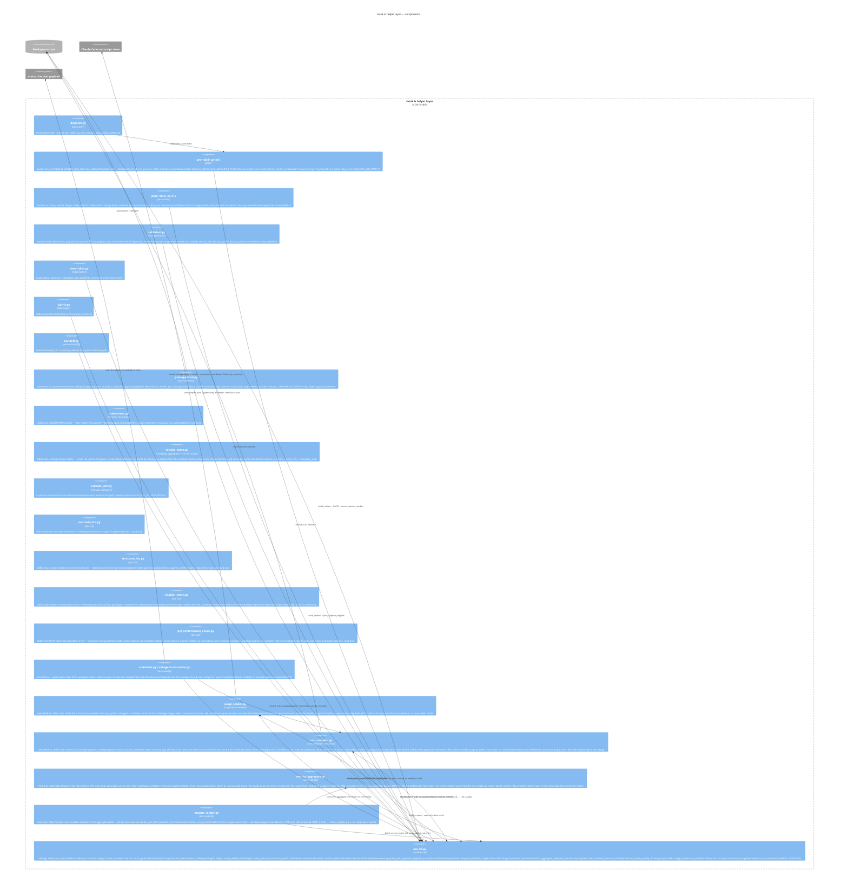

# C4 Level 3 — Components (hook & helper layer)

The container with the most internal structure is the deterministic layer.
(C4 level 4 — code — is deliberately out of scope; `acs_lib.py` and its tests
serve that level.)

```mermaid
C4Component
    title Hook & helper layer — components

    Container_Boundary(hooks, "Hook & helper layer") {
        Component(dispatch, "dispatch.py", "hook entry", "PreToolUse(Skill): route to pre-<skill>.py, exit-2 blocks; SessionEnd: safety net")
        Component(pre, "pre-<skill>.py x15", "gates", "predecessor completed, artifacts exist, lock free, settings/formats valid — fail closed; acs_lib.run_pre also writes a session-correlation marker (session_id/transcript_path off the PreToolUse envelope) via record_session_marker, wrapped in its own fail-open try/except so a marker bug never blocks the gate (MAR-1)")
        Component(post, "post-<skill>.py x15", "persistence", "finalize run entry; update ledger, index, metrics; release lock; merge extras (archive, epic auto-done); finalize_run now measures tokens/cost via usage_reader/cost_sampler instead of trusting a coordinator-supplied estimate (MAR-1)")
        Component(start, "skill-start.py", "run registration", "resolve ticket; allocate ids; acquire lock; pointer file; in_progress run; reconcile/handoff detection; reads the session-correlation marker and threads session_id/transcript_path/checkout_id onto the new run entry (MAR-1)")
        Component(mint, "new-ticket.py", "ticket factory", "id allocation, partition + ticket.json, epic backlinks, mint-time create-ticket state")
        Component(clarify, "clarify.py", "Q&A ledger", "add/answer/list clarifications; assumption protocol")
        Component(handoff, "handoff.py", "session handoff", "finalize handed_off + summary; release lock; print continue_with")
        Component(planapproval, "plan-approval.py", "plan approval", "sole writer of <partition>/phases/code/plan-approval.json; records acs_lib.plan_approval_eligible's deterministic verdict plus the approved plan's sha256 once per digest; mirrors states.plan_approved into code-state.json; STANDARD/COMPLEX only; never a gate this release")
        Component(codeowners, "codeowners.py", "reviewer resolution", "stdlib-only CODEOWNERS parser — last-match-wins pattern matching against changed files, team+user owner extraction, no workspace/lock coupling")
        Component(release_notes, "release_notes.py", "changelog aggregation + version bump", "stdlib-only, settings-driven helper — reads the .acs/settings.json release block (Decision 5), drafts the changelog section from the merged-ticket archive, cross-checks [Unreleased] coverage, bumps the block's version_locations + extra_refs + changelog_path")
        Component(vxml, "validate_xml.py", "message validation", "in-process stdlib structural validation (XSD-equivalent, default fast path); xmllint opt-in via ACS_XML_AUTHORITATIVE=1")
        Component(mermaidlint, "mermaid_lint.py", "doc lint", "stdlib-only heuristic Mermaid linter — blocking 0-syntax-error gate for generated docs; read-only")
        Component(structurelint, "structure_lint.py", "doc lint", "stdlib-only structure/section-conformance linter — blocking presence/non-empty/declared-order gate for generated docs against a skill-declared required-section list; read-only")
        Component(citationcheck, "citation_check.py", "doc lint", "stdlib-only citation-corroboration linter — blocking mechanical-floor gate (path containment, whitespace-normalized quoted-excerpt match) over the Upstream inventory citations of create-quality/-standards/-operations/-principles plan artifacts; read-only")
        Component(prdconformancecheck, "prd_conformance_check.py", "doc lint", "stdlib-only three-family corroboration linter — blocking mechanical-floor gate (code-evidence via imported citation_check helpers, answer-fidelity via clarifications.json reflection anchors, roadmap-outline via verbatim milestone-heading match) over /acs:create-prd's plan artifacts; read-only")
        Component(sline, "statusline.py / subagent-statusline.py", "observability", "prompt line + agent-panel rows from workspace state; statusline.py's main() also samples the real statusLine cost payload via cost_sampler.record_cost_sample on every invocation, before render(), its own fail-open try/except (MAR-1)")
        Component(ureader, "usage_reader.py", "usage measurement", "new (MAR-1), stdlib-only: reads the run's exact recorded transcript_path + subagents/ subtree, counts all four message.usage token classes, buckets per role (coordinator/planner/executor/verifier/other/unattributed) and per model into a parallel model_usage list (MAR-3); never raises, degrades with a reason on any read failure, cap breach, or zero-token result")
        Component(csampler, "cost_sampler.py", "cost sampling + allocation", "new (MAR-1), stdlib-only: record_cost_sample appends a shape-agnostic total_cost_usd sample to a per-checkout log; allocate_cost consumes the unconsumed portion since a persisted allocation cursor and apportions the delta across roles by measured token share — the cursor rule makes double-charging structurally impossible; MAR-3 additionally apportions the same delta across model_usage by token share, with no unattributed exclusion (a deliberate, documented gap from the role-scoped figure, not a bug)")
        Component(metrics, "metrics_aggregate.py", "observability", "read-only: aggregate all panels for /acs:metrics (PM view) and /acs:usage (usage view) from workspace artifacts; emits one superset JSON, never writes/gates/locks; panel 6 (_accumulate_burn) now reads each run entry's measured role_usage field instead of scraping <metrics> XML, including a first-class coordinator bucket (MAR-1); MAR-3 additionally folds each run entry's model_usage into the new usage_by_model panel, at both repo and per-ticket scope, in the same walk (zero extra file reads)")
        Component(mrender, "metrics_render.py", "observability", "read-only: deterministic cross-surface renderer of the aggregate JSON — serves two views via render_pm_terminal/html (/acs:metrics) and render_usage_terminal/html (/acs:usage), selected by --view {pm,usage}; bare default is PM view; self-contained HTML (--html → show_widget); pure, no clock, never writes")
        Component(lib, "acs_lib.py", "shared core", "settings resolution, repo/checkout identity, state files, ledger, index, counters, metrics, locks, gates; derive_lane() routing function; recommend_stakes() path-glob helper; verify_depth() verify-depth policy; record_escalation_event() durable escalation-audit writer; confirm_deescalation() sole user-confirmed lane-lowering writer; plan_approval_eligible() pure plan-conformance predicate; elapsed_seconds() single None-safe time primitive (run_seconds/metrics_aggregate._elapsed_seconds are adapters over it); record_session_marker()/session_marker_path(); finalize_run() invokes usage_reader/cost_sampler instead of trusting a coordinator-supplied tokens/cost_usd estimate (MAR-1, ADR 0082)")
    }
    ContainerDb_Ext(ws, "Workspace store")
    System_Ext(transcript, "Claude Code transcript store")
    System_Ext(statusline_src, "statusLine cost payload")

    Rel(dispatch, pre, "subprocess, same stdin")
    Rel(pre, lib, "build_context + GATES + record_session_marker")
    Rel(post, lib, "finalize_run, update_*")
    Rel(start, lib, "")
    Rel(mint, lib, "")
    Rel(clarify, lib, "")
    Rel(handoff, lib, "")
    Rel(planapproval, lib, "build_context + plan_approval_eligible")
    Rel(planapproval, ws, "atomic JSON read/write")
    Rel(sline, lib, "")
    Rel(sline, csampler, "record_cost_sample(payload) + read_latest_sample, fail-open")
    Rel(sline, statusline_src, "reads the piped cost payload on stdin")
    Rel(lib, ureader, "finalize_run -> read_transcript_usage(transcript_path, started_at, ended_at, skill)")
    Rel(lib, csampler, "finalize_run -> allocate_cost(workspace, repo_id, checkout_id, ..., role_usage)")
    Rel(ureader, transcript, "reads message.usage + model + timestamp + attribution fields only, read-only")
    Rel(ureader, lib, "acs_lib.parse_iso, ATTRIBUTION_SKILL_MAP")
    Rel(csampler, lib, "acs_lib.sessions_dir, read_json/write_json, build_context")
    Rel(csampler, ws, "cost-samples.jsonl (append-only, rotated) + cost-cursor.json")
    Rel(metrics, lib, "build_context + read-only state reads")
    Rel(mrender, metrics, "consumes aggregate JSON (stdin or self-invoke)")
    Rel(mrender, lib, "build_context on the self-invoke path (read-only)")
    Rel(lib, ws, "atomic JSON read/write")
```

## Skill-side anatomy (per hooked skill)

Every coordinator follows the same protocol components (defined once in
`plugins/acs/docs/INTERNALS.md`): Start (skill-start) → Resume/reconcile →
work loop (XML tasks → phase artifacts → validation → persistence) →
User interaction (clarification ledger) → Context pressure (handoff) →
Finish (result document → post-hook → completion report).

The work loop has two shapes. The **twelve triad-keeping skills** (create-prd,
create-architecture, create-project, create-quality, create-operations,
create-principles, create-standards, create-design, code, docs-sync,
standardize-project, create-requirements) run the full plan→execute→verify
reflection loop, spawning a separate planner, executor, and verifier subagent
per phase — so **12 active triads (36 agents in triads)**. Within that
twelve, `/acs:code`, `/acs:docs-sync`, `/acs:create-project`, and
`/acs:standardize-project` (MAR-71/300/301/302) spawn the planner once per
run instead of per iteration — timing only; counts above hold.
The **three apply-work skills** (create-ticket, create-pr, merge-pr) run **inline**
(MAR-60): the coordinator performs the work
directly or delegates to **at most one** executor subagent, and **never
spawns a planner or verifier** in any lane. Their correctness is gated
otherwise — create-ticket by its schema plus the Step-2 user-confirmation
gate, create-pr/merge-pr verifier-gated upstream by `/code`'s verifier
(`code-state.json` `states.verifier_passed == true`). With the 3 reachable
apply-work executors that is **39 reachable agents**; the 6 plan/verify
files of the apply-work skills remain on disk but are orphaned. Within the
12 triads, `/code`'s planner leg is lane-conditional since MAR-72: the
planner subagent is spawned on STANDARD/COMPLEX; on TRIVIAL/SMALL the
coordinator authors the plan artifact itself, with zero planner spawns (ADR
0074). The execute and verify legs stay unconditional in every lane — for
`/code`, and for every other skill among the twelve triad-keeping ones — so
the counts above are unaffected.

`/code`'s loop also adapts to the ticket's lane: the verifier runs in **every**
lane (`verify_depth()` scales only the iteration ceiling, light = 1 / full = 3;
`/code`'s loop body is execute → verify with the plan authored once before the
loop — MAR-71, slice 1b of MAR-69 — so this ceiling counts execute+verify
rounds, and exactly one `code-planner` is spawned per run **on STANDARD/COMPLEX
only — on TRIVIAL/SMALL the coordinator authors `plan.md` itself and no
`code-planner` is spawned** (MAR-72, ADR 0074)), spec authoring
folds into the plan phase on every lane whenever
`<partition>/specs/` is absent or empty (MAR-59, universalized by ADR 0066), and a lane
may escalate upward mid-flight (MAR-57), with every such escalation durably
recorded to an audit trail (`record_escalation_event`, MAR-106). A lane is
never *automatically* downward — the sole exception is a user-confirmed
de-escalation, offered only at an iteration/run boundary, applied by
`confirm_deescalation` (MAR-108, ADR 0042 D3), which is unreachable without a
resolved `clarify.py` confirmation reference. After the plan is authored, on
STANDARD/COMPLEX a deterministic plan-approval record is written
(`plan-approval.py`, `states.plan_approved`) and gates nothing this release
(MAR-73, slice 3 of MAR-69). The record is now **read** by `code-verifier`
itself as dimension 15's activation condition (`eligible`, `plan_path ==
phases/code/plan.md`, `plan_sha256` matching the current `plan.md` bytes) —
never a coordinator-relayed value; `plan-approval.py` stays its sole writer;
it **still gates nothing** (dimension 15 is a verifier dimension, not a
`/create-pr` gate change), and the revocation path re-runs the script for a
fresh record (MAR-74, slice 4 of MAR-69, ADR 0073).
