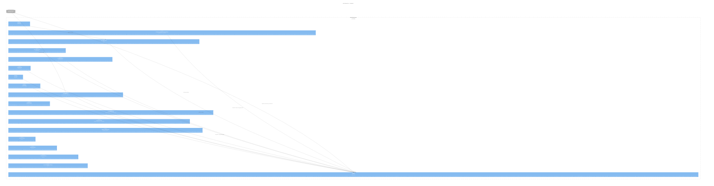

# C4 Level 3 — Components (hook & helper layer)

The container with the most internal structure is the deterministic layer.
(C4 level 4 — code — is deliberately out of scope; the `acs_lib/` package and
its tests serve that level.)

```mermaid
C4Component
    title Hook & helper layer — components

    Container_Boundary(hooks, "Hook & helper layer") {
        Component(dispatch, "dispatch.py", "hook entry", "PreToolUse(Skill): route to pre-<skill>.py, exit-2 blocks; SessionEnd: safety net")
        Component(cli, "acs.py / acs_cli.py / acs_commands.py", "deterministic CLI front door", "ADR 0001's single entry point for the verbs a SKILL.md names, so no coordinator improvises heredoc Python: context, gate, run (new|show|next|check|abandon), step (start|finish|show), result validate, ticket, pr, tracker, readiness, lock, filemap, guard, verdict, notes (merge), slug, doctor, workflow (show|validate), design (check|init|bump|status — a design document's version front matter, ADR-0122), job (start|wait|status|stop — a deterministic command run detached beside a skill's foreground subagents, ADR-0125) and artifacts are implemented in-process, while plan (check|path) and setup detect/apply forward argv to the scripts that already implement them and return their exit code unchanged; stdout is exactly one pretty-printed JSON object, a usage or precondition failure exits 2, and exit 0 means the command ran, not that the answer was yes; guard events is MAR-578's read side over invocations[-1].guard_events, emitting ok/run_id/skill/count/events/path; run next emits next plus due and parallel for a parallel group, and notes merge joins a fan-out's slice files by H2 heading into one document (ADR-0110)")
        Component(pre, "pre-<skill>.py x17", "gates", "lock free, settings/formats valid, safety brakes (never whether an upstream artifact exists: a skill falls back to the run's subject); a step owing nothing per the plan's ## Contract block is completed here as an evidenced no-op; no gate refuses a skill for a predecessor's POSITION in the workflow, though /acs:merge-pr's subject brake does read whether the step that recorded the PR reference completed — an artifact, not a position (gates.SUBJECT_GATES); fail closed; acs_lib.run_pre_payload also records the gate evidence (sessions/<checkout>-gate.json: skill and time, no session or transcript field) via record_gate_evidence, wrapped in its own fail-open try/except so a write failure never blocks the gate")
        Component(post, "post-<skill>.py x17", "persistence", "finalize the step invocation; update ledger and index; release lock; merge extras (archive, epic auto-done); no usage is recorded -- a tokens or cost figure in the result document is legacy and ignored (ADR 0104)")
        Component(start, "acs.py step start", "step registration", "resolve the run (ticket id, prompt or document); allocate ids; acquire the lock; write sessions/<checkout>/pointer.json; record the step in_progress, refused while a step of another stage is in_progress (I1: only a parallel group's members may be open together); reconcile/handoff detection; spends the gate evidence once and records the verdict as the invocation's gate_enforcement")
        Component(mint, "new-ticket.py", "ticket factory", "id allocation, partition + ticket.json, epic backlinks, mint-time create-ticket state")
        Component(clarify, "clarify.py", "Q&A ledger", "add/answer/list clarifications; assumption protocol")
        Component(handoff, "handoff.py", "session handoff", "finalize the in-flight step interrupted + stop_reason: context_pressure + summary; release lock; print continue_with")
        Component(planapproval, "plan-approval.py", "plan approval + contract read", "sole writer of steps/create-impl-plan/plan-approval.json; records acs_lib.plan_approval_eligible's deterministic verdict plus the approved plan's sha256 (over the WHOLE file, prose and ## Contract alike) once per digest; mirrors states.plan_approved into the plan step's state; standard/complex only. Its `path` verb is the read side: prints the plan's delivery_path, owes flags and contract_errors, writing nothing (ADR-0098)")
        Component(codeowners, "codeowners.py", "reviewer resolution", "stdlib-only CODEOWNERS parser — last-match-wins pattern matching against changed files, team+user owner extraction, no workspace/lock coupling")
        Component(prconventions, "pr-conventions.py", "pre-open PR-body convention self-check", "stdlib-only, runtime-agnostic helper for /acs:create-pr and the three product-level skills: check self-checks a filled PR body BEFORE a PR is opened against exactly what CI checks -- that it names its ticket (ADR-0106) -- by driving templates/ci/check-conventions.py's evaluate() as the single source of truth, never re-implementing the rule, with two producer-only hygiene scans (unrendered placeholder tokens, leftover template comments) run on top of evaluate(), never instead of it; its title, label, format and section flags are accepted and ignored. Derives no branch name or commit history itself -- its own tests assert the executable source contains no subprocess, which is why the stacked-base pre-flight below lives in a separate module rather than here")
        Component(release_notes, "release_notes.py", "changelog aggregation + version bump", "stdlib-only, settings-driven helper — reads the .acs/settings.json release block (Decision 5), drafts the changelog section from the merged-ticket archive plus a base_branch git-history fallback for tickets no /acs:merge-pr archive entry recorded (each enumerated ticket stamped source: archive|git-log), optionally anchored by --ticket-prefix, cross-checks [Unreleased] coverage, bumps the block's version_locations + extra_refs + changelog_path; has its own gh seam -- gh_pr_list reads open release PRs, per its own docstring (MAR-403 D-3) -- currently unclassified: any non-zero exit returns None indistinguishable from 'no open PR' (follow-up R11, not fixed by MAR-403)")
        Component(migrateworkspace, "migrate_workspace.py", "workspace migrator", "standalone, one-shot CLI copying an external workspace partition into the in-repo state root — preflight aborts (exit 2) on any live lock or in_progress last status found anywhere under the source, reading both the old flat <skill>-state.json and the new steps/<skill>/state.json layouts; classifies each top-level entry as a run directory (copied once, an already-present destination partition left as-is for idempotent resume), the archive/ tree (same rule per archived ticket), or a repo-level file (copied if absent, skipped if byte-identical, abort on any other conflict); verifies every source file exists at the destination before removing the source tree; --dry-run prints the planned actions without writing or removing anything")
        Component(mermaidlint, "mermaid_lint.py", "doc lint", "stdlib-only heuristic Mermaid linter — blocking 0-syntax-error gate for generated docs; read-only")
        Component(structurelint, "structure_lint.py", "doc lint", "stdlib-only structure/section-conformance linter — blocking presence/non-empty/declared-order gate for generated docs against a skill-declared required-section list; read-only")
        Component(citationcheck, "citation_check.py", "doc lint", "stdlib-only citation-corroboration linter — blocking mechanical-floor gate (path containment, whitespace-normalized quoted-excerpt match) over the Upstream inventory citations of create-quality/-standards/-operations/-principles plan artifacts; read-only")
        Component(prdconformancecheck, "prd_conformance_check.py", "doc lint", "stdlib-only three-family corroboration linter — blocking mechanical-floor gate (code-evidence via imported citation_check helpers, answer-fidelity via clarifications.json reflection anchors, roadmap-outline via verbatim milestone-heading match) over /acs:create-prd's plan artifacts; read-only")
        Component(lib, "acs_lib/", "shared core", "settings resolution, repo/checkout identity, state files, ledger, index, counters, locks, gates; default_state_root() derives the in-repo, main-checkout-anchored .acs/state-machine root from git plumbing, with no override (ADR-0102); plan_contract.read()/delivery_path()/owes() — the read side of the judged delivery path and the always-run steps' owes flags, both taken from the PLAN's ## Contract block, which is their only home; there is no writer here at all, because /acs:create-impl-plan judges the path once and writes it into the plan (ADR-0098, superseding record_delivery_path()/recorded_delivery_path() and, before them, derive_lane()/recommend_stakes()/verify_depth() and the escalation writers); record_guard_event() the file-map guard's fail-soft audit writer, appending one denial to invocations[-1].guard_events and returning False instead of raising when the invocation is absent, because its sole caller is a deny path whose verdict must not depend on the recording (MAR-578); plan_approval_eligible() pure plan-conformance predicate; allocate_ticket_id()'s fail-closed reconciliation gate — inside its existing O_EXCL critical section, the first allocation from a fresh/unreconciled (repo_id, prefix) partition refuses with exit 2 (ReconciliationRequired, a GateError subclass) unless a confirmable local-evidence proposal is confirmed via --seed-next; an already-populated counters.json is treated as already reconciled, no prompt (MAR-402); scan_local_ticket_evidence() — the ranked, bounded, network-free local-evidence scan helper backing that gate (committed-files grep, then git subjects+bodies, then branch names, each shelled out via the existing _git seam; MAR-402); an O_EXCL-guarded critical section around update_index() that serializes two concurrent writers' updates on the normal path (fail-closed since MAR-530: a bounded-spin timeout raises GuardTimeout and REFUSES the write rather than performing it unguarded; a guard left by a crashed writer is reclaimed only once it outlives twice the configured budget and its recorded holder is not a live local process) (MAR-1); GH_ACCESS_DENIED_MARKER/GH_ACCESS_HINT/GH_GENERIC_HINT constants + the pure gh_failure_hint(stderr_text) predicate -- the canonical gh-failure diagnostic (verbatim stderr substring match, wording-only, no I/O, no network, no subprocess), quoted verbatim by the three apply-work skills and their inline references as the single source of truth for the critical-failure hint sentence (MAR-403, ADR-0088; no new component -- Option F, not Option E)")
    }
    ContainerDb_Ext(ws, "Workspace store")

    Rel(dispatch, pre, "subprocess, same stdin")
    Rel(cli, lib, "imports acs_lib as lib for every in-process verb")
    Rel(pre, lib, "build_context + GATES + record_gate_evidence")
    Rel(post, lib, "finalize_run, update_*")
    Rel(start, lib, "")
    Rel(mint, lib, "")
    Rel(clarify, lib, "")
    Rel(handoff, lib, "")
    Rel(planapproval, lib, "build_context + plan_approval_eligible")
    Rel(planapproval, ws, "atomic JSON read/write")
    Rel(lib, ws, "atomic JSON read/write")
```

## Skill-side anatomy (per hooked skill)

Every coordinator follows the same protocol components (defined once in
`plugins/acs/docs/INTERNALS.md`): Start (skill-start) → Resume/reconcile →
work loop (XML tasks → phase artifacts → validation → persistence) →
User interaction (clarification ledger) → Context pressure (handoff) →
Finish (result document → post-hook → completion report).

The work loop follows each skill's own logic, and a skill spawns only the
subagents that logic needs, each named for its work (ADR 0109). Every role
has a kind — `survey`, `write` or `judge` (`acs_lib.skills.ROLE_KINDS`) — and
the kind picks its model tier and whether the file-map guard is armed. The
**nine authoring skills** run a write → judge reflection
loop over their own roles: `analyze-requirements` (analyst, impact-analyst, impact-reviewer), `create-prd`
(surveyor, author, reviewer), `create-architecture`
(architect, gap-analyst, reviewer), `create-design` (designer, design-reviewer),
`create-impl-plan` (planner,
plan-reviewer), `create-api-contract` (contract-author, contract-reviewer),
`create-test-docs` (test-designer, trace-reviewer), `create-e2e-tests`
(test-writer, suite-runner) and `docs-sync` (doc-updater, drift-reviewer)
— **21 agents**. No skill has a plan
phase before its writer (ADR 0092): a surveyor runs on iteration 1
only and freezes its notes, and where there is none the writer surveys first
and records `iter-<n>/authoring.md`; the judge judges the deliverable against
those notes. `code` spawns `code-implementer`s (1 agent) and is judged by
`/acs:review-code`'s lenses and adjudicators (2 agents). The **three
apply-work skills** (create-ticket, create-pr, merge-pr) run **inline**: the
coordinator does the work directly from its `references/` and spawns no
subagent in any lane; correctness is gated instead (create-ticket by schema +
Step-2 confirmation; create-pr/merge-pr by `/acs:review-code`). The
read-only `/acs:audit-design` runs no loop either: it spawns
`audit-design-gap-analyst`s (1 agent, survey kind) and reports, the same gap
analysis `create-architecture`'s gap analyst runs beside its survey (ADR-0122).
The read-only `/acs:audit-security` runs no loop: its auditors (survey kind, one
per category) raise candidate findings and one adjudicator (judge kind) per
candidate tries to refute it, with no writer between them — 2 agents
(ADR-0123). That gives
**27 agent files, all reachable**: every file name resolves to a shipped
skill and a known role, so no agent file is orphaned. `/create-impl-plan`'s
planner is spawned on every run: MAR-72/ADR 0074's coordinator-authored fast
path went with the lanes (ADR 0095).

Both umbrellas of the design-phase fold (ADR 0091) are gone.
`/acs:create-docs`, which ADR 0094 made a hooked product skill over the four
product doc sets, was removed by ADR 0124: those sets are written by hand,
and the skills that read them find them where they are. `/acs:project` was
removed with both of its legs by ADR 0118: a greenfield scaffold is ordinary
ticket work. The only legs left are
`/acs:code`'s, in `acs_lib.skills.SKILL_LEGS` (ADR 0109).

`/code` adapts to the recorded DELIVERY PATH, and it does so by DISPATCH
rather than by branching inside one body: `skills/code/SKILL.md` reads the
path with `acs.py plan path` — from the PLAN's `## Contract` block, its only
home (ADR-0098) — and calls the matching leg: `code-trivial`, `code-small`,
`code-standard` or `code-complex`. Each states its own implementer shape and
shares the protocol and execute references under `skills/code/references/`.
The two axes the legs used to differ by are gone, and both left for the same
reason — they were review properties, not implementation properties: the
review's shape is `/acs:review-code`'s business on every run, and the
iteration ceiling is the workflow's `loops[].max_iterations` (ADR-0099). The
legs own no agents and no hook scripts: each runs
`acs.py step start --step code`, so the run directory, the step state, the
ledger key and the post-hook are `code`'s throughout, and each spawns
`code-implementer`. `code` owns no judge.

The REVIEW runs on **every** path, as `/acs:review-code`: five read-only
lenses in parallel, one fresh-context adjudicator per candidate finding, and
a final gate running build, lint, the full unit suite and coverage — the only
place the suite runs. The ceiling counts `code` → `review-code` rounds, with
the plan authored once before the loop (MAR-71, slice 1b of MAR-69).
Exactly one plan-authoring `create-impl-plan-planner` is spawned per
`/create-impl-plan` run, on every run — MAR-72/ADR-0074's coordinator-authored
fast path went with the lanes, because that skill runs before any path exists.
Spec authoring folds into `/create-impl-plan`'s plan whenever
`<partition>/specs/` is absent or empty (MAR-59, universalized by ADR 0066).

A path never moves mid-run. MAR-57's upward escalation, MAR-106's
`record_escalation_event` audit trail and MAR-108/ADR 0042 D3's
`confirm_deescalation` all existed to make a mid-run rigor change safe, and
all three are retired with the axes they moved: the judgement is made once,
by `/acs:create-impl-plan`, and written into the plan — there is no second
writer to move it, and re-judging means editing the plan, which invalidates
its approval and shows up in the diff. After the plan is authored, on the `standard` and `complex` paths a
deterministic plan-approval record is written
(`plan-approval.py`, `states.plan_approved`) and gates nothing this release
(MAR-73, slice 3 of MAR-69). The record is now **read** by
`/acs:review-code`'s plan-conformance lens as its activation condition
(`eligible`, `plan_path == steps/create-impl-plan/plan.md`, `plan_sha256`
matching the current `plan.md` bytes) — never a coordinator-relayed value;
`plan-approval.py` stays its sole writer; it **still gates nothing** (it is a
review dimension, not a `/create-pr` gate change), and the revocation path
re-runs the script for a fresh record (MAR-74, slice 4 of MAR-69, ADR 0073).
