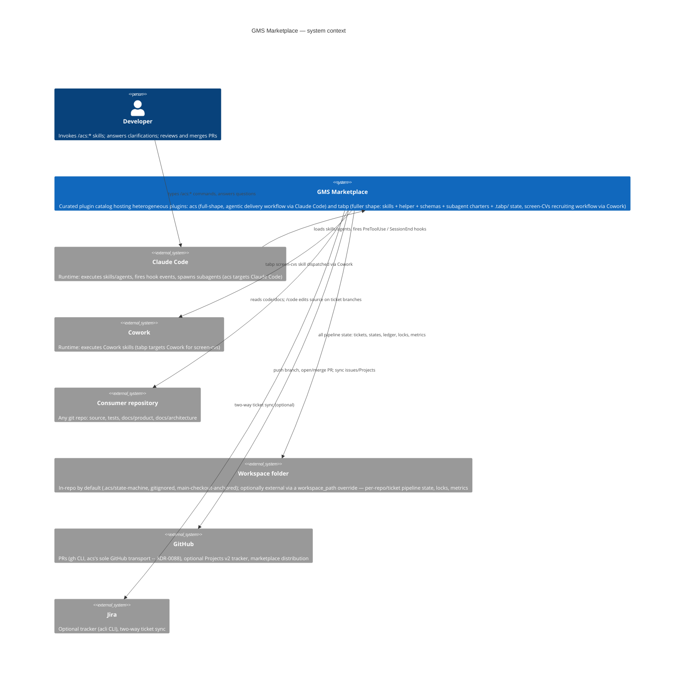

# C4 Level 1 — System Context

Trust boundaries: the marketplace plugins never store credentials — `gh` and
`acli` own authentication. No second GitHub transport is sanctioned
(ADR-0088): `gh` remains the only GitHub credential holder in every
environment. The workspace defaults to an in-repo, gitignored
folder anchored to the repo's main checkout, so every linked worktree
resolves to the same physical state (ADR-0086) — worktree-sharing survives
via that anchoring, not via a fully separate machine-local folder;
cross-machine handoff is still out of scope (see PRD).
