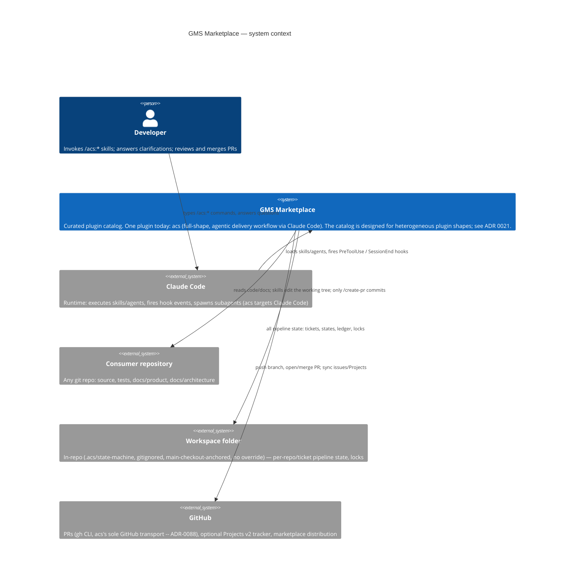

# C4 Level 1 — System Context

```mermaid
C4Context
    title GMS Marketplace — system context

    Person(dev, "Developer", "Invokes /acs:* skills; answers clarifications; reviews and merges PRs")

    System(mkt, "GMS Marketplace", "Curated plugin catalog. One plugin today: acs (full-shape, agentic delivery workflow via Claude Code). The catalog is designed for heterogeneous plugin shapes; see ADR 0021.")

    System_Ext(cc, "Claude Code", "Runtime: executes skills/agents, fires hook events, spawns subagents (acs targets Claude Code)")
    System_Ext(repo, "Consumer repository", "Any git repo: source, tests, docs/product, docs/architecture")
    System_Ext(ws, "Workspace folder", "In-repo (.acs/state-machine, gitignored, main-checkout-anchored, no override) — per-repo/ticket pipeline state, locks")
    System_Ext(gh, "GitHub", "PRs (gh CLI, acs's sole GitHub transport -- ADR-0088), optional Projects v2 tracker, marketplace distribution")

    Rel(dev, cc, "types /acs:* commands, answers questions")
    Rel(cc, mkt, "loads skills/agents, fires PreToolUse / SessionEnd hooks")
    Rel(mkt, repo, "reads code/docs; skills edit the working tree; only /create-pr commits")
    Rel(mkt, ws, "all pipeline state: tickets, states, ledger, locks")
    Rel(mkt, gh, "push branch, open/merge PR; sync issues/Projects")
```

Trust boundaries: the marketplace plugins never store credentials — `gh` owns
authentication. No second GitHub transport is sanctioned
(ADR-0088): `gh` remains the only GitHub credential holder in every
environment. The workspace defaults to an in-repo, gitignored
folder anchored to the repo's main checkout, so every linked worktree
resolves to the same physical state (ADR-0086) — worktree-sharing survives
via that anchoring, not via a fully separate machine-local folder;
the workspace itself never crosses machines; one ticket's work and state do,
as a handoff package pushed to the hidden ref `refs/acs/handoff/<ID>` and
applied by the receiver (ADR-0131).
