# HLD — Data model (workspace state)

All entities are JSON files under `<workspace>/<repo-id>/`; schemas ship with
the plugin (`plugins/acs/schemas/`). Pretty-printed, atomically written,
human-auditable.

```mermaid
erDiagram
    REPO_PARTITION ||--o{ TICKET : contains
    REPO_PARTITION ||--|| TICKETS_INDEX : "indexes all tickets"
    REPO_PARTITION ||--|| COUNTERS : "id sequence"
    REPO_PARTITION ||--o{ SESSION_POINTER : "one per checkout/worktree"
    TICKET ||--o{ SKILL_STATE : "one per skill that ran"
    TICKET ||--|| PIPELINE_STATE : "step ledger"
    TICKET ||--o| CLARIFICATIONS : "Q&A ledger"
    TICKET ||--o| LOCK : "held while worked"
    TICKET ||--o{ PHASE_ARTIFACT : "execute/verify per iteration, each with its authoring notes; no plan artifact (ADR-0092)"
    TICKET ||--o{ TICKET : "epic -> children (both directions)"
    SKILL_STATE ||--|{ RUN_ENTRY : "append-only"
    TICKET ||--o| PLAN_APPROVAL : "at most one per approved plan digest, /acs:code STANDARD/COMPLEX only, written solely by plan-approval.py"
    TICKET ||--o| PLAN : "exactly one phases/code/plan.md, authored once per run before the loop"
    PLAN ||--o{ PLAN_SUPERSEDED : "one plan-superseded-<k>.md per revocation; byte-identical copy, never deleted"

    COUNTERS {
        integer next "next ticket number to mint, required, minimum 1"
        boolean reconciled "MAR-402, true once this partition's floor is confirmed"
        string seed_source "MAR-402, committed-files|git-history|branch-names|explicit-user"
        string seeded_at "MAR-402, ISO-8601 UTC timestamp of the seeding write"
    }
    TICKET {
        string id PK "SHOP-123"
        string title
        enum type "epic|story|task"
        string description
        array acceptance_criteria
        enum priority "critical|high|medium|low"
        string parent FK "epic id or null"
        array children
        enum status "open|in_progress|in_review|done"
        json external "tracker mapping or null"
        string assignee
        number story_points
        bool needs_design "true for epics only; always false for story/task (MAR-76)"
        bool docs_only
        string due_date "ISO-8601 date or null (NEW, MAR-8 Child 3)"
    }
    SKILL_STATE {
        string skill PK
        string ticket_id FK
        json states "canonical keys per skill; code's states.plan_approved is the first key written by a script (plan-approval.py) rather than the skill's own post-hook or coordinator — MAR-73, slice 3 of MAR-69; see INTERNALS.md's canonical-keys table"
        array findings
        array errors
    }
    PLAN_APPROVAL {
        string ticket_id FK
        string skill "code"
        enum lane "STANDARD|COMPLEX (recomputed, never cached ticket.lane)"
        datetime approved_at
        bool eligible
        string plan_path "relative to the ticket partition"
        string plan_sha256 "digest of the approved plan.md bytes"
        json predicate "function, inputs, checks, failures — acs_lib.plan_approval_eligible's verdict"
        string writer "plan-approval.py (sole writer, never a subagent or the coordinator)"
    }
    RUN_ENTRY {
        datetime started_at
        datetime ended_at
        array guard_events "file-map guard denials appended by acs_lib/filemap.py on a deny only -- reasons outside_map/control_input/unreadable_payload, optional and forward-only (MAR-578)"
        enum status "in_progress|completed|failed|interrupted"
        enum stop_reason "session_end|needs_input|context_pressure -- an INTERRUPTED step only; a completed or failed step's narrative goes in summary (ADR-0097)"
        string summary "the step's own narrative, on any terminal status"
        string handoff_summary "when interrupted"
    }
    PIPELINE_STATE {
        string ticket_id PK
        enum flow "ticket|product"
        json steps "per-skill status/timestamps/summary, plus any caller-merged fields (e.g. /acs:ship's `fix_loops`) written through `update_pipeline`'s `extra` channel"
        string lane "TRIVIAL|SMALL|STANDARD|COMPLEX (mirror of ticket.lane; written by update_pipeline; not declared in schema, allowed via additionalProperties)"
    }
    CLARIFICATIONS {
        string ticket_id PK
        array clarifications "C-n: question, answer, source, status, rationale"
    }
    LOCK {
        string checkout_id
        int pid
        string hostname
        datetime created_at
    }
    SESSION_POINTER {
        string checkout_id PK
        string ticket_id
        string skill
    }
    PLAN {
        string path "phases/code/plan.md — the only name, every lane"
        string author "create-impl-plan-executor on STANDARD/COMPLEX; coordinator on TRIVIAL/SMALL (MAR-72, ADR-0092)"
        string sha256 "digest the PLAN_APPROVAL record pins"
    }
    PLAN_SUPERSEDED {
        int k "smallest positive integer with no existing file"
        string path "phases/code/plan-superseded-<k>.md"
        string writer "coordinator, at an iteration/run boundary, on a clarify.py-recorded user answer"
        string semantics "byte-identical cp of the revoked plan.md — never a rename/move; existing iter-<n>-verify.md plan.md:<line> citations resolve unchanged"
        bool approval_input "false — never an approval input, never a conformance contract (dimension 15's plan_path condition)"
    }
```

**COUNTERS note (MAR-402).** The first allocation for a `(repo_id, prefix)`
partition is fail-closed: absent both `next` and `reconciled: true`,
`allocate_ticket_id` refuses (exit 2) with a ranked local-evidence proposal
instead of minting an id, and only a confirmed `--seed-next <n>` (or an
already-populated `next`, treated as already reconciled) writes `next`,
`reconciled`, `seed_source`, and `seeded_at`. The evidence scan's
`observed_max` is surfaced only in the refusal message, for a human to read —
it is never persisted to `counters.json`.

**PHASE_ARTIFACT note (MAR-70, amended by MAR-71 slice 1b; label narrowed by
MAR-74 slice 4, by MAR-300, by MAR-301, by MAR-302, by MAR-305, and by the
create-architecture/create-design/create-requirements plan-once migration
below).** The `"execute/verify per iteration; plan authored exactly once
per run, before the loop, for every triad skill"` cardinality above already
carves out `/acs:code`'s plan leg. `/acs:code`'s plan artifact is
a single per-ticket `phases/code/plan.md`, written **exactly once per run**,
before the loop, so `/acs:code` has one plan artifact per ticket regardless of
iteration count (never rewritten in place on a later iteration — MAR-71,
slice 1b of MAR-69; this covers the `plan` leg of the ER label above for
`/acs:code`); `phases/code/plan-superseded-<k>.md` is a real, written-and-read
artifact of the plan-revocation path (MAR-74, slice 4 of MAR-69 — see the
Amendment below).
Modelling this precisely — a `PLAN` / `PLAN_APPROVAL` / `PLAN_SUPERSEDED`
entity block and a narrowed `PHASE_ARTIFACT` relationship label — is owned by
MAR-69 slices 3/4; this note records the gap without pre-empting that edit.

**Amendment (MAR-73, slice 3 of MAR-69).** The `PLAN_APPROVAL` half of the
gap above is now modelled: the `PLAN_APPROVAL` entity block and its
`TICKET ||--o| PLAN_APPROVAL` relationship above are the real artifact
behind it, written solely by `plan-approval.py` on STANDARD/COMPLEX. `PLAN`
and `PLAN_SUPERSEDED` — and the narrowed `PHASE_ARTIFACT` relationship label
covering them — remain unwritten and unread, and stay owned by **slice 4**.

**Amendment (MAR-74, slice 4 of MAR-69).** The `PLAN` / `PLAN_SUPERSEDED`
half of the gap left owned by **slice 4** above is now modelled: the `PLAN`
and `PLAN_SUPERSEDED` entity blocks and their `TICKET ||--o| PLAN` /
`PLAN ||--o{ PLAN_SUPERSEDED` relationships above are the real artifacts
behind them, and the `PHASE_ARTIFACT` relationship label is narrowed
accordingly. This corrects the MAR-73 Amendment's "remain unwritten and unread" —
`plan.md` is the plan artifact modelled by `PLAN` (unchanged since MAR-70/71),
and `plan-superseded-<k>.md`, modelled by `PLAN_SUPERSEDED`, is now written by
the coordinator at a revocation boundary and read by nothing as an approval
input or conformance contract (ADR 0073).

**Amendment (MAR-300).** `/acs:docs-sync`'s plan artifact,
`phases/docs-sync/iter-1-plan.md`, now has the same "exactly one per run,
authored before the loop, never rewritten in place on a later iteration"
cardinality as `/acs:code`'s `plan.md` above — this closes the E2 edge the
code-planner recorded (ADR-0012). Unlike `/acs:code`, `/acs:docs-sync` keeps
the `iter-<n>-plan.md` **name** (`n` is always 1, since the plan phase runs
exactly once) and carries **no** `PLAN_APPROVAL` / `PLAN_SUPERSEDED`
semantics — no new entity block is added for it; the cardinality change is
captured entirely by the narrowed `PHASE_ARTIFACT` relationship label above.

**Amendment (MAR-301).** `/acs:create-project`'s plan artifact,
`phases/create-project/iter-1-plan.md`, now has the same "exactly one per
run, authored before the loop, never rewritten in place on a later
iteration" cardinality as `/acs:code`'s `plan.md` and `/acs:docs-sync`'s
`iter-1-plan.md` above. Like `/acs:docs-sync`, `/acs:create-project` keeps
the `iter-<n>-plan.md` **name** (`n` is always 1, since the plan phase runs
exactly once) and carries **no** `PLAN_APPROVAL` / `PLAN_SUPERSEDED`
semantics — no new entity block is added for it; the cardinality change is
captured entirely by the narrowed `PHASE_ARTIFACT` relationship label above.

**Amendment (MAR-302).** `/acs:standardize-project`'s plan artifact,
`phases/standardize-project/iter-1-plan.md`, now has the same "exactly one
per run, authored before the loop, never rewritten in place on a later
iteration" cardinality as `/acs:code`'s `plan.md`, `/acs:docs-sync`'s and
`/acs:create-project`'s `iter-1-plan.md` above. Like `/acs:docs-sync` and
`/acs:create-project`, `/acs:standardize-project` keeps the
`iter-<n>-plan.md` **name** (`n` is always 1, since the plan phase runs
exactly once) and carries **no** `PLAN_APPROVAL` / `PLAN_SUPERSEDED`
semantics — no new entity block is added for it; the cardinality change is
captured entirely by the narrowed `PHASE_ARTIFACT` relationship label above.
Zero migration: no new state key, no new schema field, no new artifact path.

**Amendment (MAR-1, ADR 0082) — closes doc-graph gap E2.** Cost/time
measurement replaced two self-estimated paths with real measurement: the
`RUN_ENTRY` entity above gains `session_id`/`transcript_path`/`checkout_id`
(session correlation), the widened `tokens` object, `cost_basis`/
`cost_scope`/`excluded_cost_usd`/`excluded_token_share` (cost provenance),
and a `ROLE_USAGE` breakdown; three new sibling entities —
`SESSION_MARKER`, `COST_SAMPLE`, `COST_CURSOR` — are new files under
`sessions/`, alongside the existing `SESSION_POINTER`. All of it is
additive: no previously valid `RUN_ENTRY`/`PIPELINE_STATE` document becomes
invalid, and `role_usage`/`cost_basis`/etc. are simply absent on any run
entry finalized before this shipped (D7, forward-only — no backfill).

**Amendment (MAR-3).** Per-model token/cost breakdown: the `RUN_ENTRY`
entity gains a `MODEL_USAGE` breakdown, parallel to and independent of
`ROLE_USAGE` (D1.1 Option B — `role_usage`'s shape is unchanged).
`model_usage.cost_usd` apportions the run's full charged delta by token
share with no unattributed exclusion (D1.2 Option A), so
`sum(model_usage.cost_usd)` can exceed `sum(role_usage.cost_usd)`'s
attributed-only total by `excluded_cost_usd` — a named, testable
reconciliation identity, not a bug. Additive: `model_usage` is simply
absent on any run entry finalized before this shipped (forward-only, no
backfill, same pattern as `role_usage`'s MAR-1 rollout).

**Amendment (MAR-6, ADR 0082 amendment).** API-duration sampling/persistence
backend: the `RUN_ENTRY` entity gains `api_duration_ms`/`api_duration_basis`/
`api_duration_scope`, apportioned across `ROLE_USAGE` by the identical
token-share mechanism as `cost_usd` (D3/C-6); `COST_SAMPLE` and `COST_CURSOR`
each widen to also carry `total_api_duration_ms` (plus `duration_src` on
`COST_SAMPLE`) — one shared cursor file tracks both quantities (D3 Option A),
not a second cursor file; `PIPELINE_STATE.totals` gains three counters,
`api_duration_ms`/`runs_api_duration_measured`/`runs_api_duration_unavailable`,
mirroring the existing cost counters' rule. Additive throughout: no
previously valid `RUN_ENTRY`/`COST_SAMPLE`/`COST_CURSOR`/`PIPELINE_STATE`
document becomes invalid, and the new fields are simply absent on any run
finalized before this shipped (forward-only, no backfill, same pattern as
MAR-1's/MAR-3's rollouts). This capability is not yet surfaced by
`/acs:usage`'s rendered output — MAR-6 is Seam B1 of a 2-way split
(MAR-5 → MAR-6 + MAR-7); MAR-7 is the sibling ticket that consumes these
fields in the rendered view.

**Amendment (MAR-305).** `/acs:create-prd`'s plan artifact — and, until ADR
0094 folded them into the planner-less `/acs:create-docs`, the four doc-set
legs' — (`phases/<skill>/iter-1-plan.md`
each) now have the same "exactly one per run, authored before the loop,
never rewritten in place on a later iteration" cardinality as `/acs:code`'s
`plan.md`, `/acs:docs-sync`'s, `/acs:create-project`'s, and
`/acs:standardize-project`'s `iter-1-plan.md` above. Like those four, each of
these five skills keeps the `iter-<n>-plan.md` **name** (`n` is always 1,
since the plan phase runs exactly once) and carries **no** `PLAN_APPROVAL` /
`PLAN_SUPERSEDED` semantics — no new entity block is added for any of them;
the cardinality change is captured entirely by the narrowed `PHASE_ARTIFACT`
relationship label above. Zero migration: no new state key, no new schema
field, no new artifact path.

**Amendment (completes the plan-once migration).** `/acs:create-architecture`'s,
`/acs:create-design`'s, and `/acs:create-requirements`'s plan artifacts
(`phases/<skill>/iter-1-plan.md` each) now have the same "exactly one per
run, authored before the loop, never rewritten in place on a later
iteration" cardinality as the nine other triad skills above. Like those
nine, each of these three keeps the `iter-<n>-plan.md` **name** (`n` is
always 1, since the plan phase runs exactly once) and carries **no**
`PLAN_APPROVAL` / `PLAN_SUPERSEDED` semantics — no new entity block is
added for any of them; the cardinality change is captured entirely by the
narrowed `PHASE_ARTIFACT` relationship label above, which no longer names
any per-iteration-plan exception — all twelve triad skills now plan
exactly once per run. Zero migration: no new state key, no new schema
field, no new artifact path.

**Amendment (ADR-0092, stage 2 — closes the plan-artifact thread above).**
No skill writes `iter-<n>-plan.md` any more: the plan phase itself is gone
from every skill that runs a reflection loop, so every "exactly one per run,
authored before the loop" amendment above (MAR-300, MAR-301, MAR-302,
MAR-305 and the plan-once completion) now describes an artifact that no
longer exists. In its place each authoring skill's executor writes
`phases/<skill>/iter-<n>-authoring.md` **per iteration** — iteration 1 the
survey the deliverable was authored from (mode, inputs, evidence, open
questions; the sections the deterministic floors parse, e.g.
`/acs:create-prd`'s three corroboration sections and
`/acs:standardize-project`'s frozen allowlist, live here now), iteration 2+
the findings addressed — and the verifier's `authoring-conformance`
dimension reads it. The `PHASE_ARTIFACT` relationship label above is
re-narrowed accordingly. `PLAN` / `PLAN_APPROVAL` / `PLAN_SUPERSEDED` are
unchanged: `/acs:create-impl-plan`'s deliverable is itself the plan, its
`author` string names the executor in the planner's place, and the
`clarifications.json` / `ROLE_USAGE` shapes keep their `planner` vocabulary
for the runs already recorded. Zero migration: no new state key, no new
schema field; the retired path is simply never written again.

**Amendment (ADR-0086).** The physical root each `REPO_PARTITION` resolves
under is now `<main-checkout>/.acs/state-machine/<repo-id>/` —
gitignored, anchored to the repo's main checkout (`git rev-parse
--git-common-dir`) so every linked worktree resolves to the same on-disk
tree, with no override ([ADR-0102](../../adr/0102-documents-are-found-not-configured.md)). No
entity, field, or relationship change (D6): only what `workspace` (the
string) resolves to is different.

**Amendment (MAR-578).** The file-map guard's denial trail: the `RUN_ENTRY`
entity above gains `guard_events`, one entry per denied write in occurrence
order, appended by `acs_lib/filemap.py` on a deny only. No new entity block —
like `escalations`, the array is documented by field rather than promoted to a
`ROLE_USAGE`-style entity. Additive and forward-only: `guard_events` is simply
absent on any run entry finalized before this shipped (no backfill, the
same forward-only pattern as every amendment above). `skill-state.schema.json`
declares the item shape (seven required fields, `iteration` a string, `target`
nullable) even though run entries already allow additional properties, so the
declaration documents the entry rather than tightening what a run entry may
carry.

**Amendment (ADR 0103) — supersedes the cost half of the MAR-1, MAR-3 and
MAR-6 amendments above.** acs no longer ships a status line, and the
statusLine-sourced cost and API-duration apportionment went with it
([ADR 0103](../../adr/0103-no-status-line-no-cost-metering.md)).
`COST_SAMPLE` and `COST_CURSOR` are gone, and so are `RUN_ENTRY`'s
`cost_usd`/`cost_basis`/`cost_scope`/`excluded_cost_usd`/`excluded_token_share`
and `api_duration_ms`/`api_duration_basis`/`api_duration_scope`, the cost and
API-duration fields on `ROLE_USAGE` and `MODEL_USAGE`, and the cost and
API-duration sums and counters in `PIPELINE_STATE.totals`. What remains is
measured tokens (`tokens`, `ROLE_USAGE`, `MODEL_USAGE` — unattributed tokens
still surface as the `unattributed` role) and wall-clock time.
`SESSION_MARKER` and `RUN_ENTRY`'s session-correlation fields stand: token
measurement still needs them. Nothing is migrated: the schemas tolerate
unknown keys, so a run entry or `metrics.json` written before this change
keeps its cost fields, and nothing reads them.

**Amendment (ADR 0104) — supersedes the MAR-1 and MAR-3 amendments above,
and the tokens the ADR 0103 amendment kept.** acs records no usage
([ADR 0104](../../adr/0104-no-usage-dashboards-no-usage-recording.md)), so
the diagram no longer draws `METRICS` (`metrics.json`), `SESSION_MARKER`
(`sessions/<checkout_id>/session.json`), `ROLE_USAGE` or `MODEL_USAGE`, nor
`RUN_ENTRY`'s `session_id`/`transcript_path`/`checkout_id`/`tokens` or
`PIPELINE_STATE.totals`. A run entry keeps what the pipeline itself needs:
timestamps, status, stop reason, summary, handoff summary and guard events.
Nothing is migrated: a `metrics.json`, a `session.json`, a run entry's
`tokens` or a `totals` object written earlier is ignored — the step-state
schema tolerates unknown keys and the run schema still accepts a legacy
`totals`. The per-checkout gate evidence (`sessions/<checkout_id>-gate.json`)
was always a separate file and is unaffected.

Invariants (enforced by `acs_lib` + schemas + tests):

- `runs[-1]` is the only source of current status — nothing mirrored at top level.
- Epic ↔ child links stored in **both** directions; epic status auto-managed.
- Cross-partition writes limited to the defined parent-epic updates; reads
  (e.g. a child consuming the epic's `design.md`) are allowed.
- Done partitions move to `archive/` — never deleted; the index keeps them.
