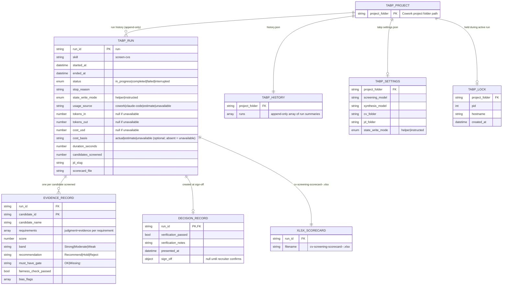

# HLD — Data model (workspace state)

All entities are JSON files under `<workspace>/<repo-id>/`; schemas ship with
the plugin (`plugins/acs/schemas/`). Pretty-printed, atomically written,
human-auditable.

```mermaid
erDiagram
    REPO_PARTITION ||--o{ TICKET : contains
    REPO_PARTITION ||--|| TICKETS_INDEX : "indexes all tickets"
    REPO_PARTITION ||--|| COUNTERS : "id sequence"
    REPO_PARTITION ||--|| METRICS : "aggregates"
    REPO_PARTITION ||--o{ SESSION_POINTER : "one per checkout/worktree"
    REPO_PARTITION ||--o| SESSION_MARKER : "one per checkout, ticket-independent (MAR-1)"
    REPO_PARTITION ||--o{ COST_SAMPLE : "append-only log, one per checkout (MAR-1)"
    REPO_PARTITION ||--o| COST_CURSOR : "one per checkout (MAR-1)"
    TICKET ||--o{ SKILL_STATE : "one per skill that ran"
    TICKET ||--|| PIPELINE_STATE : "step ledger"
    TICKET ||--o| CLARIFICATIONS : "Q&A ledger"
    TICKET ||--o| LOCK : "held while worked"
    TICKET ||--o{ PHASE_ARTIFACT : "execute/verify per iteration; plan per iteration for the three non-/code non-/docs-sync non-/create-project non-/standardize-project non-/create-prd non-/create-quality non-/create-standards non-/create-operations non-/create-principles triad skills"
    TICKET ||--o{ TICKET : "epic -> children (both directions)"
    SKILL_STATE ||--|{ RUN_ENTRY : "append-only"
    RUN_ENTRY ||--o{ ROLE_USAGE : "measured token/cost breakdown by role (MAR-1)"
    RUN_ENTRY ||--o{ MODEL_USAGE : "measured token/cost breakdown by model (MAR-3)"
    SESSION_MARKER ||--o| RUN_ENTRY : "read at skill-start, threaded onto the new entry (MAR-1)"
    RUN_ENTRY }o--o{ COST_SAMPLE : "cost consumed from the log via the cursor (MAR-1)"
    COST_CURSOR ||--|| COST_SAMPLE : "advances to the newest consumed sample (MAR-1)"
    TICKET ||--o| PLAN_APPROVAL : "at most one per approved plan digest, /acs:code STANDARD/COMPLEX only, written solely by plan-approval.py"
    TICKET ||--o| PLAN : "exactly one phases/code/plan.md, authored once per run before the loop"
    PLAN ||--o{ PLAN_SUPERSEDED : "one plan-superseded-<k>.md per revocation; byte-identical copy, never deleted"

    TICKET {
        string id PK "SHOP-123"
        string title
        enum type "epic|story|task"
        string description
        array acceptance_criteria
        enum priority "critical|high|medium|low"
        string parent FK "epic id or null"
        array children
        enum status "open|in_progress|in_review|done"
        json external "tracker mapping or null"
        string assignee
        number story_points
        bool needs_design "true for epics only; always false for story/task (MAR-76)"
        bool docs_only
        string due_date "ISO-8601 date or null (NEW, MAR-8 Child 3)"
        enum size "trivial|small|standard|large (axis for derive_lane; MAR-56)"
        enum stakes "low|normal|high (axis for derive_lane; MAR-56)"
        enum lane "TRIVIAL|SMALL|STANDARD|COMPLEX (derived cache from size x stakes via derive_lane; MAR-56)"
    }
    SKILL_STATE {
        string skill PK
        string ticket_id FK
        json states "canonical keys per skill; code's states.plan_approved is the first key written by a script (plan-approval.py) rather than the skill's own post-hook or coordinator — MAR-73, slice 3 of MAR-69; see INTERNALS.md's canonical-keys table"
        array findings
        array errors
    }
    PLAN_APPROVAL {
        string ticket_id FK
        string skill "code"
        enum lane "STANDARD|COMPLEX (recomputed, never cached ticket.lane)"
        datetime approved_at
        bool eligible
        string plan_path "relative to the ticket partition"
        string plan_sha256 "digest of the approved plan.md bytes"
        json predicate "function, inputs, checks, failures — acs_lib.plan_approval_eligible's verdict"
        string writer "plan-approval.py (sole writer, never a subagent or the coordinator)"
    }
    RUN_ENTRY {
        datetime started_at
        datetime ended_at
        string session_id "captured off the PreToolUse envelope via the session marker; null when no marker was accepted (MAR-1)"
        string transcript_path "exact recorded path, never a constructed slug (MAR-1)"
        string checkout_id "needed at finalize time to locate this checkout's cost-sample/cursor files (MAR-1)"
        json tokens "input/output/cache_creation/cache_read -- raw measured counts, MAR-1 widened the allow-list"
        number cost_usd "null means cost_basis=unavailable, never a fabricated 0 (MAR-1)"
        enum cost_basis "measured|apportioned|unavailable (MAR-1, ADR 0082)"
        enum cost_scope "session_total|main_session_only on a charge; reused as the degraded reason (no_unconsumed_sample_in_window|cost_total_reset) when cost_usd is null (MAR-1)"
        number excluded_cost_usd "the unattributed same-window slice dropped per C-8, never redistributed (MAR-1)"
        number excluded_token_share "0..1 (MAR-1)"
        number api_duration_ms "null means api_duration_basis=unavailable, never a fabricated 0 (MAR-6)"
        enum api_duration_basis "measured|apportioned|unavailable (MAR-6)"
        enum api_duration_scope "session_total|main_session_only|no_unconsumed_sample_in_window|cost_total_reset|duration_unavailable_on_cursor -- the last value has no cost_scope analogue (MAR-6)"
        enum status "in_progress|completed|failed|interrupted|handed_off"
        string stop_reason
        string handoff_summary "when handed_off"
    }
    ROLE_USAGE {
        string role "coordinator|planner|executor|verifier|other|unattributed (MAR-1)"
        int input
        int output
        int cache_creation
        int cache_read
        number cost_usd "null on an unattributed entry, which never receives a dollar share (MAR-1)"
        enum cost_basis "measured|apportioned|unavailable (MAR-1)"
        number api_duration_ms "null on an unattributed entry, which never receives a duration share (MAR-6)"
        enum api_duration_basis "measured|apportioned|unavailable (MAR-6)"
    }
    MODEL_USAGE {
        string model "message.model, or the literal string unknown (MAR-3)"
        int input
        int output
        int cache_creation
        int cache_read
        number cost_usd "full-delta apportioned share, no unattributed exclusion, D1.2 Option A; null when unavailable (MAR-3)"
        enum cost_basis "measured|apportioned|unavailable (MAR-3)"
    }
    SESSION_MARKER {
        string checkout_id PK "sessions/<checkout_id>-session.json, sibling of SESSION_POINTER (MAR-1)"
        string session_id
        string transcript_path
        string cwd
        string hook_event_name
        string skill "off tool_input.skill, raw acs:<name> value"
        datetime updated_at "staleness guard: rejected if > 15 min old or checkout_id mismatches"
    }
    COST_SAMPLE {
        string checkout_id FK "sessions/<checkout_id>-cost-samples.jsonl, append-only, rotated past 64 KiB (MAR-1)"
        datetime ts
        number total_cost_usd "session-cumulative, monotonic barring a session reset"
        string src "the matched probe key path, e.g. cost.total_cost_usd"
        number total_api_duration_ms "session-cumulative, independently nullable from total_cost_usd -- a sample is written when EITHER quantity is found (MAR-6)"
        string duration_src "the matched probe key path, e.g. cost.total_api_duration_ms (MAR-6)"
    }
    COST_CURSOR {
        string checkout_id PK "sessions/<checkout_id>-cost-cursor.json -- the 'before' edge for the next allocate_cost call (MAR-1)"
        datetime ts
        number total_cost_usd
        number total_api_duration_ms "one shared cursor file tracks both quantities -- D3 Option A, not a second cursor file (MAR-6)"
    }
    PIPELINE_STATE {
        string ticket_id PK
        enum flow "ticket|product"
        json steps "per-skill status/timestamps/summary"
        json totals "runs, runs_timed, runs_untimed, runs_cost_measured, runs_cost_unavailable, seconds, tokens (input/output/cache_creation/cache_read), cost (four counters additive since MAR-1); api_duration_ms, runs_api_duration_measured, runs_api_duration_unavailable (three counters additive since MAR-6, mirroring the cost counters' rule)"
        string lane "TRIVIAL|SMALL|STANDARD|COMPLEX (mirror of ticket.lane; written by update_pipeline; not declared in schema, allowed via additionalProperties)"
    }
    CLARIFICATIONS {
        string ticket_id PK
        array clarifications "C-n: question, answer, source, status, rationale"
    }
    LOCK {
        string checkout_id
        int pid
        string hostname
        datetime created_at
    }
    SESSION_POINTER {
        string checkout_id PK
        string ticket_id
        string skill
    }
    PLAN {
        string path "phases/code/plan.md — the only name, every lane"
        string author "code-planner on STANDARD/COMPLEX; coordinator on TRIVIAL/SMALL (MAR-72)"
        string sha256 "digest the PLAN_APPROVAL record pins"
    }
    PLAN_SUPERSEDED {
        int k "smallest positive integer with no existing file"
        string path "phases/code/plan-superseded-<k>.md"
        string writer "coordinator, at an iteration/run boundary, on a clarify.py-recorded user answer"
        string semantics "byte-identical cp of the revoked plan.md — never a rename/move; existing iter-<n>-verify.md plan.md:<line> citations resolve unchanged"
        bool approval_input "false — never an approval input, never a conformance contract (dimension 15's plan_path condition)"
    }
```

**PHASE_ARTIFACT note (MAR-70, amended by MAR-71 slice 1b; label narrowed by
MAR-74 slice 4, by MAR-300, by MAR-301, by MAR-302, and by MAR-305).** The `"execute/verify
per iteration; plan per iteration for the three non-/code non-/docs-sync
non-/create-project non-/standardize-project non-/create-prd non-/create-quality
non-/create-standards non-/create-operations non-/create-principles triad skills"` cardinality above already carves out
`/acs:code`'s plan leg. `/acs:code`'s plan artifact is
a single per-ticket `phases/code/plan.md`, written **exactly once per run**,
before the loop, so `/acs:code` has one plan artifact per ticket regardless of
iteration count (never rewritten in place on a later iteration — MAR-71,
slice 1b of MAR-69; this covers the `plan` leg of the ER label above for
`/acs:code`); `phases/code/plan-superseded-<k>.md` is a real, written-and-read
artifact of the plan-revocation path (MAR-74, slice 4 of MAR-69 — see the
Amendment below).
Modelling this precisely — a `PLAN` / `PLAN_APPROVAL` / `PLAN_SUPERSEDED`
entity block and a narrowed `PHASE_ARTIFACT` relationship label — is owned by
MAR-69 slices 3/4; this note records the gap without pre-empting that edit.

**Amendment (MAR-73, slice 3 of MAR-69).** The `PLAN_APPROVAL` half of the
gap above is now modelled: the `PLAN_APPROVAL` entity block and its
`TICKET ||--o| PLAN_APPROVAL` relationship above are the real artifact
behind it, written solely by `plan-approval.py` on STANDARD/COMPLEX. `PLAN`
and `PLAN_SUPERSEDED` — and the narrowed `PHASE_ARTIFACT` relationship label
covering them — remain unwritten and unread, and stay owned by **slice 4**.

**Amendment (MAR-74, slice 4 of MAR-69).** The `PLAN` / `PLAN_SUPERSEDED`
half of the gap left owned by **slice 4** above is now modelled: the `PLAN`
and `PLAN_SUPERSEDED` entity blocks and their `TICKET ||--o| PLAN` /
`PLAN ||--o{ PLAN_SUPERSEDED` relationships above are the real artifacts
behind them, and the `PHASE_ARTIFACT` relationship label is narrowed
accordingly. This corrects the MAR-73 Amendment's "remain unwritten and unread" —
`plan.md` is the plan artifact modelled by `PLAN` (unchanged since MAR-70/71),
and `plan-superseded-<k>.md`, modelled by `PLAN_SUPERSEDED`, is now written by
the coordinator at a revocation boundary and read by nothing as an approval
input or conformance contract (ADR 0073).

**Amendment (MAR-300).** `/acs:docs-sync`'s plan artifact,
`phases/docs-sync/iter-1-plan.md`, now has the same "exactly one per run,
authored before the loop, never rewritten in place on a later iteration"
cardinality as `/acs:code`'s `plan.md` above — this closes the E2 edge the
code-planner recorded (ADR-0012). Unlike `/acs:code`, `/acs:docs-sync` keeps
the `iter-<n>-plan.md` **name** (`n` is always 1, since the plan phase runs
exactly once) and carries **no** `PLAN_APPROVAL` / `PLAN_SUPERSEDED`
semantics — no new entity block is added for it; the cardinality change is
captured entirely by the narrowed `PHASE_ARTIFACT` relationship label above.

**Amendment (MAR-301).** `/acs:create-project`'s plan artifact,
`phases/create-project/iter-1-plan.md`, now has the same "exactly one per
run, authored before the loop, never rewritten in place on a later
iteration" cardinality as `/acs:code`'s `plan.md` and `/acs:docs-sync`'s
`iter-1-plan.md` above. Like `/acs:docs-sync`, `/acs:create-project` keeps
the `iter-<n>-plan.md` **name** (`n` is always 1, since the plan phase runs
exactly once) and carries **no** `PLAN_APPROVAL` / `PLAN_SUPERSEDED`
semantics — no new entity block is added for it; the cardinality change is
captured entirely by the narrowed `PHASE_ARTIFACT` relationship label above.

**Amendment (MAR-302).** `/acs:standardize-project`'s plan artifact,
`phases/standardize-project/iter-1-plan.md`, now has the same "exactly one
per run, authored before the loop, never rewritten in place on a later
iteration" cardinality as `/acs:code`'s `plan.md`, `/acs:docs-sync`'s and
`/acs:create-project`'s `iter-1-plan.md` above. Like `/acs:docs-sync` and
`/acs:create-project`, `/acs:standardize-project` keeps the
`iter-<n>-plan.md` **name** (`n` is always 1, since the plan phase runs
exactly once) and carries **no** `PLAN_APPROVAL` / `PLAN_SUPERSEDED`
semantics — no new entity block is added for it; the cardinality change is
captured entirely by the narrowed `PHASE_ARTIFACT` relationship label above.
Zero migration: no new state key, no new schema field, no new artifact path.

**Amendment (MAR-1, ADR 0082) — closes doc-graph gap E2.** Cost/time
measurement replaced two self-estimated paths with real measurement: the
`RUN_ENTRY` entity above gains `session_id`/`transcript_path`/`checkout_id`
(session correlation), the widened `tokens` object, `cost_basis`/
`cost_scope`/`excluded_cost_usd`/`excluded_token_share` (cost provenance),
and a `ROLE_USAGE` breakdown; three new sibling entities —
`SESSION_MARKER`, `COST_SAMPLE`, `COST_CURSOR` — are new files under
`sessions/`, alongside the existing `SESSION_POINTER`. All of it is
additive: no previously valid `RUN_ENTRY`/`PIPELINE_STATE` document becomes
invalid, and `role_usage`/`cost_basis`/etc. are simply absent on any run
entry finalized before this shipped (D7, forward-only — no backfill).

**Amendment (MAR-3).** Per-model token/cost breakdown: the `RUN_ENTRY`
entity gains a `MODEL_USAGE` breakdown, parallel to and independent of
`ROLE_USAGE` (D1.1 Option B — `role_usage`'s shape is unchanged).
`model_usage.cost_usd` apportions the run's full charged delta by token
share with no unattributed exclusion (D1.2 Option A), so
`sum(model_usage.cost_usd)` can exceed `sum(role_usage.cost_usd)`'s
attributed-only total by `excluded_cost_usd` — a named, testable
reconciliation identity, not a bug. Additive: `model_usage` is simply
absent on any run entry finalized before this shipped (forward-only, no
backfill, same pattern as `role_usage`'s MAR-1 rollout).

**Amendment (MAR-6, ADR 0082 amendment).** API-duration sampling/persistence
backend: the `RUN_ENTRY` entity gains `api_duration_ms`/`api_duration_basis`/
`api_duration_scope`, apportioned across `ROLE_USAGE` by the identical
token-share mechanism as `cost_usd` (D3/C-6); `COST_SAMPLE` and `COST_CURSOR`
each widen to also carry `total_api_duration_ms` (plus `duration_src` on
`COST_SAMPLE`) — one shared cursor file tracks both quantities (D3 Option A),
not a second cursor file; `PIPELINE_STATE.totals` gains three counters,
`api_duration_ms`/`runs_api_duration_measured`/`runs_api_duration_unavailable`,
mirroring the existing cost counters' rule. Additive throughout: no
previously valid `RUN_ENTRY`/`COST_SAMPLE`/`COST_CURSOR`/`PIPELINE_STATE`
document becomes invalid, and the new fields are simply absent on any run
finalized before this shipped (forward-only, no backfill, same pattern as
MAR-1's/MAR-3's rollouts). This capability is not yet surfaced by
`/acs:usage`'s rendered output — MAR-6 is Seam B1 of a 2-way split
(MAR-5 → MAR-6 + MAR-7); MAR-7 is the sibling ticket that consumes these
fields in the rendered view.

**Amendment (MAR-305).** `/acs:create-prd`'s, `/acs:create-quality`'s,
`/acs:create-standards`'s, `/acs:create-operations`'s, and
`/acs:create-principles`'s plan artifacts (`phases/<skill>/iter-1-plan.md`
each) now have the same "exactly one per run, authored before the loop,
never rewritten in place on a later iteration" cardinality as `/acs:code`'s
`plan.md`, `/acs:docs-sync`'s, `/acs:create-project`'s, and
`/acs:standardize-project`'s `iter-1-plan.md` above. Like those four, each of
these five skills keeps the `iter-<n>-plan.md` **name** (`n` is always 1,
since the plan phase runs exactly once) and carries **no** `PLAN_APPROVAL` /
`PLAN_SUPERSEDED` semantics — no new entity block is added for any of them;
the cardinality change is captured entirely by the narrowed `PHASE_ARTIFACT`
relationship label above. Zero migration: no new state key, no new schema
field, no new artifact path.

Invariants (enforced by `acs_lib` + schemas + tests):

- `runs[-1]` is the only source of current status — nothing mirrored at top level.
- Epic ↔ child links stored in **both** directions; epic status auto-managed.
- Cross-partition writes limited to the defined parent-epic updates; reads
  (e.g. a child consuming the epic's `design.md`) are allowed.
- Done partitions move to `archive/` — never deleted; the index keeps them.

---

## tabp plugin data model

Source: `MAR-2/specs/01-tabp-state-json-schemas.md`, `MAR-1/design.md:652-722`.
Schemas: `plugins/tabp/schemas/`. All entities live in `<project>/.tabp/`
within the Cowork project folder (separate from the acs workspace partition).

Invariants (enforced by `tabp_helper.py` at runtime, not by schema alone):

- `runs[-1]` in `history.json` is the current status of the most recent run.
- `status = "in_progress"` means the run is resumable from `.tabp/runs/<run-id>/`.
- Evidence records and the decision record are appended/updated only within an `in_progress` run.
- The lock is held while `status = "in_progress"`; stale locks are reported, not stolen.
- No entry in `history.json` or any per-run file is ever deleted; archives are never purged.

PII-minimal rule: `candidate_name` holds only a name or anonymised label. No contact
details, no protected-class attributes, no secrets in any state file
(`design.md:129-132`).
