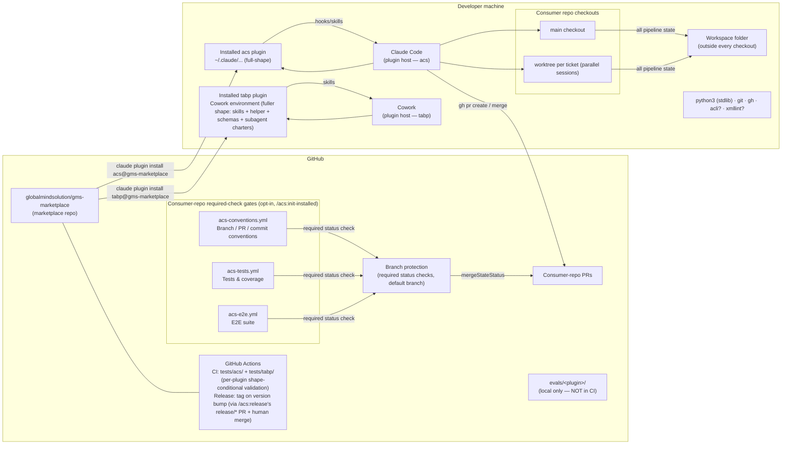

# HLD — Deployment & runtime topology

Key facts:

- **Distribution**: GitHub URL only; semver in `plugin.json`; the release
  workflow tags `v<version>` when the version bumps on `main` (updates reach
  users only on version bumps). The recommended trigger-author of that
  version-bump PR is `/acs:release <version>` — it drafts/dates the CHANGELOG
  section, bumps both manifests + `source.ref`, and opens the exempt
  `release/*` PR, then stops for a human merge; `release.yml` itself is
  reused unchanged.
- **Per-plugin install paths**: acs installs into Claude Code
  (`claude plugin install acs@gms-marketplace`); tabp installs into the Cowork
  environment (`claude plugin install tabp@gms-marketplace`). Each plugin
  targets a different runtime host.
- **One workspace, many repos**: `workspace_path` is machine-local
  (`settings.local.json`, gitignored) and may serve any number of consumer
  repos — partitions are keyed by repo identity derived from the git remote,
  so every worktree of a repo shares one partition.
- **No server-side anything**: the plugins are files; all execution happens in
  the user's Claude Code / Cowork session and shell. Tracker/PR access goes
  through the user's authenticated CLIs.
- **This repo's own CI** runs the deterministic-layer suite (Python 3.9 +
  3.12), JSON/schema validation, and the prose contract tests on every PR via
  per-plugin test discovery (`tests/acs/` and `tests/tabp/`). Behavioral evals
  (`evals/<plugin>/`) run **locally only** — they make LLM calls and are not
  coupled to CI.
- **Consumer-repo required-check gates**: `/acs:init` can opt-in scaffold up
  to three independent GitHub Actions checks per consumer repo — conventions
  (`acs-conventions.yml`), tests+coverage (`acs-tests.yml`), and e2e
  (`acs-e2e.yml`, this ticket) — each backed by a stdlib-only runner reading
  the committed `.acs/settings.json`. A committed workflow file is advisory
  until a repo admin makes its check a **required status check** on the
  protected default branch (branch protection); that is the actual
  enforcement point — a red check then leaves `mergeStateStatus BLOCKED` and
  a PR cannot merge.
  The same `acs-e2e.yml` topology is also reachable via
  `/acs:standardize-project`'s additive brownfield scaffold path for a repo
  that already exists — it adds the workflow+runner files only and never
  wires branch protection itself, so an admin still completes the gate via
  `/acs:init` (or the manual `gh api` command) afterward.
