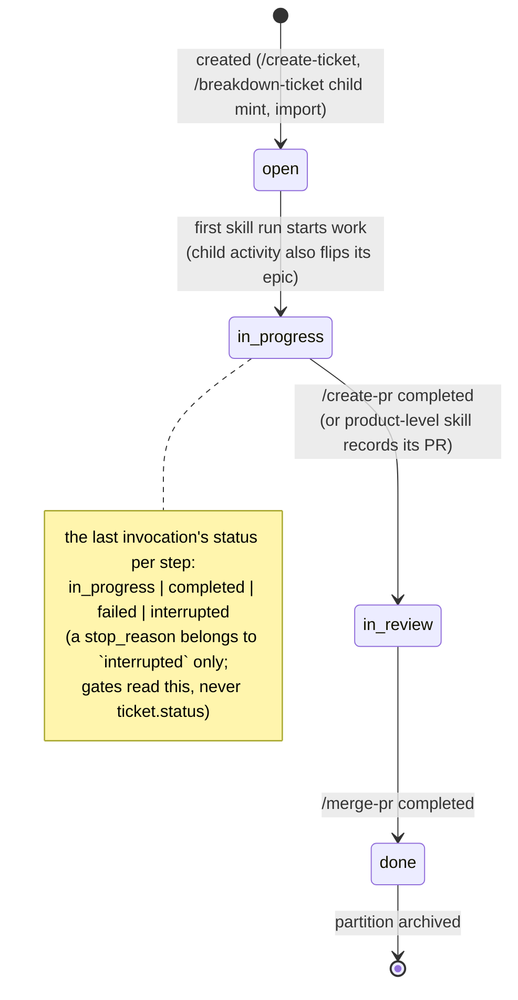

# Flow — Ticket status lifecycle

The statuses a ticket moves through from its creation to its archive, and what moves it; the merge that takes it to `done` is [ticket-lifecycle.md](ticket-lifecycle.md).

## Status lifecycle

