# LLD Flow — acs cost/time metering (measure/persist and read/render)

How `acs` measures and persists real elapsed time, real token counts, and a
real (never self-estimated) dollar figure for every hooked skill run, and how
`/acs:usage`/`/acs:metrics` render those figures back out. Two coupled paths:
**measure/persist** (every hooked skill run, at its pre-hook and post-hook)
and **read/render** (`/acs:usage`, `/acs:metrics`), both read-only on the
render side. ADR 0082 records the decision this flow implements.

## Sequence diagram — measure/persist path

```mermaid
sequenceDiagram
    participant Coord as Coordinator (skill session)
    participant CC as Claude Code runtime
    participant Disp as dispatch.py pre
    participant Pre as pre-<skill>.py / acs_lib.run_pre
    participant Start as skill-start.py
    participant SL as statusline.py (opt-in)
    participant CS as cost_sampler.py
    participant Post as post-<skill>.py / acs_lib.finalize_run
    participant UR as usage_reader.py
    participant TR as Transcript store (session .jsonl + subagents/)
    participant WS as Workspace (marker, cursor, samples, run entry, totals)

    Coord->>CC: /acs:<skill> invoked
    CC->>Disp: PreToolUse(Skill) envelope (session_id, transcript_path, cwd, tool_input.skill)
    Disp->>Pre: forward raw envelope, HOOKED_SKILLS only
    Pre->>Pre: build_context, GATES[skill] check
    Pre->>Pre: record_session_marker(ctx, payload), own try/except Exception: pass
    Pre->>WS: write sessions/<checkout_id>-session.json
    Pre-->>Disp: exit 0 (pass) or exit 2 (blocked) -- the marker write never affects this exit code
    Coord->>Start: skill-start.py --skill <skill>, coordinator's first action
    Start->>WS: read sessions/<checkout_id>-session.json
    Start->>Start: accept only if marker.checkout_id == ctx.checkout_id and age <= 15 min
    Start->>WS: append_in_progress_run(..., session=marker) -- persists session_id/transcript_path/checkout_id, or all-null if rejected
    loop while the skill runs, subagents spawn, statusLine refreshes
        CC->>SL: statusLine payload on stdin (model, workspace, session, cost)
        SL->>CS: record_cost_sample(payload), before render(), own try/except
        CS->>CS: _extract_total_cost -- cost.total_cost_usd, cost.total_cost, total_cost_usd, or a depth<=3 scan for /total_cost(_usd)$/
        CS->>CS: _extract_api_duration -- cost.total_api_duration_ms, cost.total_api_duration, total_api_duration_ms, or a depth<=3 scan for /total_api_duration(_ms)$/ (MAR-6)
        alt either candidate matched
            CS->>WS: append {ts, total_cost_usd, src, total_api_duration_ms, duration_src} to sessions/<checkout_id>-cost-samples.jsonl (rotated past 64 KiB — MAR-6, a sample is written when EITHER quantity is found)
        else neither candidate matched
            CS->>CS: no sample written -- not an error
        end
    end
    Coord->>Post: skill finishes, coordinator calls the post-hook with the result document
    Post->>WS: finalize_run reads runs[-1] (session_id, transcript_path, checkout_id, started_at)
    alt run entry has no session_id or transcript_path
        Post->>Post: short-circuit -- no transcript I/O (new-ticket.py's synthetic create-ticket runs land here)
        Post->>WS: persist tokens all-zero, cost_usd=null, cost_basis="unavailable", role_usage=[], model_usage=[]
    else session_id and transcript_path present
        Post->>UR: read_transcript_usage(transcript_path, started_at, ended_at, skill)
        UR->>TR: stream the exact transcript_path, then a recursive walk of dirname(transcript_path)/<session_id>/subagents/*.jsonl (never a constructed slug, never *.meta.json)
        TR-->>UR: message.usage (4 integer fields) + model + timestamp + attributionSkill/attributionAgent, in-window records only
        alt transcript unreadable, cap breached (32 MiB / 64 files), empty window, or zero real tokens resolved
            UR-->>Post: {degraded: true, reason, role_usage: [], model_usage: []}
            Post->>WS: tokens all-zero, cost_usd=null, cost_basis="unavailable", role_usage=[], model_usage=[]
        else at least one in-window usage record
            UR-->>Post: {degraded: false, role_usage: [{role, input, output, cache_creation, cache_read}, ...], model_usage: [{model, input, output, cache_creation, cache_read}, ...], excluded_token_share}
            Post->>Post: sum role_usage into raw tokens.{input,output,cache_creation,cache_read}
            alt run entry has no checkout_id
                Post->>WS: persist measured tokens/role_usage/model_usage, cost_usd=null, cost_basis="unavailable" (no checkout_id to locate the cost-sample/cursor files)
            else checkout_id present
                Post->>CS: allocate_cost(workspace, repo_id, checkout_id, started_at, ended_at, role_usage, model_usage)
                CS->>WS: read cost-cursor.json (default {ts: null, total_cost_usd: 0.0, total_api_duration_ms: null} if absent — MAR-6 widens the cursor to 3 fields, one shared file) and cost-samples.jsonl
                CS->>CS: after = newest sample with ts <= ended_at
                alt no sample, or after.ts <= cursor.ts
                    CS-->>Post: (role_usage unavailable, model_usage unavailable, cost_usd=null, cost_basis="unavailable", cost_scope="no_unconsumed_sample_in_window", api_duration_ms=null, api_duration_basis="unavailable", api_duration_scope="no_unconsumed_sample_in_window")
                else delta = after.total_cost_usd - cursor.total_cost_usd is negative
                    CS->>WS: advance cursor to after (charge nothing — total_api_duration_ms carried onto the cursor regardless)
                    CS-->>Post: (role_usage unavailable, model_usage unavailable, cost_usd=null, cost_basis="unavailable", cost_scope="cost_total_reset", api_duration_ms=null, api_duration_basis="unavailable", api_duration_scope="cost_total_reset" -- MAR-6, a cost reset marks BOTH quantities unavailable for this charge)
                else delta >= 0
                    CS->>CS: apportion delta across role_usage by token share (denominator = ALL in-window tokens, incl. unattributed) — unattributed entries receive no dollar share
                    CS->>CS: _apportion_models applies the SAME delta to model_usage by token share across ALL in-window tokens, no unattributed exclusion (D1.2 Option A)
                    CS->>WS: advance cursor to after (total_cost_usd and total_api_duration_ms together, one write)
                    CS-->>Post: (role_usage apportioned, model_usage apportioned, cost_usd=attributed-token share of delta (delta net of excluded_cost_usd), cost_basis="measured", cost_scope="session_total", excluded_cost_usd, excluded_token_share)
                    alt cursor_duration and after_duration both numeric, and duration_delta = after_duration - cursor_duration >= 0 (MAR-6)
                        CS->>CS: _apportion_duration applies duration_delta to role_usage by the identical token-share mechanism as cost (same denominator, same UNATTRIBUTED_ROLE exclusion)
                        CS-->>Post: (api_duration_ms=attributed-token share of duration_delta, api_duration_basis="apportioned", api_duration_scope="session_total")
                    else either edge missing/non-numeric, or duration_delta negative
                        CS-->>Post: (role_usage's api_duration_ms/api_duration_basis degraded to null/"unavailable" — api_duration_ms=null, api_duration_basis="unavailable", api_duration_scope="duration_unavailable_on_cursor" -- no cost-side analogue, cost proceeds unaffected)
                    end
                end
                Post->>WS: persist tokens, role_usage, model_usage, cost_usd, cost_basis, cost_scope, excluded_cost_usd, excluded_token_share, api_duration_ms, api_duration_basis, api_duration_scope (MAR-6)
            end
        end
    end
    Post->>WS: compute_ticket_totals / update_metrics -- exclude None-elapsed and non-measured/apportioned cost contributions from sums, increment runs_timed/runs_untimed and runs_cost_measured/runs_cost_unavailable for every run regardless -- MAR-6 additionally sums api_duration_ms and increments runs_api_duration_measured/runs_api_duration_unavailable by the identical rule
```

## Sequence diagram — read/render path

```mermaid
sequenceDiagram
    actor PM as PdM or tech lead
    participant CC as Claude Code runtime
    participant Usage as /acs:usage or /acs:metrics coordinator
    participant Agg as metrics_aggregate.py
    participant WS as Workspace (run entries, totals)
    participant Render as metrics_render.py

    PM->>CC: /acs:usage (or /acs:metrics)
    CC->>Usage: expand skill, run coordinator
    Usage->>Agg: python3 metrics_aggregate.py
    Agg->>WS: read pipeline-state.json + <skill>-state.json runs, per ticket
    WS-->>Agg: run entries -- tokens, role_usage, model_usage, cost_usd or null, cost_basis, cost_scope
    Agg->>Agg: elapsed_seconds via acs_lib -- None renders "no data", never 0
    Agg->>Agg: sum totals excluding cost_basis != measured/apportioned and None-elapsed runs, divide by runs_timed / runs_cost_measured, never by runs
    Agg->>Agg: _accumulate_burn buckets every role_usage entry into panel 6 by role, including a first-class coordinator bucket, and every model_usage entry into usage_by_model by model, at both repo and per-ticket scope (MAR-3), plus each entry's own api_duration_ms/api_duration_basis/wall-clock seconds into a per-skill raw duration accumulator feeding panel 3's step_api_duration and usage_by_ticket.skills[] (MAR-7, zero extra file reads)
    Agg->>Agg: _apply_panel6_shares computes repo-scope token_share_pct/cost_share_pct on every panel-6 bucket, once, post-loop, and _usage_by_ticket_panel finalizes ticket-scope role shares into the new usage_by_ticket panel (MAR-4)
    Agg-->>Usage: aggregate JSON -- panels 1-7 (panel 3 widened with step_api_duration/step_order per ticket, MAR-7) plus usage_by_model plus usage_by_ticket (widened with ticket-scope api_duration_ms/api_duration_basis and a skills[] array, MAR-7) plus meta.degraded entries
    Usage->>Render: pipe JSON, render the requested view
    Render->>Render: _humanize_seconds / _fmt_money render None/non-numeric as "no data" — _humanize_ms (MAR-7) converts a millisecond duration to seconds and delegates to _humanize_seconds, and a step_api_duration cell renders the literal UNAVAILABLE marker uniformly whether that skill's entry is structurally absent or present with basis unavailable (D6), never a bare "no data" at this per-skill scope
    Render-->>Usage: self-contained HTML
    Usage-->>PM: show_widget -- dashboard with basis-labeled figures and a degraded summary
```

No write, lock, or gate involvement on the read/render path — it is a pure
function of workspace JSON already written by the measure/persist path above.

## Step annotations

### Measure/persist — correlation capture (pre-hook)

`record_session_marker` persists exactly the fields present on the
`PreToolUse(Skill)` envelope — `session_id`, `transcript_path`, `cwd`,
`checkout_id` (from `build_context`), `hook_event_name`, and the skill name
read from `tool_input.skill` — never a constructed or guessed value; a
missing field is written as `null`. The marker call sits **between**
`build_context` and the skill's own `GATES[skill]` check inside `run_pre`,
wrapped in its own `try/except Exception: pass`, so a bug in the marker path
can never turn `run_pre`'s outer fail-closed handler (exit 2) into a blocked
pipeline over an unrelated audit-trail write.

### Measure/persist — threading onto the run entry (skill-start)

`skill-start.py` reads the marker as its first action after
`build_context(cwd)`, before the `--pr` resume branch. It accepts the marker
only when `marker.checkout_id` matches the current checkout **and** the
marker is no older than 15 minutes (bounded by the pre-hook's own 30s/25s
timeouts) — a rejected or stale marker means `session_id = null` on the new
run entry, which `usage_reader` treats as `degraded, reason="no_session_marker"`
at finalize time. It never falls back to constructing a path.

### Measure/persist — statusLine sampling (opt-in, continuous)

Every `statusline.py` invocation — independent of whether a ticket exists
yet — probes its stdin payload for a `total_cost_usd`-shaped value at four
candidate locations, in order, and records which one matched (`src`). No
match means no sample is written; this is expected, not an error, on any
payload shape the probe does not recognize. The sample log is append-only
JSONL, rotated once it exceeds 64 KiB (keeping the most recent half-budget
of lines).

### Measure/persist — token measurement and cost allocation (post-hook)

`finalize_run` short-circuits before any transcript I/O when the run entry
carries no `session_id`/`transcript_path` — this is deliberate: `new-ticket.py`
synthesizes and immediately finalizes a `create-ticket` run per epic child
with no session, and an unguarded scan would run once per child. When a
session is present, `usage_reader.read_transcript_usage` reads the exact
recorded file plus a recursive walk of its `subagents/` subtree — never a
`*.meta.json` sidecar, since only `*.jsonl` paths are ever enumerated — and
returns per-role token buckets or a degraded reason. `usage_reader` now
buckets by model as well as by role (`model_usage`, parallel to
`role_usage`, MAR-3); `cost_sampler.allocate_cost` apportions the same
session-window delta across both dimensions independently — the
role-scoped figure stays attributed-only, while the model-scoped figure is
full-delta with no unattributed exclusion (D1.2 Option A). It also
consumes at most the unconsumed portion of the sample log since the
persisted cursor: the cursor is always the "before" edge, so a sample once
consumed can never again serve as another run's charge (the structural
no-double-charge invariant). A negative delta (a session cost reset) charges
nothing but still advances the cursor.

### Read/render — never a second source of truth

`metrics_aggregate.py` reads only already-finalized run entries; it performs
no transcript or statusLine I/O of its own and writes nothing. Panel 6 sums
each run entry's `role_usage` list directly — the `coordinator` bucket
(main-session work attributed to **the run's own skill**) surfaces exactly
like `planner`/`executor`/`verifier`/`other`, and an `unattributed` bucket
(present when `excluded_token_share` is nonzero) is visible rather than
silently absorbed into an attributed role's total; it also absorbs
main-session records attributed to a different acs skill than the run's own,
not just records with no attribution at all. `usage_by_model` (MAR-3) sums
each run entry's `model_usage` list similarly, at both repo and per-ticket
scope, with no exclusion applied — its `cost_usd` total is therefore the
full-delta figure, not the attributed-only one panel 6 reports. `_apply_panel6_shares`
(MAR-4) computes each panel-6 bucket's `token_share_pct`/`cost_share_pct` as a
repo-scope percentage of the already-summed totals, once, after the
accumulation loop — never persisted, always recomputed on the next read;
`usage_by_ticket` (MAR-4) similarly derives each role's ticket-scope share
from the same per-ticket `role_usage` rows panel 6 already sums, so it
reports a different (ticket-local) denominator, not a conflicting figure.
