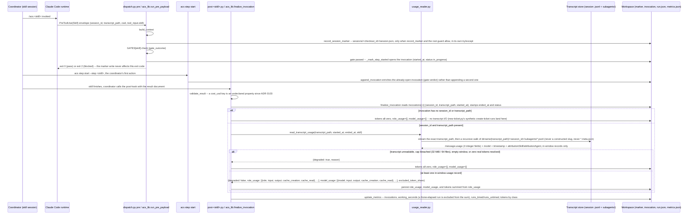
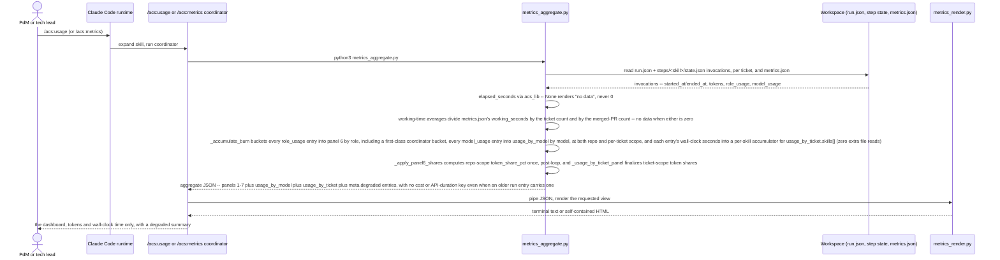

# LLD Flow — acs token/time metering (measure/persist and read/render)

How `acs` measures and persists real elapsed time and real token counts for
every hooked skill run, and how `/acs:usage`/`/acs:metrics` render those
figures back out. Two coupled paths: **measure/persist** (every hooked skill
run, at its pre-hook and post-hook) and **read/render** (`/acs:usage`,
`/acs:metrics`), read-only on the render side. ADR 0082 records the decision
this flow implements.

[ADR 0103](../../../adr/0103-no-status-line-no-cost-metering.md) removed this
flow's dollar-cost half: the status line that sampled Claude Code's cost
payload, `cost_sampler.py`, the per-checkout sample log and allocation cursor,
and every cost and API-duration figure on a run entry, a total or a
dashboard. acs records no dollar figure. The file keeps its original name.

## Sequence diagram — measure/persist path

## Sequence diagram — read/render path

No write, lock, or gate involvement on the read/render path — it is a pure
function of workspace JSON already written by the measure/persist path above.

## Step annotations

### Measure/persist — correlation capture (pre-hook)

`record_session_marker` persists the fields present on the
`PreToolUse(Skill)` envelope — `session_id`, `transcript_path`, `cwd`,
`checkout_id` (from `build_context`), `hook_event_name`, and the skill name
read from `tool_input.skill` — never a constructed or guessed value.

**Two conditions gate it, and both were added after this diagram was first drawn.**
`run_pre_payload` takes `record_marker`, which `acs gate` passes as `False`:
`gate` answers "would this pass?" and is not a `PreToolUse` event, so routing
it through the hook path used to rewrite the marker with a null `session_id`
and cost the NEXT run its attribution. And the root guard declines to
overwrite a marker that already carries a `session_id` with a payload that
does not. So a missing field is written as `null` only when the write happens
at all; where either condition declines, nothing is written. The marker call sits **between**
`build_context` and the skill's own `GATES[skill]` check inside `run_pre_payload`,
wrapped in its own `try/except Exception: pass`, so a bug in the marker path
can never turn the outer fail-closed handler (exit 2) into a blocked
pipeline over an unrelated audit-trail write.

### Measure/persist — threading onto the invocation

`acs_lib.accepted_session_marker` is the accept rule: it takes the marker
only when `marker.checkout_id` matches the current checkout **and** the
marker is no older than 15 minutes (bounded by the pre-hook's own 30s/25s
timeouts). `append_invocation` takes an accepted marker as `session` and
copies `session_id`/`transcript_path`/`checkout_id` onto the open invocation.
A rejected or stale marker means `session_id = null` on the invocation, which
`usage_reader` treats as `degraded, reason="no_session_marker"` at finalize
time. It never falls back to constructing a path.

**Known gap.** Neither opener passes `session` today — not the pre-hook's
`_mark_step_started`, and not `acs step start` — so a live invocation reaches
`finalize_invocation` without a `session_id` and takes the no-transcript
branch of the diagram above. The accept rule and the copy are implemented
and tested on their own; the call that joins them is missing.

### Measure/persist — token measurement (post-hook)

`finalize_invocation` calls `_measure_run_usage`, which short-circuits before
any transcript I/O when the invocation carries no `session_id`/
`transcript_path` — deliberately: `new-ticket.py` synthesizes and immediately
finalizes a `create-ticket` run per epic child with no session, and an
unguarded scan would run once per child. When a session is present,
`usage_reader.read_transcript_usage` reads the exact recorded file plus a
recursive walk of its `subagents/` subtree — never a `*.meta.json` sidecar,
since only `*.jsonl` paths are ever enumerated — and returns per-role and
per-model token buckets (`role_usage`, `model_usage`, MAR-3) or a degraded
reason. Unattributed same-window tokens land in an `unattributed` role
bucket rather than inflating an attributed role (C-8); the reader also
reports `excluded_token_share`, which the invocation does not persist. A
degraded read records empty token counts, never a fabricated figure.

### Read/render — never a second source of truth

`metrics_aggregate.py` reads only already-finalized invocations; it performs
no transcript I/O of its own and writes nothing. Panel 6 sums each
invocation's `role_usage` list directly — the `coordinator` bucket
(main-session work attributed to **the run's own skill**) surfaces exactly
like `planner`/`executor`/`verifier`/`other`, and an `unattributed` bucket
is visible rather than silently absorbed into an attributed role's total; it
also absorbs main-session records attributed to a different acs skill than
the run's own, not just records with no attribution at all.
`usage_by_model` (MAR-3) sums each invocation's `model_usage` list similarly,
at both repo and per-ticket scope. `_apply_panel6_shares` (MAR-4) computes
each panel-6 bucket's `token_share_pct` as a repo-scope percentage of the
already-summed totals, once, after the accumulation loop — never persisted,
always recomputed on the next read; `usage_by_ticket` (MAR-4) similarly
derives each role's ticket-scope share from the same per-ticket `role_usage`
rows panel 6 already sums, so it reports a different (ticket-local)
denominator, not a conflicting figure. A cost or API-duration field that an
invocation, `run.json` or `metrics.json` written before ADR 0103 still
carries is ignored, never summed or rendered.
