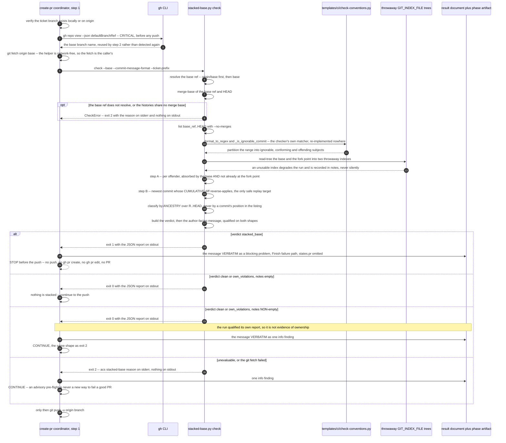

# Flow — /acs:create-pr stacked-base pre-flight

Until ADR-0106, `.acs/ci/check-conventions.py` collected a PR's commits in CI
with `git log --no-merges origin/<base>..HEAD` — pure SHA ancestry. A squash
merge replaces the base PR's commits with ONE new commit, so the originals never
become ancestors of the base. A branch stacked on that base still carries them,
the range still lists them, and the `commit_message` check fails on subjects
belonging to a pull request that is already merged — which the author cannot fix
by renaming anything. CI no longer checks commit subjects
([ADR-0106](../../../adr/0106-ci-checks-the-ticket-link-only.md)); the optional
local `pre-push` hook still does, over the commits being pushed, when
`enforcement.checks.commit_message` is on.

Since MAR-590 `/acs:create-pr` runs `hooks/scripts/stacked-base.py check` as a
pre-flight in **step 1**, before the branch is pushed. The base detect moves
into step 1 with it and is **critical**, so its failure now stops the run before
the push instead of after it. The helper is read-only and network-free — every
tree test runs against a throwaway `GIT_INDEX_FILE` under `tempfile.mkdtemp()`,
nothing under `.git` is written, and the `git fetch` that refreshes the base is
the caller's job. Only the stacked verdict stops the run. Everything else is
advisory, because an advisory pre-flight must never become a new way to fail a
good PR.

## Sequence diagram

## The four dispositions, and why only one of them stops the run

**Exit 1 is the one that stops it**, and it stops it *before* the push rather
than failing a PR that is already open. The report's `message` is the whole
deliverable: it names the offending subjects with their short SHAs and carries
the replay command with real values substituted, so it is surfaced verbatim
rather than paraphrased. The run then follows the Finish failure path with
`states.pr` omitted, because no PR exists.

**Exit 2 is advisory.** The condition could not be evaluated at all — the base
ref does not resolve, or the histories share no merge base — and the helper
writes `acs stacked-base: <reason>` to stderr and nothing at all to stdout. One
`info` finding, then the run continues. A failed `git fetch` is treated
identically.

**A qualified exit 0 is advisory too.** A non-empty `notes` means the run
qualified its own report: a commit it could not test, an index it could not
build, or absorbed-looking content with no safe replay point. The report's
`message` accounts for every `notes` entry, each named exactly once — either by
a sentence of its own or by the closing qualification — and it withholds the
classification rather than restating it. So a qualified exit 0 is **not**
evidence that the non-conforming subjects are the branch's own: it is recorded
as one `info` finding and the run continues, the same shape as exit 2. Only an
exit 0 whose `notes` is empty carries the ordinary conclusion, where a
non-conforming subject is the branch's own and gets the ordinary
`commit_message` failure with no replay advice.

## What the flow does not do

The diagram is a disposition table, not a complete decision procedure, and the
detection it gates is deliberately incomplete.

- **It reports, it does not prevent.** The conventions gate is unchanged. A
  commit whose region the base edited again after the squash fails both
  reverse-apply tests and is not recognised, and step B never runs when step A
  finds no candidate. A miss degrades to the ordinary `commit_message` failure
  with no replay advice — never to a false alarm.
- **One false positive is accepted.** A branch whose entire net content against
  the base is already in the base acquires a replay point and is reported as
  stacked even when it was never stacked. The diagnosis is wrong, but such a
  branch has zero net content, so the replay is a no-op and cannot lose work.
- **A degraded run can add a second one, and says so.** With the fork-point
  index unusable the merge-base control cannot run, so a commit that reverts
  this branch's own earlier work can read as absorbed. The commit it reverted is
  unaffected. `notes` names the index that failed and the message carries the
  same warning, on either verdict.
- **The skill never rewrites the branch.** `/acs:create-pr` runs neither the
  `git rebase --onto` nor the `git push --force-with-lease` — the author does,
  from the remedy the report hands them. Every commit SHA on the branch changes
  when they do, so any SHA recorded elsewhere is stale afterwards and has to be
  updated by hand.
- **Stacking stays permitted.** The repository's merge strategy is unchanged and
  squash merges are still how PRs land, which is why this condition exists at
  all. This flow is a report, not a policy change.

The author-facing remedy in full, with the measured record of why no patch-id
based detection can work here, lives in
`skills/create-pr/references/ci-convention-check.md`.
