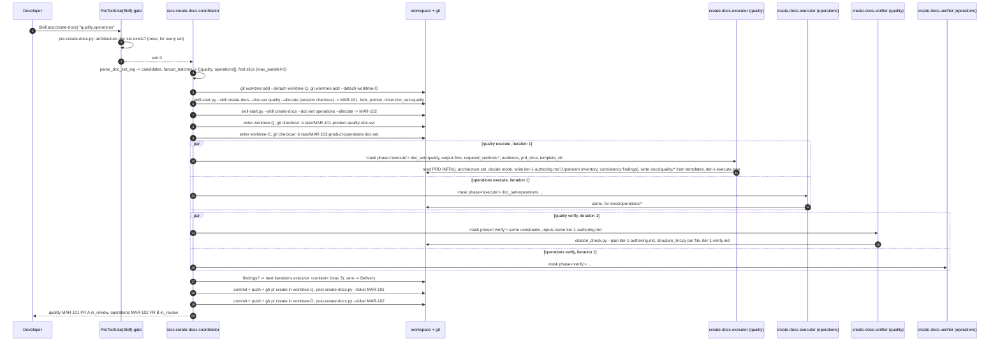
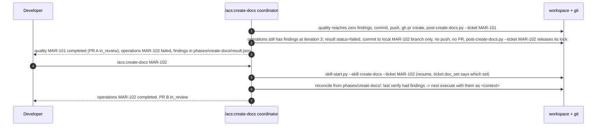

# Flow — `/acs:create-docs`: one skill, four doc sets, one delivery ticket per set

`/acs:create-docs <set|all>` bootstraps or maintains the four product doc sets
— `quality`, `operations`, `principles`, `standards` — and is, since ADR-0094,
the skill that does the work rather than an umbrella over four leg skills. The
sets are rows of `acs_lib.DOC_SETS`; one executor and one verifier serve every
set, the set riding in the task constraints; there is no planner (ADR-0092
class D). What this flow keeps from ADR-0085 is the mechanics that were never
about the legs: the declared eligibility predicate, capped parallel slices, a
worktree per unit of work, one delivery ticket and one docs-only PR per set,
and no fan-out ledger of its own.

## Eligibility and batching (pure, before anything is spent)

`fanout_batches(settings, tickets_index, checkout_root, candidates)` is the
**declared, not inferred** predicate. A set is eligible when its settings path
is configured (a `null` path is the consumer's opt-out), its sentinel file — the
first file of its `DOC_SETS` row — is absent at that path, no non-`done`
delivery ticket for it is in flight (matched by the ticket's `doc_set`, or its
title for tickets minted before the field existed), and every **hard**
dependency is unconfigured or shipped. A **soft** dependency only keeps two
sets out of the same batch: `standards` declares one on `principles`, so the
default request batches as `[[quality, operations, principles], [standards]]`,
which the cap walks as `quality` + `operations`, then `principles`, then
`standards`. Nothing here re-derives or reorders those batches.

## The run, two sets in one slice

Every write the executor makes lands in that set's worktree on that set's
branch — the constraints carry worktree-absolute output paths — so the
disjoint-file-map precondition `/acs:code`'s parallel-executor rule requires
holds by construction, and the session checkout is never dirtied.

## Failure isolation and resume

A failed set's run status, ticket, partition and lock are its own; the other
set's PR and ledger are never touched. There is no batch ledger: each set's
`pipeline-state.json` (`flow: "product"`, step `create-docs`) is its complete
resume record, and re-running `/acs:create-docs` with set names simply
re-derives eligibility — a set with an open delivery ticket or a shipped
sentinel is not re-offered.

## What the fold changed, in one table

| Before (ADR-0085 / ADR-0091) | Now (ADR-0094) |
|---|---|
| Four leg skills, each with a SKILL.md, a planner/executor/verifier trio, `pre-`/`post-` scripts, a `GATES` row | One skill; `DOC_SETS` rows; one executor + one verifier; `pre-`/`post-create-docs.py`; one `GATES` row |
| Umbrella unhooked; each leg's gate fired on its own `Skill(acs:<leg>)` call; fail-fast carve-out for the shared gate | Skill hooked; the one gate fires once at the Skill call, so there is no shared failure to carve out |
| A planner wrote `iter-1-plan.md` per leg, the executor followed it | The executor authors from the templates and writes `iter-<n>-authoring.md` (mode, Upstream inventory, consistency findings, decisions); the verifier corroborates it |
| Resume: `/acs:create-<leg> <ticket-id>` | Resume: `/acs:create-docs <ticket-id>` — the ticket records its `doc_set` |
| `fanout_batches` keyed by leg skill name | Keyed by set name; the former leg name still parses for one release |
