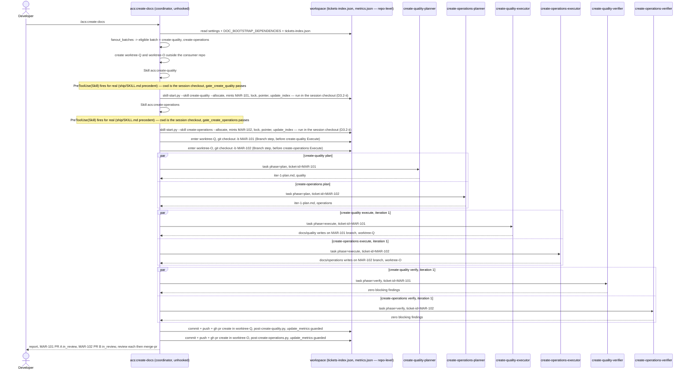
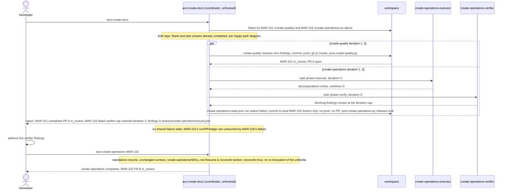

# Flow — /acs:create-docs cross-skill fan-out

`/acs:create-docs` is an unhooked coordinator (like `/acs:ship`) that spawns
**two or more existing doc-bootstrap skills as ordinary delivery tickets**,
running each one's own plan→execute→verify phases in a **parallel worktree**,
one delivery ticket per leg. It reuses the worktree-per-ticket primitive that
already exists for cross-*ticket* parallelism; what is new is the cross-*skill*,
phase-level fan-out from a single coordinator: each phase batch (both
planners, then both executors, then both verifiers) runs in parallel before
the next batch starts. `fanout_batches()` (`acs_lib.py`) computes the eligible
batch from `DOC_BOOTSTRAP_DEPENDENCIES` and `DOC_BOOTSTRAP_SETTINGS_KEY`
against the consumer repo's settings and on-disk doc state
(`doc_set_present_on_disk()`), gated on the declared v1 set
`DOC_BOOTSTRAP_FANOUT_V1` (`create-quality`, `create-operations`).

## Sequence — happy path (both legs succeed)

## Sequence — one leg fails, isolation and resume

Properties: each leg is an ordinary, independently-resumable delivery ticket
— its own branch, its own PR, its own verifier state; the umbrella holds no
shared failure state across legs, so one leg's iteration-cap failure never
blocks or rolls back a sibling leg's success. A crashed or failed leg resumes
exactly the way a standalone run already does, via its own skill's Resume &
reconcile path — `/acs:create-docs` is never re-invoked for a single-leg
resume. Each leg's worktree is entered at that leg's own Delivery step's
Branch sub-step, before that leg's Execute phase; that Branch entry point
precedes the later Delivery commit/push/PR steps, which run in the same
worktree once entered. The shared session checkout is used for both
legs' Starts and `skill-start.py --allocate` calls (D3.2-ii); each leg's
execute and verify phases, and Delivery steps 2-4, then run in that leg's
own worktree on its own branch.
