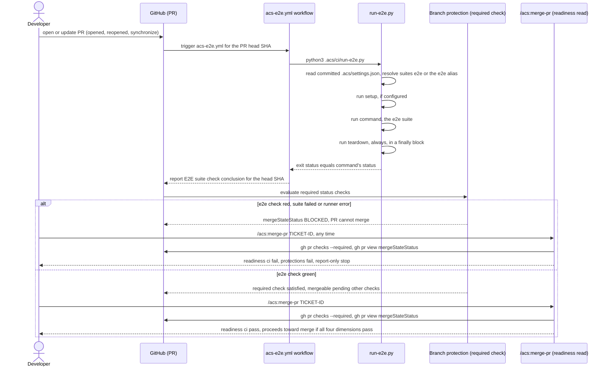

# Flow — enforce-e2e-merge-gate

A red e2e suite becomes a fail-closed merge brake; a green one lets
`/acs:merge-pr`'s existing `ci` readiness dimension pass. Transcribed verbatim
from the binding design (`MAR-124/design.md` Flow 1).

Composes with [`ticket-lifecycle.md`](ticket-lifecycle.md) for the surrounding
PR lifecycle, and with [`standardize-project.md`](standardize-project.md) for
the brownfield-scaffold-only sibling path (E2E-2/MAR-126, out of scope here).
