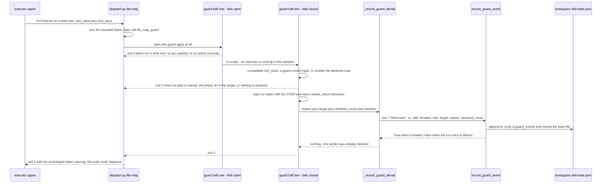

# Flow — File-map guard deny path

`dispatch.py file-map` runs on `PreToolUse` for the write tools and exits 2 on
a write the running executor's declared file map does not cover. Since MAR-578
each of those denials is also recorded: one entry appended to the executor's
own `runs[-1].guard_events`, so a denial survives the session that caused it
and `acs.py guard events` can read the trail back. The guard is a two-half
control — the scope half fails OPEN, the in-map half fails CLOSED — and the
recording sits only on the closed half, after the verdict is already decided.

## Sequence diagram

The three recorded reasons are the three closed-half denies: `outside_map` (a
path no declared task covers — `declared_count` is the declared union's size),
`control_input` (the active-agents record, the file map itself, or the ticket
docs tree, which an executor may never write because they are what arms and
feeds the guard), and `unreadable_payload` (a `tool_input` shape the guard
cannot check, which while an executor runs is an unverifiable write rather
than an absent one — `target` is `null`, there being no path to name).

**Failure shapes.** Recording is strictly subordinate to the deny. A missing
run entry makes `record_guard_event` return `False`; an append that raises is
caught as `Exception` — never `BaseException`, so `dispatch.py`'s `GateTimeout`
still reaches `run_file_map_guard` instead of being swallowed at a deny. Either
way the only visible difference is one extra stderr note, `file-map guard
denial not recorded: …`, beside the warning the executor already gets: same
exit 2, same warning text, no retry, no wait, no lock. The append is unlocked,
so two denials racing in the same instant can lose one — the trail is a floor
on what was denied, not a guaranteed count. Nothing is recorded on any
fail-open branch, so a zero-length trail and no trail at all mean the same
thing: the guard denied nothing, which is why the derived
`states.review.guard_denials` is absent rather than `0`.
