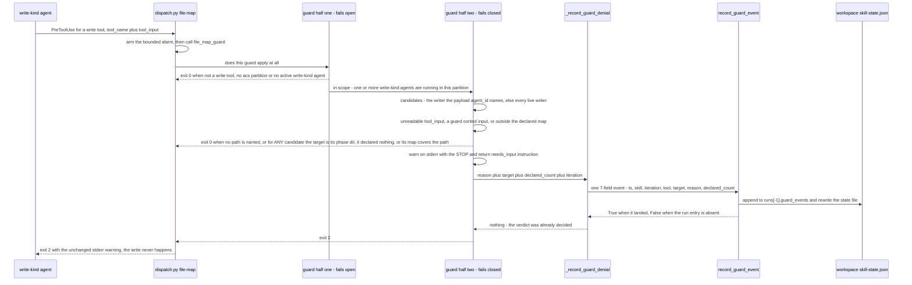

# Flow — File-map guard deny path

`dispatch.py file-map` runs on `PreToolUse` for the write tools and exits 2 on
a write the declared file map does not cover while an acs agent of the
`write` kind runs (`code-implementer`, `create-prd-author`,
`standardize-project-scaffolder`, … — `acs_lib.skills.ROLE_KINDS`). Since
MAR-578 each of those denials is also recorded: one entry appended to the
step's own `runs[-1].guard_events`, so a denial survives the session that caused it
and `acs.py guard events` can read the trail back. The guard is a two-half
control — the scope half fails OPEN, the in-map half fails CLOSED — and the
recording sits only on the closed half, after the verdict is already decided.

**Several live writers (ADR-0110).** Writer slices of one skill, and the
writers of a parallel group's members, can be recorded at once, so the guard
reads every live writer (`filemap.active_writers`, most recent first) and
decides which of them the call may belong to — its **candidates**. When the
payload carries the calling subagent's `agent_id`, `filemap._writer_for`
matches it and the only candidate is that writer: the check is exact, against
its own skill's phase directory and map. Without one the call cannot be
attributed and every live writer is a candidate: the write is allowed when ANY
of them may make it (the union of their scopes), and denied only when none
may, naming every candidate skill and the combined declared list. It is never
judged against whichever writer started last.

## Sequence diagram

```mermaid
sequenceDiagram
    participant WR as write-kind agent
    participant DP as dispatch.py file-map
    participant SCOPE as guard half one - fails open
    participant MAP as guard half two - fails closed
    participant REC as _record_guard_denial
    participant ST as record_guard_event
    participant WS as workspace skill-state.json

    WR->>DP: PreToolUse for a write tool, tool_name plus tool_input
    DP->>DP: arm the bounded alarm, then call file_map_guard
    DP->>SCOPE: does this guard apply at all
    SCOPE-->>DP: exit 0 when not a write tool, no acs partition or no active write-kind agent
    SCOPE->>MAP: in scope - one or more write-kind agents are running in this partition
    MAP->>MAP: candidates - the writer the payload agent_id names, else every live writer
    MAP->>MAP: unreadable tool_input, a guard control input, or outside the declared map
    MAP-->>DP: exit 0 when no path is named, or for ANY candidate the target is its phase dir, it declared nothing, or its map covers the path
    MAP->>MAP: warn on stderr with the STOP and return needs_input instruction
    MAP->>REC: reason plus target plus declared_count plus iteration
    REC->>ST: one 7-field event - ts, skill, iteration, tool, target, reason, declared_count
    ST->>WS: append to runs[-1].guard_events and rewrite the state file
    ST-->>REC: True when it landed, False when the run entry is absent
    REC-->>MAP: nothing - the verdict was already decided
    MAP-->>DP: exit 2
    DP-->>WR: exit 2 with the unchanged stderr warning, the write never happens
```

The three recorded reasons are the three closed-half denies: `outside_map` (a
path no declared task covers — `declared_count` is the declared union's size),
`control_input` (the active-agents record, the file map itself, or the ticket
docs tree, which a writer may never write because they are what arms and
feeds the guard), and `unreadable_payload` (a `tool_input` shape the guard
cannot check, which while a writer runs is an unverifiable write rather
than an absent one — `target` is `null`, there being no path to name).

**Failure shapes.** Recording is strictly subordinate to the deny. A missing
run entry makes `record_guard_event` return `False`; an append that raises is
caught as `Exception` — never `BaseException`, so `dispatch.py`'s `GateTimeout`
still reaches `run_file_map_guard` instead of being swallowed at a deny. Either
way the only visible difference is one extra stderr note, `file-map guard
denial not recorded: …`, beside the warning the writer already gets: same
exit 2, same warning text, no retry, no wait, no lock. The append is unlocked,
so two denials racing in the same instant can lose one — the trail is a floor
on what was denied, not a guaranteed count. Nothing is recorded on any
fail-open branch, so on a run that carries the trail a zero-length one means
the guard denied nothing. No trail at all says less than that: the field is
optional and forward-only, so its absence covers a run finalized before the
trail shipped as well as a run that was never denied. That is why the derived
`states.review.guard_denials` is absent rather than `0` — a `0` could not be
told apart from a run predating the trail.
