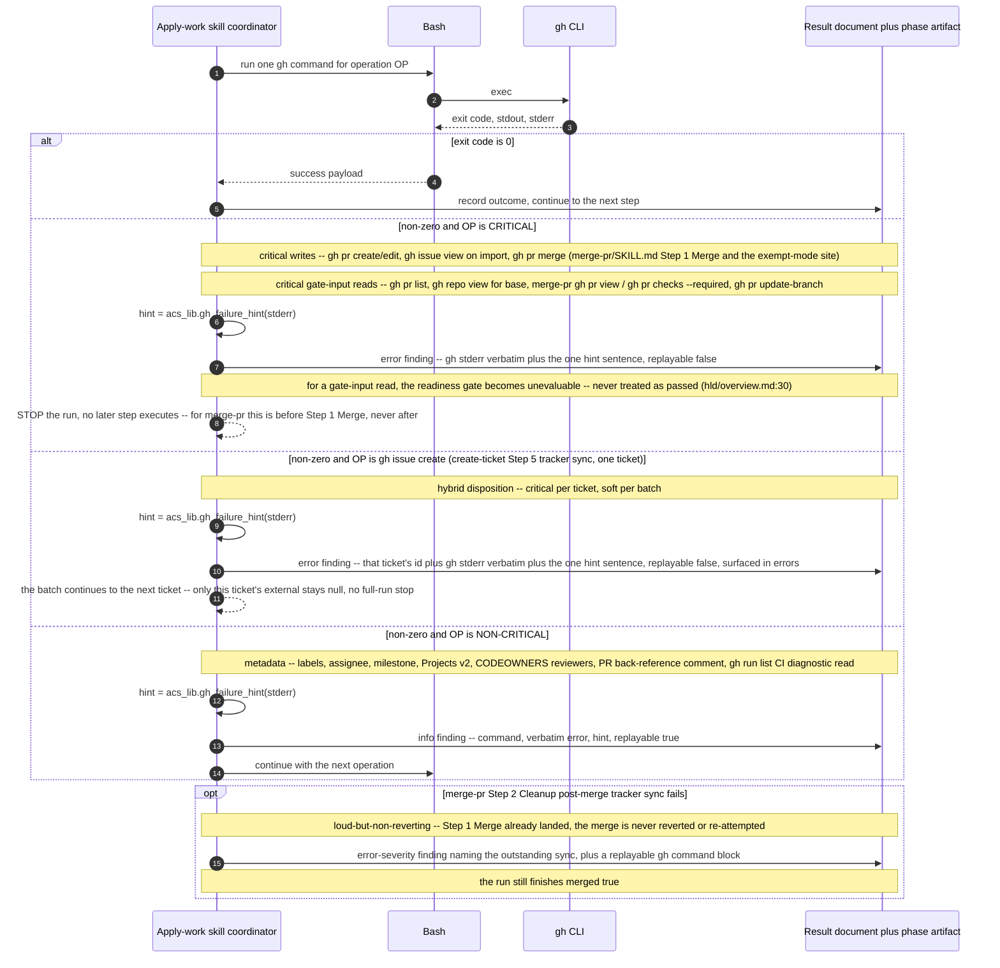

# Flow — GitHub call failure policy (criticality classification)

`gh` is acs's **sole** GitHub transport in every environment (ADR-0088; no
GitHub MCP fallback, clarification C-6 of epic MAR-401). Every in-scope `gh`
call site across `create-ticket/SKILL.md`, `create-pr/SKILL.md`, and
`merge-pr/SKILL.md` is classified into one of four disposition classes:
**critical** (gh's verbatim stderr plus one canonical
`acs_lib.gh_failure_hint()` hint, then stop — no silent fallback to any
other transport); **critical per ticket, soft per batch** (an error-severity
finding for that one item, but the batch continues — `create-ticket/
SKILL.md`'s `gh issue create` tracker-sync call); **non-critical** (one
`info` finding plus a replayable `gh` command block, never abort); or
**loud-but-non-reverting** (an error-severity finding naming the outstanding
sync, but an already-completed action — such as a merge — is never reverted
or re-attempted). The classes are defined by consequence, not by
write-versus-read: a gate-input read whose failure leaves a readiness gate
unevaluable is critical, because an unevaluable gate is never treated as
passed (`hld/overview.md:30`).

## Sequence — one gh call site, all four classes, and the post-merge exception

## merge-pr's two merge sites carry the identical rule

`### Step 1 — Merge` (`merge-pr/SKILL.md`, gated only when all Step 0
readiness dimensions pass or Step 1a's BEHIND carve-out succeeds) and
`## Exempt non-ticket PR mode` (the `gh pr merge` call reached via the
sanctioned `/acs:merge-pr --pr <PRNUMBER>` path named in `CLAUDE.md`) run the
identical critical rule at the identical command: verbatim stderr + the
canonical hint, stop **before** `### Step 2 — Cleanup` ever runs. Step 2's
own tracker sync (`gh issue close`, Projects Status→Done) is the one
loud-but-non-reverting exception in this policy: by the time Step 2 runs, the
merge in Step 1 has already landed, so a Step-2 failure is reported — never
grounds to revert or re-attempt the merge — and the run still finishes
`merged: true`.
