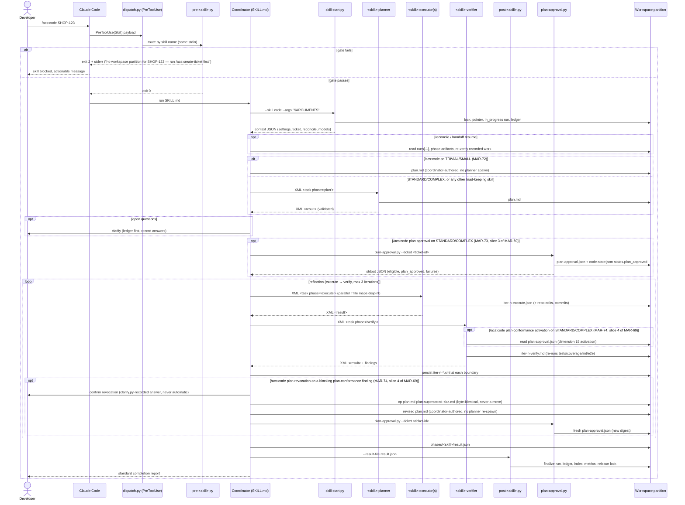

# Flow — Hook-gated skill run

The core runtime flow: every hooked skill, direct invocation. (Under `/ship`
the coordinator invokes the same flow directly — see `ship-pipeline.md`.)

The diagram below shows the **full reflection triad** (planner → executor →
verifier), which is how the twelve triad-keeping skills run (`create-prd`,
`create-architecture`, `create-project`, `create-quality`,
`create-operations`, `create-principles`, `create-standards`,
`create-design`, `code`, `docs-sync`, `standardize-project`,
`create-requirements` — `/acs:code` is the example traced here; the diagram's
`PL->>WS` plan write is therefore labeled `plan.md`, `/acs:code`'s single
per-ticket plan artifact (MAR-70) — the other eleven triad skills write
`iter-n-plan.md` there instead. Because `/acs:code` is the traced example and
MAR-71 (slice 1b of MAR-69) moved its plan phase out of the loop, the `CO->>PL`
/ `PL->>WS` steps below happen **once, before** the `loop reflection` block for
`/acs:code`; for the other eleven triad skills the plan step instead sits
**inside** the `loop reflection` block, a shape this `/acs:code`-traced diagram
no longer draws. Those same two steps are additionally **lane-conditional**
since MAR-72: they fire on STANDARD/COMPLEX only; on TRIVIAL/SMALL the
coordinator writes `plan.md` itself and there is no `PL` participant leg at
all for that run (ADR 0074) — see the `alt` branch below). The three **apply-work
skills** (`create-ticket`, `create-pr`, `merge-pr`) run **inline** instead
(MAR-60): the coordinator performs the steps directly or delegates to **at most
one executor**, with **no planner and no verifier subagent** in any lane —
their correctness is gated upstream by `/code`'s verifier (`create-pr`,
`merge-pr`) or by the schema plus the user-confirmation gate (`create-ticket`).
Immediately after the plan step and before the reflection loop, on
STANDARD/COMPLEX only, `/acs:code` also runs `plan-approval.py`, which
records a deterministic plan-approval verdict and gates nothing this release
(MAR-73, slice 3 of MAR-69). The `code-verifier` now reads that record itself
for dimension 15 (plan conformance) — never a coordinator-relayed value — and
when dimension 15 blocks because the *plan* is wrong rather than the
changeset, the boundary-gated revocation path copies `plan.md` to
`plan-superseded-<k>.md`, revises it, and re-runs `plan-approval.py` for a
fresh record; the record still gates nothing (MAR-74, slice 4 of MAR-69, ADR
0073).

Failure shapes: iteration cap → `failed` with findings recorded; coverage
hard-fail → `failed`, `/create-pr` gate stays closed; crash → `in_progress`
left behind, SessionEnd marks `interrupted`, next run reconciles.

The `CO->>WS: persist iter-n-*.xml at each boundary` step above is itself
lane-conditional for `/acs:code`'s plan phase (**D-4**, MAR-72): on
TRIVIAL/SMALL no `<task phase="plan">` message is ever sent and no
`<result>` is returned, so there is no plan XML to validate and no
`iter-<n>-plan.xml` snapshot to persist — the execute/verify XML persistence
in the `loop reflection` block above is unaffected in every lane.

## Verify-depth scaling (MAR-58 / D4)

The iteration ceiling for the reflection loop is **lane-driven**:

- **TRIVIAL/SMALL lanes** (low/normal stakes): cap = **1** iteration — light
  verify (single verifier pass that may iterate once on blocking findings).
- **STANDARD/COMPLEX lanes** (or any high-stakes ticket): cap = **3** iterations
  — full verify (execute → verify loop, with the plan authored once
  before it starts rather than a per-iteration plan→execute→verify loop, + full
  16-dimension review + e2e when configured); the cap counts execute+verify
  rounds (MAR-71, slice 1b of MAR-69).

The ceiling is determined by `verify_depth(ticket.lane, ticket.stakes)` in
`acs_lib.py` (see `VERIFY_ITERATION_CAP`). High-stakes tickets ALWAYS use full
verify regardless of size (stakes floor; AC-2).

This initial ceiling is the **starting** value only. At the start of each
iteration `/code` runs the in-loop **upward escalation check** (MAR-57): on a
verifier finding signaling higher stakes/size, a `recommend_stakes` glob match
firing `"high"`, or an explicit user/agent request, `guard_axes` clamps each
axis upward and `escalate_lane` recomputes the lane via `derive_lane`; the
ceiling is then raised to `max(current, new)` — **monotone, never lowered**.
Completed iterations are preserved (no restart). De-escalation is never
automatic. If escalation crosses the fast→full fold boundary (TRIVIAL/SMALL →
STANDARD/COMPLEX), the iteration ceiling and verify depth are raised to the
escalated lane's values; there is no stage re-entry and no re-spawn of any
prior phase — including no retro-spawn of a `code-planner` for a run that
started on a fast lane (**D-3**, MAR-72): the escalation raises verify depth
and the iteration ceiling only; it never spawns a planner after the fact.
Completed iterations are preserved (`code/SKILL.md`'s "In-loop
escalation check" section).

**The verifier subagent runs in every lane as the in-loop gate (C-5).** Light
verify reduces the iteration ceiling only — the verifier always runs; there is
no inline human-approval gate. The TDD/coverage gate (Coverage hard fail) is
never trimmed by the verify-depth selection and applies in full in every lane.
