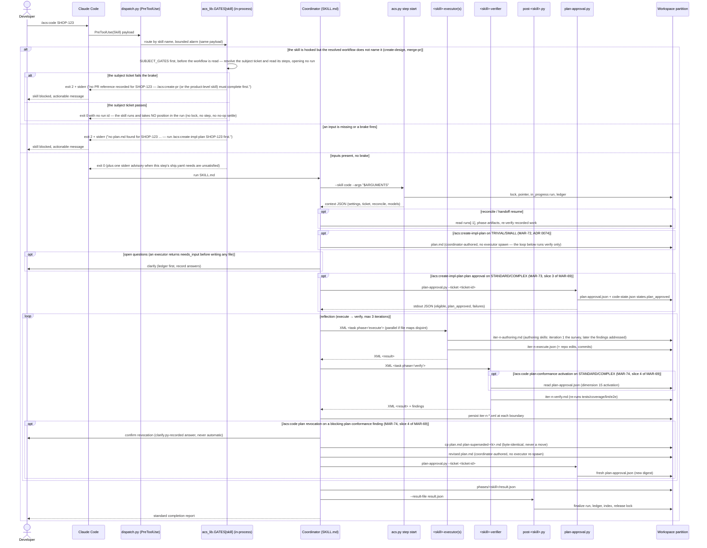

# Flow — Hook-gated skill run

The core runtime flow: every hooked skill, direct invocation. (Under `/ship`
the coordinator invokes the same flow directly — see `ship-pipeline.md`.)

This flow is **also** exactly what a leg of `/acs:project` or `/acs:code`
runs (a leg declares itself with `disable-model-invocation: true`; there is no
registry). The entry-point fold changed only who may invoke those skills,
never how they run: the entry point invokes each leg as a genuine Skill-tool
call, so the `PreToolUse(Skill)` gate, `acs.py step start`, the reflection
loop and the `post-` hook all fire for real, precisely as drawn below. Read every `/acs:create-project`-style
name in this file as the skill, not as a command a user types.

The diagram below shows the **reflection loop** (execute → verify), which is
how the twelve authoring skills run (`create-prd`, `create-architecture`,
`create-project`, `create-design`, `docs-sync`, `standardize-project`,
`create-requirements`, `analyze-requirements`, `create-impl-plan`,
`create-api-contract`, `create-test-docs`, `create-e2e-tests`), and how
`code` and `create-docs` run it too. No skill has a plan phase (ADR 0092):
for an authoring skill, iteration 1's executor surveys first, records the
survey in `iter-n-authoring.md`, and authors the deliverable from it; the
verifier judges the deliverable against those notes among its other
dimensions. `/acs:code` is the example traced here: it enters the loop with
the `plan.md` that `/acs:create-impl-plan` approved as an input (ADR 0089),
so its executor writes no authoring notes. The per-iteration re-plan left
the loop first (MAR-71, slice 1b of MAR-69, for `/acs:code`; MAR-300 for
`/acs:docs-sync`; MAR-301 for `/acs:create-project`; MAR-302 for
`/acs:standardize-project`; MAR-305 for `/acs:create-prd`, which also
covered the four doc-set legs since folded into `/acs:create-docs`, ADR
0094; then `/acs:create-architecture`, `/acs:create-design` and
`/acs:create-requirements`), and ADR 0092 then retired the plan phase
itself, so iteration-2+ findings route straight to the executor's
`<context>` in every skill. One execute leg is **lane-conditional**:
`/acs:create-impl-plan`'s, since MAR-72 — its executor (whose survey is the
former `code-planner` charter) is spawned on STANDARD/COMPLEX only; on
TRIVIAL/SMALL the coordinator writes `plan.md` itself and there is no `EX`
participant leg at all for that run (ADR 0074) — see the `opt` branch
below. No other skill has a lane-conditional executor — each runs a fixed
iteration cap of 3 in every lane. The three **apply-work skills**
(`create-ticket`, `create-pr`, `merge-pr`) run **inline** instead (MAR-60):
the coordinator performs the steps directly or delegates to **at most one
executor**, with **no verifier subagent** in any lane — their correctness is
gated upstream by `/code`'s verifier (`create-pr`, `merge-pr`) or by the
schema plus the user-confirmation gate (`create-ticket`). Immediately after
the plan is authored and before the reflection loop, on STANDARD/COMPLEX
only, `/acs:create-impl-plan` also runs `plan-approval.py`, which records a
deterministic plan-approval verdict and gates nothing this release (MAR-73,
slice 3 of MAR-69). `/acs:review-code`'s plan-conformance lens reads that
record itself — never a coordinator-relayed value — and when it blocks because
the *plan* is wrong rather than the changeset, the revocation path preserves
the revoked plan under `steps/create-impl-plan/iter-<n>/plan.md`, revises the
one plan at the step root, and re-runs `plan-approval.py` for a
fresh record; the record still gates nothing (MAR-74, slice 4 of MAR-69, ADR
0073).

Failure shapes: iteration cap → `failed` with findings recorded; coverage
hard-fail → `failed`, `/create-pr` gate stays closed; crash → `in_progress`
left behind, SessionEnd marks `interrupted`, next run reconciles.

The `CO->>WS: persist iter-n-*.xml at each boundary` step above is itself
lane-conditional for `/acs:create-impl-plan`'s execute phase (**D-4**,
MAR-72): on TRIVIAL/SMALL no `<task phase="execute">` message is ever sent
and no `<result>` is returned, so there is no execute XML to validate and no
`iter-<n>-execute.xml` snapshot to persist — the verify XML persistence in
the `loop reflection` block above is unaffected in every lane.

**Gate evidence.** One of the diagram's steps carries an undrawn
responsibility: the `PRE` participant's gate check also records that it fired
(the skill and the time, in `sessions/<checkout>-gate.json`) before it passes
or blocks, in its own fail-open `try/except` so a write failure can never turn
into a blocked gate, and `SS` spends that evidence once to record whether the
run was gated. Neither step measures usage: `POST` records no token count and
no dollar figure, and nothing reads a transcript
([ADR 0104](../../../adr/0104-no-usage-dashboards-no-usage-recording.md)).

**File-map guard denials (MAR-578).** The `PreToolUse` write-tool guard is not
a participant in this diagram at all — it runs per write tool call inside the
executor's own step, not at a skill boundary — and it carries one further
undrawn responsibility, detailed in full in the dedicated
`file-map-guard-deny.md` flow: since MAR-578 each write it denies also appends
one entry to that executor's `runs[-1].guard_events`, which `post-<skill>.py`
then derives into `states.review.guard_denials`. It records on a deny only —
never on any of the guard's fail-open branches — and never changes the deny it
describes, so no gate, exit code or warning in the flow above moves.

## Delivery-path routing (ADR-0095)

The iteration ceiling for the reflection loop is **path-driven**, and the path
is **judged once, from the plan, and recorded** — never derived per run.

`/acs:create-impl-plan` judges the change onto one of four delivery paths
from the plan's own scope and writes it into the plan's `## Contract` block —
its only home (ADR-0098). Every later read takes that recorded value, which is
what keeps a resumed run on the path its first session chose. `/acs:code`
reads it with `acs.py plan path` and dispatches to that path's leg:

| Path | Leg | Executors | Plan approval |
|---|---|---|---|
| `trivial` | `code-trivial` | one | not required |
| `small` | `code-small` | one, rarely two | not required |
| `standard` | `code-standard` | one per disjoint file-map partition | enforced |
| `complex` | `code-complex` | one per partition **+ an integration executor** | enforced |

**The verifier column and the ceiling column are gone from this table, and
that is the point.** Both were review properties, so both left with the
review (ADR-0099): the review's shape is `/acs:review-code`'s on every path,
and the ceiling is the workflow's single `loops[].max_iterations` (3),
counting `code` → `review-code` rounds. There is no depth function, no
`VERIFY_ITERATION_CAP` table and no lane to derive: `derive_lane`,
`verify_depth`, `escalate_lane`, `guard_axes` and `recommend_stakes` were all
retired with the `size`/`stakes` axes they read.

**The ceiling does not move mid-run.** ADR-0042's upward escalation check and
ADR-0034's boundary-only de-escalation are both gone, and deliberately: they
were a correction loop for a classification made before anyone had looked at
the work. The remedy for a path that turns out wrong is a **replan** —
`/acs:review-code`'s path-audit lens raises it, the step ends `failed` with a
summary naming the plan as superseded, the run re-enters
`/acs:create-impl-plan`, and the corrected plan is judged fresh. That fixes the artifact everything
downstream reads instead of compensating for it.

**The verifier subagent runs on every path as the in-loop gate (C-5).** A
cheaper path spends less looking — fewer executors, one verifier instead of
four merged lenses, one fewer iteration — never less rigor per dimension it
checks. The TDD/coverage gate (Coverage hard fail) is identical on all four.

## Amendment — skills-independence refactor (ADR-0089)

The `PRE` participant's check changed kind, not position. It still runs
in-process under `dispatch.py`'s bounded alarm, still fails closed, and exit 2
is still the block. What it evaluates is now only:

- the **inputs** the skill about to run reads — the partition resolves;
  `plan.md` for `/acs:code`;
  `plan.md` plus an `api_surface: true` `analysis.md` for
  `/acs:create-api-contract`; a configured e2e suite plus at least one
  e2e-typed case in `test-cases.md` for `/acs:create-e2e-tests`; and
- a small set of **safety brakes** — the partition `.lock`, the epic refusal,
  `/acs:create-pr`'s `verifier_passed` brake (narrowed to a ticket that HAS a
  recorded `code` run), `/acs:create-design`'s `needs_design` brake, and
  `/acs:merge-pr`'s recorded-PR requirement.

A repo document is not among them: the PRD `/acs:create-architecture` needs,
and the architecture set `/acs:create-project`, `/acs:standardize-project`
and `/acs:create-docs` need, are checked by the skill itself at Start, since
no setting says where either lives ([ADR-0102](../../../adr/0102-documents-are-found-not-configured.md)).

No gate refuses a skill for a predecessor's POSITION: `_require_completed`
is deleted. The one gate that reads another step's status is
`/acs:merge-pr`'s subject brake, which asks whether the step that recorded
the PR reference completed (`gates._pr_recorded_for`) — an artifact, not a
position.
When the skill IS a step of the resolved `workflows/ship.yaml` and that step's
a step that precedes it in `ship.yaml` has not completed, the gate passes and
prints one stderr line — `acs: docs-sync normally follows code in ship.yaml;
code has not completed for SHOP-123` — suppressed by
`settings.workflow.advisories: false` and by any read it cannot complete. The
order itself is enforced one layer up, by `/acs:ship`'s loop over
`acs.py run next` (`ship-pipeline.md`).

`acs gate --skill <s>` re-runs this same `PRE` participant with `mutate=False`,
judging a run PROJECTED in memory (`run.projected_run`) rather than one it
creates, so it reproduces the hook's exit code and its stderr while creating no
run, taking no lock, opening no step and settling no no-op. It is drawn as no
step of this flow on purpose: `cmd_gate` is a CLI query, not a `PreToolUse`
event.

Two other participants in the diagram moved with the refactor. The
plan-authoring `EX` leg and the `PA` leg belong to `/acs:create-impl-plan`
now, not `/acs:code`: the plan phase, `code-planner.md` (as
`create-impl-plan-planner.md`, and since ADR 0092 the survey section of
`create-impl-plan-executor.md`) and `plan-approval.py`'s invocation all
moved there, so a `/acs:code` run draws no plan-authoring step at all and
enters the reflection loop directly with the approved plan as an input. And `WS` splits in two: the phase artifacts,
verdicts, ledger and lock stay in the workspace partition, while the plan and
the other human-facing ticket documents are written to the fixed
`docs/tickets/<ID>/` in the repo (ADR-0090, ADR-0102).
