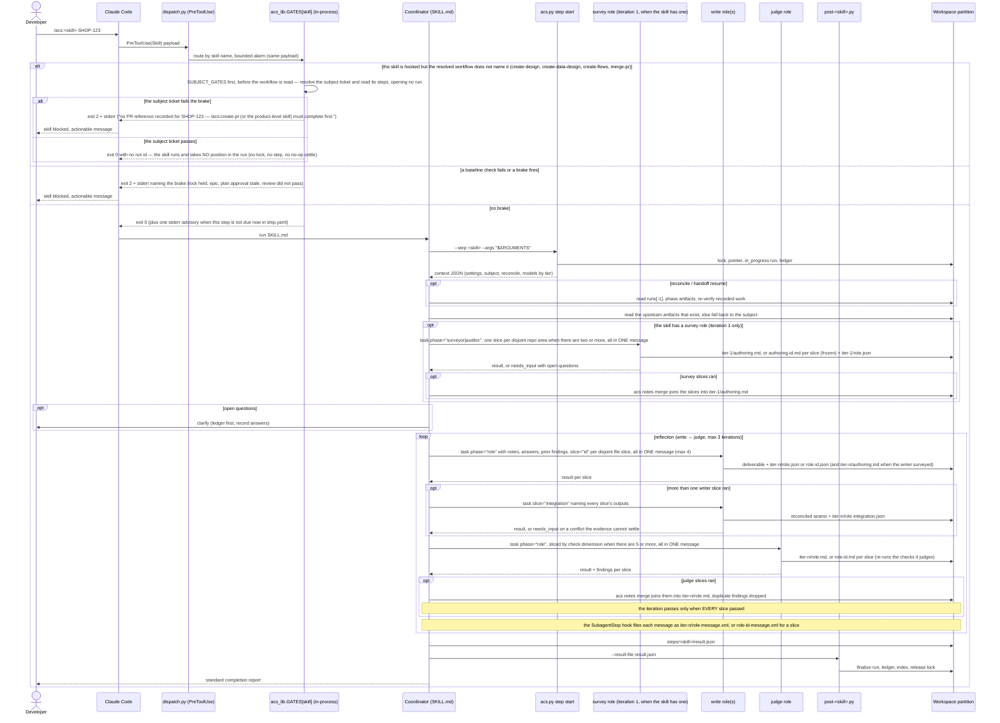

# Flow — Hook-gated skill run

The core runtime flow: every hooked skill, direct invocation. (Under `/ship`
the coordinator invokes the same flow directly — see `ship-pipeline.md`.)

This flow is **also** exactly what a leg of `/acs:code` runs (the legs are
one table, `acs_lib.skills.SKILL_LEGS`; there is no per-skill manifest). The
entry-point fold changed only who may invoke those skills, never how they
run: the entry point invokes each leg as a genuine Skill-tool call, so the
`PreToolUse(Skill)` gate (resolved to `code`'s), `acs.py step start`, and the
`post-` hook all fire for real, precisely as drawn below. Read every
`/acs:code-standard`-style name in this file as the skill, not as a command a
user types.

The diagram below shows the **reflection loop** (write → judge), which is
how the eleven authoring skills run (`create-prd`, `create-architecture`,
`create-design`, `create-data-design`, `create-flows`, `docs-sync`, `analyze-requirements`, `create-impl-plan`,
`create-api-contract`, `create-test-docs`, `create-e2e-tests`). Each skill spawns its own roles, named for its
work (ADR 0109): an optional **survey** role (`create-prd-surveyor`,
`analyze-requirements-impact-analyst`) on iteration 1
only, which records the survey in `iter-1/authoring.md` and freezes it; a
**write** role that authors the deliverable (and, with no survey role before
it, surveys first); and a **judge** role that judges the deliverable against
those notes among its other dimensions. No skill has a plan phase before its
writer (ADR 0092), so iteration-2+ findings route straight to the write
role's `<context>`. `/acs:analyze-requirements` runs the same loop on a
controller (ADR 0114): `acs.py analysis next` hands its coordinator one action
at a time and the `record-*` verbs derive each transition — the pass, stall
detection, the cap of 3 and publication — from the snapshots the
`SubagentStop` hook writes, rather than from the coordinator's reading. `/acs:create-impl-plan`'s `planner` authors `plan.md` on
every run: the MAR-72/ADR 0074 fork on which the coordinator wrote it itself
went with the lanes (ADR 0095). `/acs:code` runs no loop of its own: its
legs spawn `code-implementer`s against the approved plan, and the review is
`/acs:review-code`, a step of its own. The three **apply-work skills**
(`create-ticket`, `create-pr`, `merge-pr`) run **inline** instead: the
coordinator performs the steps from its `references/` and spawns **no
subagent** in any lane — their correctness is gated upstream by
`/acs:review-code` (`create-pr`, `merge-pr`) or by the schema plus the
user-confirmation gate (`create-ticket`). On the standard and complex paths,
`plan-approval.py` records a deterministic plan-approval verdict over the
approved plan (MAR-73, slice 3 of MAR-69). `/acs:review-code`'s
plan-conformance lens reads that record itself — never a coordinator-relayed
value — and when it blocks because the *plan* is wrong rather than the
changeset, the revocation path preserves the revoked plan under
`steps/create-impl-plan/iter-<n>/plan.md`, revises the one plan at the step
root, and re-runs `plan-approval.py` for a fresh record (MAR-74, slice 4 of
MAR-69, ADR 0073).

```mermaid
sequenceDiagram
    actor Dev as Developer
    participant CC as Claude Code
    participant D as dispatch.py (PreToolUse)
    participant PRE as acs_lib.GATES[skill] (in-process)
    participant CO as Coordinator (SKILL.md)
    participant SS as acs.py step start
    participant SV as survey role (iteration 1, when the skill has one)
    participant WR as write role(s)
    participant JG as judge role
    participant POST as post-<skill>.py
    participant WS as Workspace partition

    Dev->>CC: /acs:<skill> SHOP-123
    CC->>D: PreToolUse(Skill) payload
    D->>PRE: route by skill name, bounded alarm (same payload)
    alt the skill is hooked but the resolved workflow does not name it (create-design, create-data-design, create-flows, merge-pr)
        PRE->>PRE: SUBJECT_GATES first, before the workflow is read — resolve the subject ticket and read its steps, opening no run
        alt the subject ticket fails the brake
            PRE-->>CC: exit 2 + stderr ("no PR reference recorded for SHOP-123 — /acs:create-pr (or the product-level skill) must complete first.")
            CC-->>Dev: skill blocked, actionable message
        else the subject ticket passes
            PRE-->>CC: exit 0 with no run id — the skill runs and takes NO position in the run (no lock, no step, no no-op settle)
        end
    else a baseline check fails or a brake fires
        PRE-->>CC: exit 2 + stderr naming the brake (lock held, epic, plan approval stale, review did not pass)
        CC-->>Dev: skill blocked, actionable message
    else no brake
        PRE-->>CC: exit 0 (plus one stderr advisory when this step is not due now in ship.yaml)
        CC->>CO: run SKILL.md
        CO->>SS: --step <skill> --args "$ARGUMENTS"
        SS->>WS: lock, pointer, in_progress run, ledger
        SS-->>CO: context JSON (settings, subject, reconcile, models by tier)
        opt reconcile / handoff resume
            CO->>WS: read runs[-1], phase artifacts, re-verify recorded work
        end
        CO->>WS: read the upstream artifacts that exist, else fall back to the subject
        opt the skill has a survey role (iteration 1 only)
            CO->>SV: task phase="surveyor|auditor", one slice per disjoint repo area when there are two or more, all in ONE message
            SV->>WS: iter-1/authoring.md, or authoring-id.md per slice (frozen) + iter-1/role.json
            SV-->>CO: result, or needs_input with open questions
            opt survey slices ran
                CO->>WS: acs notes merge joins the slices into iter-1/authoring.md
            end
        end
        opt open questions
            CO->>Dev: clarify (ledger first, record answers)
        end
        loop reflection (write → judge, max 3 iterations)
            CO->>WR: task phase="role" with notes, answers, prior findings, slice="id" per disjoint file slice, all in ONE message (max 4)
            WR->>WS: deliverable + iter-n/role.json or role-id.json (and iter-n/authoring.md when the writer surveyed)
            WR-->>CO: result per slice
            opt more than one writer slice ran
                CO->>WR: task slice="integration" naming every slice's outputs
                WR->>WS: reconciled seams + iter-n/role-integration.json
                WR-->>CO: result, or needs_input on a conflict the evidence cannot settle
            end
            CO->>JG: task phase="role", sliced by check dimension when there are 5 or more, all in ONE message
            JG->>WS: iter-n/role.md, or role-id.md per slice (re-runs the checks it judges)
            JG-->>CO: result + findings per slice
            opt judge slices ran
                CO->>WS: acs notes merge joins them into iter-n/role.md, duplicate findings dropped
                Note over CO,WS: the iteration passes only when EVERY slice passed
            end
            Note over CO,WS: the SubagentStop hook files each message as iter-n/role-message.xml, or role-id-message.xml for a slice
        end
        CO->>WS: steps/<skill>/result.json
        CO->>POST: --result-file result.json
        POST->>WS: finalize run, ledger, index, release lock
        CO-->>Dev: standard completion report
    end
```

Failure shapes: iteration cap → `failed` with findings recorded; a failed
review → `/create-pr` gate stays closed; crash → `in_progress` left behind,
SessionEnd marks `interrupted`, next run reconciles.

**Fan-out (ADR-0110).** Each of `SV`, `WR` and `JG` may be several instances
of the same agent over disjoint slices, spawned in one message and capped at
four per phase. A slice's task and result carry `slice="<id>"`, which is how
its report (`<role>-<id>.*`, `authoring-<id>.md`) and its snapshot
(`<role>-<id>-message.xml`) avoid their siblings'. The joins are
deterministic (`acs.py notes merge`, by `## ` heading; a missing slice fails
it), and a join is followed by a synthesis: the `slice="integration"` writer
pass over the seams, a `## Synthesis` section in a single writer's notes over
merged survey slices, and the coordinator's de-duplication of judge findings.
A resumed iteration re-runs only the slices whose report is missing. With
several writers live, the file-map guard judges a write against its own
writer's map when the payload names the agent, else against the union of
every live writer's scope (`file-map-guard-deny.md`).

**Gate evidence.** One of the diagram's steps carries an undrawn
responsibility: the `PRE` participant's gate check also records that it fired
(the skill and the time, in `sessions/<checkout>-gate.json`) before it passes
or blocks, in its own fail-open `try/except` so a write failure can never turn
into a blocked gate, and `SS` spends that evidence once to record whether the
run was gated. Neither step measures usage: `POST` records no token count and
no dollar figure, and nothing reads a transcript
([ADR 0104](../../adr/0104-no-usage-dashboards-no-usage-recording.md)).

**File-map guard denials (MAR-578).** The `PreToolUse` write-tool guard is not
a participant in this diagram at all — it runs per write tool call while a
write role runs, not at a skill boundary — and it carries one further
undrawn responsibility, detailed in full in the dedicated
`file-map-guard-deny.md` flow: since MAR-578 each write it denies also appends
one entry to that step's `runs[-1].guard_events`, which `post-<skill>.py`
then derives into `states.review.guard_denials`. It records on a deny only —
never on any of the guard's fail-open branches — and never changes the deny it
describes, so no gate, exit code or warning in the flow above moves.

## Delivery-path routing (ADR-0095)

The iteration ceiling for the reflection loop is **path-driven**, and the path
is **judged once, from the plan, and recorded** — never derived per run.

`/acs:create-impl-plan` judges the change onto one of four delivery paths
from the plan's own scope and writes it into the plan's `## Contract` block —
its only home (ADR-0098). Every later read takes that recorded value, which is
what keeps a resumed run on the path its first session chose. `/acs:code`
reads it with `acs.py plan path` and dispatches to that path's leg:

| Path | Leg | Implementers | Plan approval |
|---|---|---|---|
| `trivial` | `code-trivial` | one | not required |
| `small` | `code-small` | one, rarely two | not required |
| `standard` | `code-standard` | one per disjoint file-map partition | enforced |
| `complex` | `code-complex` | one per partition **+ an integration implementer** | enforced |

**The review column and the ceiling column are gone from this table, and
that is the point.** Both were review properties, so both left with the
review (ADR-0099): the review's shape is `/acs:review-code`'s on every path,
and the ceiling is the workflow's single `loops[].max_iterations` (3),
counting `code` → `review-code` rounds. There is no depth function, no
`VERIFY_ITERATION_CAP` table and no lane to derive: `derive_lane`,
`verify_depth`, `escalate_lane`, `guard_axes` and `recommend_stakes` were all
retired with the `size`/`stakes` axes they read.

**The ceiling does not move mid-run.** ADR-0042's upward escalation check and
ADR-0034's boundary-only de-escalation are both gone, and deliberately: they
were a correction loop for a classification made before anyone had looked at
the work. The remedy for a path that turns out wrong is a **replan** —
`/acs:review-code`'s path-audit lens raises it, the step ends `failed` with a
summary naming the plan as superseded, the run re-enters
`/acs:create-impl-plan`, and the corrected plan is judged fresh. That fixes the artifact everything
downstream reads instead of compensating for it.

**The review runs on every path as the gate (C-5).** A cheaper path spends
less implementing — fewer implementers — never less rigor per dimension the
review checks. The TDD/coverage gate (Coverage hard fail) is identical on all
four.

## Amendment — skills-independence refactor (ADR-0089)

The `PRE` participant's check changed kind, not position. It still runs
in-process under `dispatch.py`'s bounded alarm, still fails closed, and exit 2
is still the block. What it evaluates is now only:

- the **baseline** — the settings validate and the subject resolves; and
- a small set of **safety brakes** — the partition `.lock`, the epic refusal,
  `/acs:code`'s plan-approval brake on the standard and complex paths,
  `/acs:create-pr`'s `verifier_passed` brake (narrowed to a run that HAS a
  recorded `/acs:review-code` step), `/acs:create-design`'s `needs_design`
  brake, and `/acs:merge-pr`'s recorded-PR requirement.

It never checks that an upstream artifact exists (ADR 0109): each skill reads
what it finds and falls back to the run's subject. A repo document is not
checked either: the PRD `/acs:create-architecture` reads (and works without,
from the subject) is found by the skill itself at Start, since no setting
says where it lives ([ADR-0102](../../adr/0102-documents-are-found-not-configured.md)).

No gate refuses a skill for a predecessor's POSITION: `_require_completed`
is deleted. The one gate that reads another step's status is
`/acs:merge-pr`'s subject brake, which asks whether the step that recorded
the PR reference completed (`gates._pr_recorded_for`) — an artifact, not a
position.
When the skill IS a step of the resolved `workflows/ship.yaml` and is not one
of the steps due now (the cursor's stage — every unfinished member of a
parallel group is due together), the gate passes and prints one stderr line —
`acs: review-code normally follows code in ship.yaml; the cursor for SHOP-123
is code` — suppressed by `settings.workflow.advisories: false` and by any read
it cannot complete. The
order itself is enforced one layer up, by `/acs:ship`'s loop over
`acs.py run next` (`ship-pipeline.md`).

`acs gate --skill <s>` re-runs this same `PRE` participant with `mutate=False`,
judging a run PROJECTED in memory (`run.projected_run`) rather than one it
creates, so it reproduces the hook's exit code and its stderr while creating no
run, taking no lock, opening no step and settling no no-op. It is drawn as no
step of this flow on purpose: `cmd_gate` is a CLI query, not a `PreToolUse`
event.

The plan-authoring write role belongs to `/acs:create-impl-plan`, not
`/acs:code`: the plan phase and `code-planner.md` (as the survey section of
`create-impl-plan-planner.md`) moved there, so a `/acs:code` run draws no
plan-authoring step at all and its implementers start from the approved plan
as an input. And `WS` splits in two: the phase artifacts,
verdicts, ledger and lock stay in the workspace partition, while the plan and
the other human-facing documents are written to the run's phase folders in the
repo — the plan and test cases under `docs/development/<feature>/<id>/`, the
design records under `lld/<feature>/<id>/` — and never to a
`docs/tickets/<ID>/` folder, which is only read for older tickets (ADR-0128).
