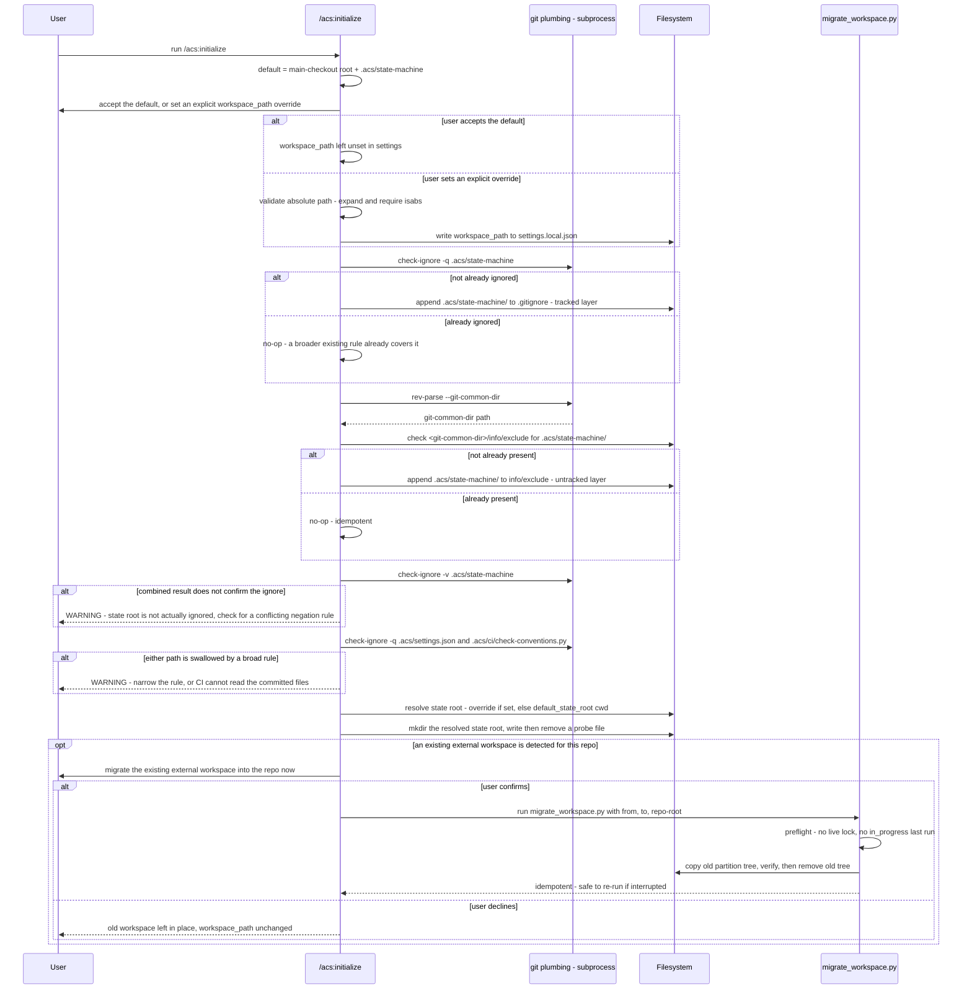

# Flow — `/acs:initialize` state-root setup

`/acs:initialize` sets up the acs workspace root on every fresh run and every
re-run. After the default-vs-override choice is collected, the skill retrofits
the in-repo state root's gitignore coverage through two independent layers,
verifies the combined result, guards against a broad ignore rule swallowing
committed CI-readable files, creates and write-probes the resolved state root,
and — only when an existing external workspace is detected for this repo —
offers a user-confirmed, one-shot migration into the new in-repo location. See
the companion `initialize-state-root-setup.evidence.md` sidecar for the code
anchors this doc would otherwise cite inline.

## Sequence diagram

Both gitignore-coverage warnings above are non-fatal: `/acs:initialize` warns
and continues rather than hard-failing, since a conflicting negation rule or a
pre-existing broad `.acs/` ignore is the user's own configuration to fix, not
something init itself can safely resolve. The migration offer only ever
triggers when an external `workspace_path` is detected pointing at a directory
that already contains a partition tree for this repo; when none is detected,
the branch is skipped entirely and nothing is asked.
