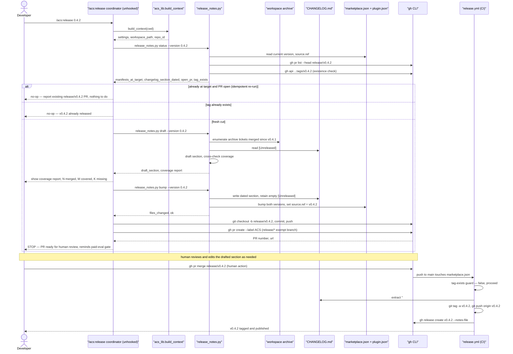

# Flow — cut-release

A developer runs `/acs:release <version>`; the coordinator probes idempotency
first, then drafts and dates the CHANGELOG section from the merged-ticket
archive, bumps both manifests + `source.ref`, and opens an exempt `release/*`
PR — stopping for a mandatory human merge before the existing `release.yml`
workflow tags and publishes. Transcribed verbatim from the binding design
(`MAR-128/design.md` "Sequence diagrams" → "Flow — cut-release").

Composes with [`ticket-lifecycle.md`](ticket-lifecycle.md) for the PR that
precedes a release (every ticket merged since the last tag is the population
`release_notes.py draft` enumerates from the archive).
