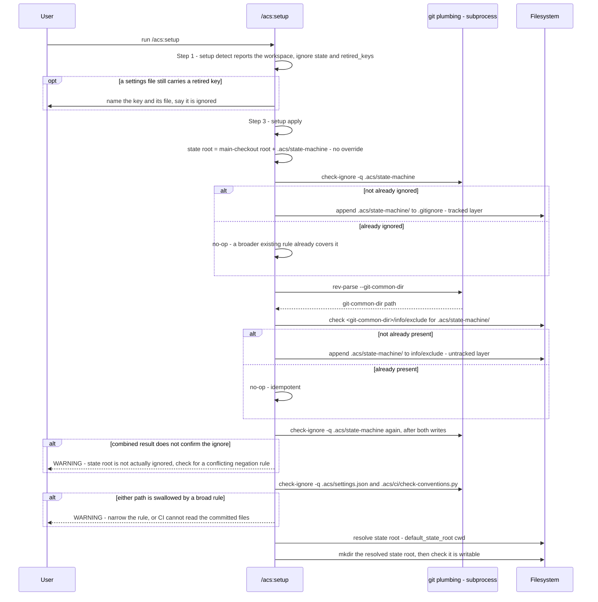

# Flow — `/acs:setup` state-root setup

`/acs:setup` sets up the acs workspace root on every fresh run and every
re-run. The state root is always the in-repo default — there is no override
to choose ([ADR-0102](../../../adr/0102-documents-are-found-not-configured.md)) — so the skill retrofits
the in-repo state root's gitignore coverage through two independent layers,
verifies the combined result, guards against a broad ignore rule swallowing
committed CI-readable files, creates the resolved state root and checks it is writable,
and names any retired settings key still in a settings file as ignored. The
reads are `setup detect` (Step 1) and the writes are `setup apply` (Step 3),
both in `setup_wizard.py`. See the companion `setup-state-root-setup.evidence.md`
sidecar for the code anchors this doc would otherwise cite inline.

Setup is optional, and nothing depends on this flow having run
([ADR-0105](../../../adr/0105-acs-runs-without-setup.md)): the state root
ignores itself, because the first state write under it creates
`.acs/state-machine/.gitignore` containing `*`. The two layers below are
kept for a repo that runs setup, not needed by one that never does.

## Sequence diagram

Both gitignore-coverage warnings above are non-fatal: `/acs:setup` warns
and continues rather than hard-failing, since a conflicting negation rule or a
pre-existing broad `.acs/` ignore is the user's own configuration to fix, not
something init itself can safely resolve. Moving state that an older acs kept
in an external workspace is not part of setup: `migrate_workspace.py` does it
by hand ([workspace-and-state.md](../../../requirements/functional/workspace-and-state.md)).
