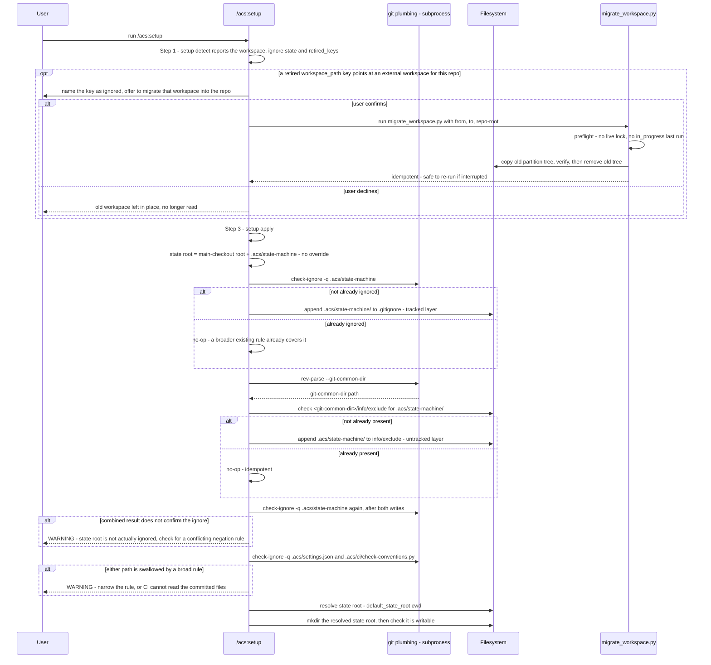

# Flow — `/acs:setup` state-root setup

`/acs:setup` sets up the acs workspace root on every fresh run and every
re-run. The state root is always the in-repo default — there is no override
to choose ([ADR-0102](../../../adr/0102-documents-are-found-not-configured.md)) — so the skill retrofits
the in-repo state root's gitignore coverage through two independent layers,
verifies the combined result, guards against a broad ignore rule swallowing
committed CI-readable files, creates the resolved state root and checks it is writable,
and — only when a retired `workspace_path` key still points at an external
workspace left by an older acs for this repo — offers a user-confirmed, one-shot
migration into the new in-repo location. The reads are `setup detect` (Step 1)
and the writes are `setup apply` (Step 3), both in `setup_wizard.py`; the
migration offer is made at Step 1, before anything is asked. See
the companion `setup-state-root-setup.evidence.md` sidecar for the code
anchors this doc would otherwise cite inline.

## Sequence diagram

Both gitignore-coverage warnings above are non-fatal: `/acs:setup` warns
and continues rather than hard-failing, since a conflicting negation rule or a
pre-existing broad `.acs/` ignore is the user's own configuration to fix, not
something init itself can safely resolve. The migration offer only ever
triggers when a settings file still carries the retired `workspace_path` key
pointing at an external workspace left by an older acs — a directory that
already contains a partition tree for this repo; when there is none, the
branch is skipped entirely and nothing is asked.
