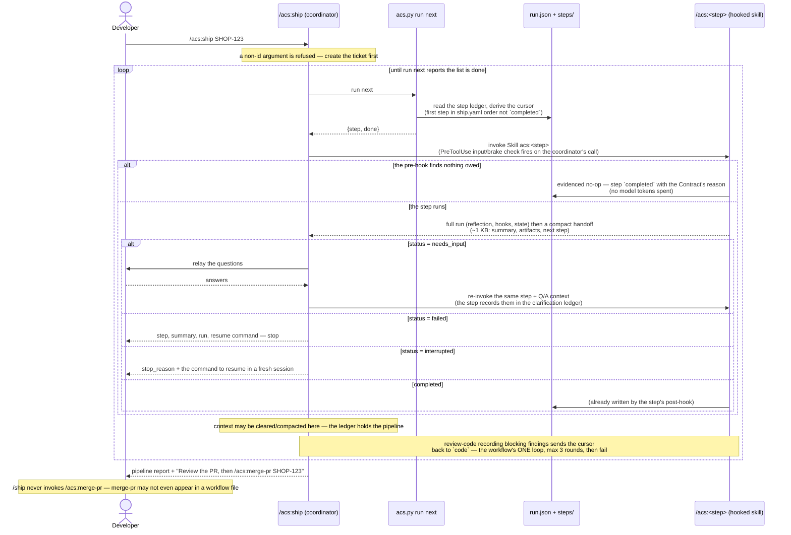
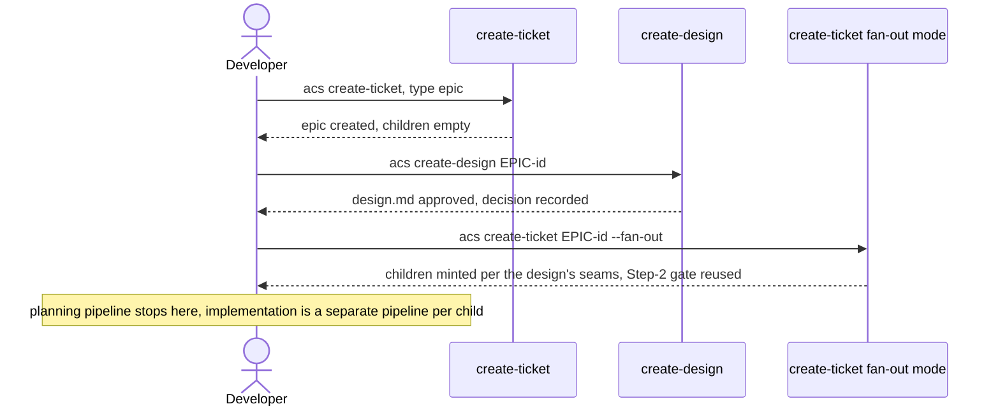

# Flow — /ship pipeline orchestration

`/ship` adds orchestration only, and it adds it by **reading a declaration**:
the step order lives in `plugins/acs/workflows/ship.yaml` (or the consumer's
`.acs/workflows/ship.yaml`, which replaces it wholesale). The coordinator
loops over `acs.py run next`, which prints the run's **derived** cursor — the
first step in that list the run has not recorded `completed`. No new state:
the ledger is the only memory `/ship` needs, and the cursor is computed from
it on every call rather than stored beside it, so the two cannot disagree.

**The workflow is a list, not a DAG.** Version 3 carries a `version`, a flat
list of skill names and one `loops:` entry; `when`, `paths`, `requires`,
`needs`, `max_parallel`, `exclusive`, `on_fail`, `boundary`, `delivery`,
`id`, `name` and `stop_after` are all rejected by the schema (ADR-0096).
Every step runs on every run: a step that owes nothing records an **evidenced
no-op** from the plan's `## Contract` block, in its own pre-hook, at no token
cost.

`/ship` takes a **ticket id**. This diagram is therefore the whole of what it
drives — the implementation walk for a subject that already exists (and, for
an epic child, has already been fanned out). `create-ticket` and
`create-design` are Design-phase work that runs before it; see "Planning
pipeline (epics)" below.



Properties: every pre-hook still fires on the coordinator's direct Skill call
(no bypass) — it checks that step's **inputs** and **safety brakes**, not its
position, so the declared order is enforced by this walk rather than by the
gates. `/ship` stops before `merge-pr` because `create-pr` is the last name
in the list, not because of a `stop_after` key. Re-running `/ship <ticket>`
re-derives the cursor and continues from it; a step recorded `failed`,
`interrupted` or `in_progress` is not `completed`, so the cursor is still on
it. There is no parallel mode: one step at a time, with parallelism inside a
step (`/acs:review-code`'s five lenses, `/acs:create-docs`'s sets) remaining
that skill's own business. Epic fan-out — its own `--fan-out` invocation, run
once after the epic's design is approved, never part of the epic's creation
run — mints the children, and each child's implementation walk above then
runs independently (parallel worktrees supported).

## Planning pipeline (epics)

An epic follows a separate, shorter pipeline before any child's
implementation loop starts: it is created childless, its design is
approved, and only then are children minted — never at the epic's own
creation time.



The epic path in one sentence: `create-ticket` (epic, `children: []`) →
`create-design` → `create-ticket <epic-id> --fan-out` → STOP; implementation
is the separate, per-child pipeline diagrammed above.

## The declared order

```yaml
version: 3
steps:
  - analyze-requirements
  - create-impl-plan
  - create-api-contract
  - create-test-docs
  - code
  - review-code
  - create-e2e-tests
  - run-e2e-tests
  - docs-sync
  - create-pr
loops:
  - from: review-code
    back_to: code
    max_iterations: 3
    on_exhausted: fail
```

Three things are worth saying about that list, because each replaced a
mechanism this document used to describe at length:

- **`review-code` is a step, not a phase inside `code`** (ADR-0099). Five
  parallel lenses, one fresh-context adjudicator per finding, then a final
  gate running build, lint, the full unit suite and coverage — the only place
  the suite runs. `create-pr`'s brake reads this step's `verifier_passed`.
- **The delivery path is judged by `/acs:create-impl-plan` and recorded in
  the plan's `## Contract` block** (ADR-0098), not by `/acs:ship` and not on
  the run ledger. `/acs:code` reads it with `acs.py plan path` and dispatches
  to the matching leg. The path and its one-sentence reason are also what the
  metrics layer slices by (G14/G15), in place of the retired `lane`.
- **`create-api-contract`, `create-test-docs`, `create-e2e-tests` and
  `run-e2e-tests` are unconditional steps that may cost nothing.** Each reads
  the Contract's `owes` flags in its own pre-hook and records an evidenced
  no-op when nothing is owed. That is what replaced the `when:` predicates,
  and the difference is accountability: the skill that owns the question
  answers it and records why, so the same answer is reached whether `/ship`
  reached the skill or a person typed it.

> **History.** Earlier revisions of this flow described a DAG walk over
> `acs.py workflow next` with `needs`/`when`/`requires` predicates, a
> `parallel` mode with one git worktree per leg, a `boundary:
> full_verify_stop` that ended the run `handed_off` after `code`, an
> `on_fail: {relay_to: code}` fix-loop counter on the e2e step, a
> `delivery:` block, and `workflows/phases.yaml` as the skill registry. All
> of it is removed in v0.5.0 — see ADR-0096 (the workflow is a list),
> ADR-0097 (two state machines; `handed_off` is `interrupted` plus a
> `stop_reason`), ADR-0098 (the path is the plan's) and ADR-0099 (the review
> is a step). The mechanisms those notes introduced that still stand — doc
> sync on the same branch as additional commits, never a second PR; a
> ticket-scoped e2e run after the code is written; the epic planning pipeline
> above — are stated in their own right in this document rather than as
> amendments.
