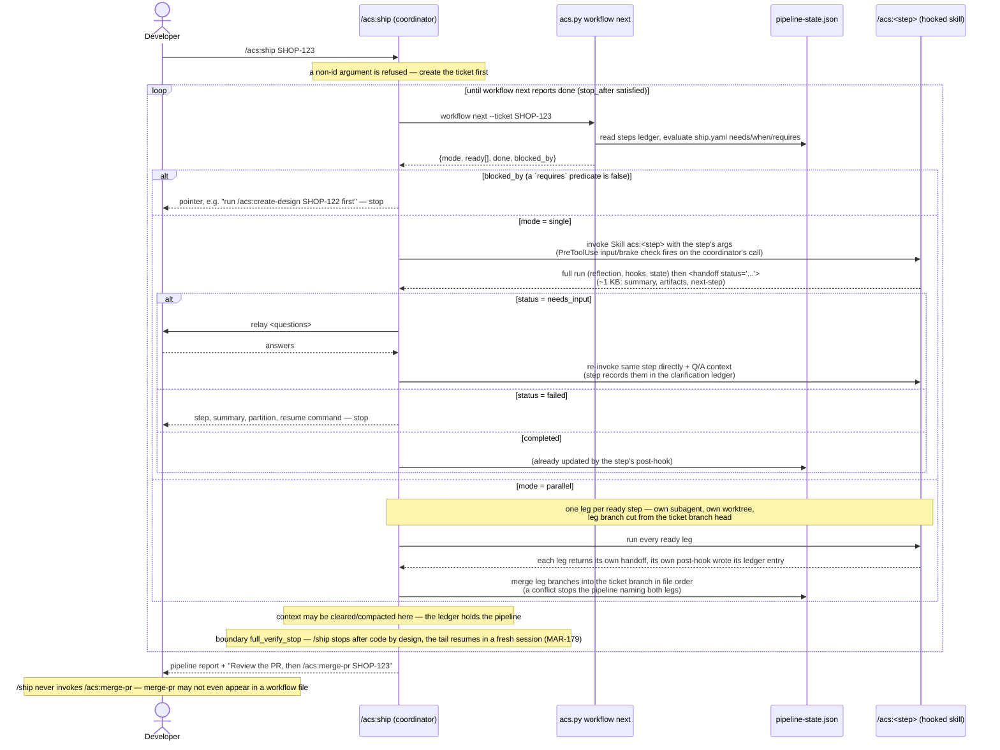
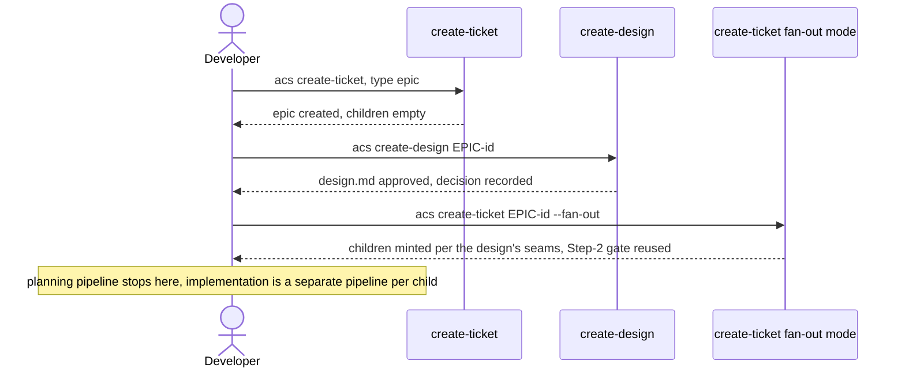

# Flow — /ship pipeline orchestration

`/ship` adds orchestration only, and since the skills-independence refactor it
adds it by **reading a declaration**: the step order lives in
`plugins/acs/workflows/ship.yaml` (or the consumer's
`.acs/workflows/ship.yaml`, which replaces it wholesale), and the coordinator
loops over `acs.py workflow next`, which evaluates that DAG against the
ticket's existing `pipeline-state.json`. No new state: the ledger is still the
only memory `/ship` needs. Each ready step is invoked **directly** via the
Skill tool in the coordinator's own context, returning a compact `<handoff>`.

`/ship` takes a **ticket id**. This diagram is therefore the whole of what it
drives — the implementation walk for a ticket that has already been created
(and, for an epic child, already fanned out). `create-ticket` and
`create-design` are Design-phase work that runs before it; see "Planning
pipeline (epics)" below.

Properties: every pre-hook still fires on the coordinator's direct Skill call
(no bypass) — it now checks that step's **inputs** and **safety brakes**, not
its position, so the declared order is enforced by this walk rather than by
the gates (ADR-0089). Re-running `/ship <ticket>` re-evaluates `workflow next`
against the ledger and continues from whatever is ready; a step recorded
`failed`, `interrupted`, `in_progress` or `handed_off` is simply ready again,
and a failed leg does not cancel its siblings. Epic fan-out — its own
`--fan-out` invocation, run once after the epic's design is approved, never
part of the epic's creation run — mints the children, and each child's
implementation walk above then runs independently (parallel worktrees
supported).

## Planning pipeline (epics)

An epic follows a separate, shorter pipeline before any child's
implementation loop starts: it is created childless, its design is
approved, and only then are children minted — never at the epic's own
creation time.

The epic path in one sentence: `create-ticket` (epic, `children: []`) →
`create-design` → `create-ticket <epic-id> --fan-out` → STOP; implementation
is the separate, per-child pipeline diagrammed above.

> **NOTE (MAR-56):** The ship coordinator reads `ticket.lane` from `ticket.json` (written
> by `/create-ticket`) to determine which pipeline steps are active. The `lane` field is
> always derived from the ticket's authoritative axes (`size` × `stakes`) via
> `derive_lane(size, stakes, needs_design, type)`. This field is available in
> `pipeline-state.json` (alongside `flow`) and in `tickets-index.json` (alongside
> `needs_design`) for observability and metrics (G14/G15).
>
> **NOTE (MAR-161 — supersedes the MAR-59 fast-lane-fold note):**
> The standalone spec-authoring skill no longer exists (ADR 0066 supersedes ADR 0006). The
> `[create-design]` bracketing above is still conditional — on
> `ticket.needs_design`, independent of lane — but there is no
> bracketed spec-authoring step on any lane: `/code`'s plan's author (the
> planner on STANDARD/COMPLEX, the coordinator on TRIVIAL/SMALL — MAR-72)
> self-authors the five-section spec content (Scope, Approach, API/data
> changes, Test plan, Out of scope) inside its plan phase on EVERY lane when
> `<partition>/specs/` is absent or empty, and reads pre-existing specs
> unchanged when they are present (backward-compat with tickets minted
> before this ADR). See `ship/SKILL.md` "Pipeline order" (the `code` row) and
> `code/SKILL.md`'s "Spec authoring fold" section.
>
> **NOTE (MAR-159):** The pipeline also gains a new **conditional** step between
> `code` and `create-pr` — a post-code, pre-create-pr `/acs:test --for-ticket <id>`
> invocation. It is gated by `settings.post_code_test`: OFF only when neither
> `settings.e2e` nor `suites.e2e` is configured (per AC-5); ON otherwise, or
> whenever `post_code_test.enabled` is explicitly set to `true`/`false`. On
> failure the step increments `pipeline-state.json.steps.test.fix_loops`
> (capped by `post_code_test.fix_loops_cap`, default 2) and relays back into
> `/acs:code <ticket-id>` via the pipeline's existing "Re-invoke after
> needs_input" pattern — no new relay mechanism. See `ship/SKILL.md`
> "Pipeline order" and "Post-code test gate", and ADR 0068
> (`docs/adr/0068-acs-test-ticket-scoped-fix-and-retest-mode.md`).
>
> **NOTE (MAR-160):** The pipeline gains one more step, `docs-sync`, inserted
> between `code`/`test` and `create-pr` — a new hooked triad skill
> (`docs-sync-planner`/`-executor`/`-verifier`) that independently re-derives
> doc impact from `git diff <default_branch>...HEAD`, `/code`'s
> `result.json`, and the final code-verify artifact, committing any doc
> updates as additional commits on the SAME ticket branch (never a new
> branch, never a new PR). `gate_create_pr` now also requires `docs-sync`
> `completed`, alongside its existing `code` `completed` +
> `verifier_passed: true` checks. See `design.md`'s sequence diagram 1 and
> `ship/SKILL.md` "Pipeline order" / "Picking the next step".
>
> **NOTE (MAR-179):** On a full-verify lane the coordinator stops right
> after `code` completes and before the post-code test gate, ending
> `handed_off`; the remaining steps run in a fresh `/acs:ship <ticket-id>`
> resumed from `pipeline-state.json`. Light lanes are unaffected. Which
> steps run and in what order is unchanged. See `ship/SKILL.md` "Full-verify
> pipeline boundary".
>
> **NOTE (skills-independence refactor — supersedes the step-order clauses of
> the MAR-159 and MAR-160 notes above; their mechanisms stand):** the steps and
> their conditions are no longer stated in `ship/SKILL.md` prose at all. They
> are declared in `plugins/acs/workflows/ship.yaml` — `analyze-ticket` →
> `create-impl-plan` (`requires: design_approved`) → `create-api-contract`
> (`when: api_surface_changed`) → `create-test-docs` → `code`
> (`exclusive: true`, `boundary: full_verify_stop`,
> `on_replan: create-impl-plan`) → `create-e2e-tests`
> (`when: e2e_configured`) ∥ `docs-sync` → `run-e2e-tests`
> (`when: post_code_test_active`, `on_fail: {relay_to: code, max_loops:
> post_code_test_fix_loops_cap}`) → `create-pr` (`stop_after`) — and evaluated
> by `acs.py workflow next`. Three consequences for the diagram above:
> `gate_create_pr` no longer requires `docs-sync` (or `code`) completed — that
> ordering is the walk's job now, and the gate keeps only its
> `verifier_passed` brake, itself narrowed to a ticket that HAS a recorded
> `code` run; the post-code test step is `run-e2e-tests` (today's `/acs:test`
> renamed, alias kept one release) and its fix-loop counter is the declared
> `on_fail`, not a prose rule; and the `code → create-pr` tail can run two
> steps at once, so the loop is a walk over a DAG rather than a line.
> The MAR-56 note's `ticket.lane` read now resolves the ticket document via
> `docs/tickets/<ID>/ticket.md` first and the partition's `ticket.json` second
> (ADR-0090); the field and its derivation are unchanged. See ADR 0089 and
> ADR 0090.
