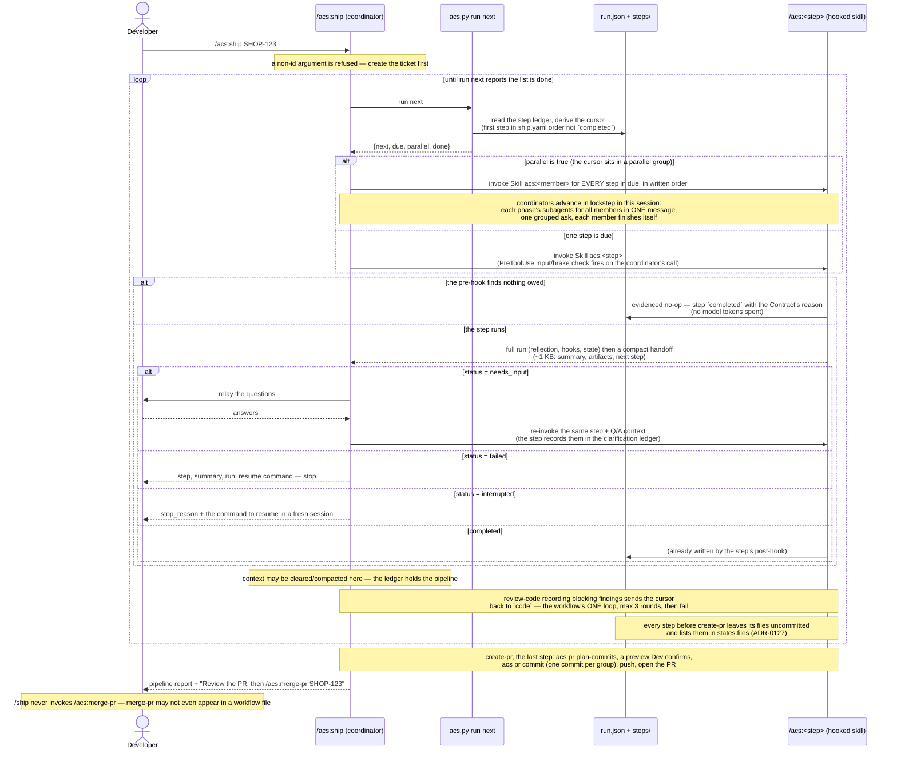
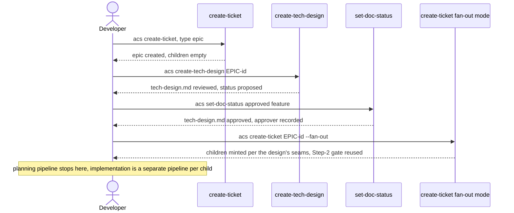

# Flow — /ship pipeline orchestration

`/ship` adds orchestration only, and it adds it by **reading a declaration**:
the step order lives in `plugins/acs/workflows/ship.yaml` (or the consumer's
`.acs/workflows/ship.yaml`, which replaces it wholesale). The coordinator
loops over `acs.py run next`, which prints the run's **derived** cursor — the
first step in that list the run has not recorded `completed`. No new state:
the ledger is the only memory `/ship` needs, and the cursor is computed from
it on every call rather than stored beside it, so the two cannot disagree.

**The workflow is a list, not a DAG.** Version 3 carries a `version`, a
list of step entries and one `loops:` entry. An entry is a skill name or a
list of two or more — a **parallel group** (ADR-0110), whose members run side
by side and which completes when every member has; `when`, `paths`, `requires`,
`needs`, `max_parallel`, `exclusive`, `on_fail`, `boundary`, `delivery`,
`id`, `name` and `stop_after` are all rejected by the schema (ADR-0096).
Every step runs on every run: a step that owes nothing records an **evidenced
no-op** from the plan's `## Contract` block, in its own pre-hook, at no token
cost.

`/ship` takes a **ticket id**. This diagram is therefore the whole of what it
drives — the implementation walk for a subject that already exists (and, for
an epic child, has already been fanned out). `create-ticket` and
`create-tech-design` are Design-phase work that runs before it; see "Planning
pipeline (epics)" below.


```mermaid
sequenceDiagram
    actor Dev as Developer
    participant SH as /acs:ship (coordinator)
    participant WF as acs.py run next
    participant WS as run.json + steps/
    participant SK as /acs:<step> (hooked skill)

    Dev->>SH: /acs:ship SHOP-123
    note over SH: a non-id argument is refused — create the ticket first
    loop until run next reports the list is done
        SH->>WF: run next
        WF->>WS: read the step ledger, derive the cursor<br/>(first step in ship.yaml order not `completed`)
        WF-->>SH: {next, due, parallel, done}
        alt parallel is true (the cursor sits in a parallel group)
            SH->>SK: invoke Skill acs:<member> for EVERY step in due, in written order
            note over SH,SK: coordinators advance in lockstep in this session:<br/>each phase's subagents for all members in ONE message,<br/>one grouped ask, each member finishes itself
        else one step is due
            SH->>SK: invoke Skill acs:<step><br/>(PreToolUse input/brake check fires on the coordinator's call)
        end
        alt the pre-hook finds nothing owed
            SK->>WS: evidenced no-op — step `completed` with the Contract's reason<br/>(no model tokens spent)
        else the step runs
            SK-->>SH: full run (reflection, hooks, state) then a compact handoff<br/>(~1 KB: summary, artifacts, next step)
            alt status = needs_input
                SH->>Dev: relay the questions
                Dev-->>SH: answers
                SH->>SK: re-invoke the same step + Q/A context<br/>(the step records them in the clarification ledger)
            else status = failed
                SH-->>Dev: step, summary, run, resume command — stop
            else status = interrupted
                SH-->>Dev: stop_reason + the command to resume in a fresh session
            else completed
                SK->>WS: (already written by the step's post-hook)
            end
        end
        note over SH: context may be cleared/compacted here — the ledger holds the pipeline
        note over SH,SK: review-code recording blocking findings sends the cursor<br/>back to `code` — the workflow's ONE loop, max 3 rounds, then fail
        note over SK,WS: every step before create-pr leaves its files uncommitted<br/>and lists them in states.files (ADR-0127)
    end
    note over SH,SK: create-pr, the last step: acs pr plan-commits, a preview Dev confirms,<br/>acs pr commit (one commit per group), push, open the PR
    SH-->>Dev: pipeline report + "Review the PR, then /acs:merge-pr SHOP-123"
    note over Dev: /ship never invokes /acs:merge-pr — merge-pr may not even appear in a workflow file
```

Properties: every pre-hook still fires on the coordinator's direct Skill call
(no bypass) — it checks that step's **inputs** and **safety brakes**, not its
position, so the declared order is enforced by this walk rather than by the
gates. `/ship` stops before `merge-pr` because `create-pr` is the last name
in the list, not because of a `stop_after` key. Re-running `/ship <ticket>`
re-derives the cursor and continues from it; a step recorded `failed`,
`interrupted` or `in_progress` is not `completed`, so the cursor is still on
it. Steps overlap only where the list declares a parallel group: `run next`
then reports every unfinished member in `due`, and `/ship` invokes them all
and drives their coordinators in lockstep inside its own session — a step's
coordinator runs in the invoking session, so two steps cannot each get a
session of their own within one run. Invariant I1 allows the members of one
group, and nothing else, to be `in_progress` at once; when a member fails,
the others finish the phase in flight, are recorded `interrupted`, and the run
stops. Parallelism inside a step — sliced writers, judges and surveys, joined
by `acs.py notes merge` (ADR-0110) — remains that skill's own business.

**Nothing is committed until `create-pr`** (ADR-0127). Every step before it
writes into the working tree on whatever branch is checked out and records
the paths it wrote; the run's `baseline.json`, written by its first `acs.py
step start`, says what was already dirty before. `create-pr` turns the
changeset into a commit plan (`acs.py pr plan-commits`: the ticket docs, the
design docs, per plan slice its tests then its code, `docs-sync`'s updates,
the e2e suites), shows it as a preview the developer confirms or edits, then
`acs.py pr commit` creates the ticket branch when needed and commits each group
by pathspec before the push. A changed file no step recorded is left out and
listed; a file that was dirty at the baseline is never swept in. Epic fan-out — its own `--fan-out` invocation, run
once after the epic's design is approved, never part of the epic's creation
run — mints the children, and each child's implementation walk above then
runs independently (parallel worktrees supported — and needed when two run at
once, since nothing is committed before `create-pr`).

## Planning pipeline (epics)

An epic follows a separate, shorter pipeline before any child's
implementation loop starts: it is created childless, its design is
approved, and only then are children minted — never at the epic's own
creation time.


```mermaid
sequenceDiagram
    actor Dev as Developer
    participant CT as create-ticket
    participant CD as create-tech-design
    participant SDS as set-doc-status
    participant FO as create-ticket fan-out mode

    Dev->>CT: acs create-ticket, type epic
    CT-->>Dev: epic created, children empty
    Dev->>CD: acs create-tech-design EPIC-id
    CD-->>Dev: tech-design.md reviewed, status proposed
    Dev->>SDS: acs set-doc-status approved feature
    SDS-->>Dev: tech-design.md approved, approver recorded
    Dev->>FO: acs create-ticket EPIC-id --fan-out
    FO-->>Dev: children minted per the design's seams, Step-2 gate reused
    note over Dev: planning pipeline stops here, implementation is a separate pipeline per child
```

The epic path in one sentence: `create-ticket` (epic, `children: []`) →
`create-tech-design` → `set-doc-status approved` (the team's sign-off on the
hand-off, ADR-0135) → `create-ticket <epic-id> --fan-out` → STOP; implementation
is the separate, per-child pipeline diagrammed above. Each child runs in a
worktree of its own when two are in flight at once: one checkout has one
working tree, and so one changeset.

## The declared order

```yaml
version: 3
steps:
  - analyze-requirements
  - create-impl-plan
  - create-test-docs
  - code
  - review-code
  - [create-e2e-tests, docs-sync]   # a parallel group
  - run-e2e-tests
  - create-pr
loops:
  - from: review-code
    back_to: code
    max_iterations: 3
    on_exhausted: fail
```

Five things are worth saying about that list, because each replaced a
mechanism this document used to describe at length:

- **`review-code` is a step, not a phase inside `code`** (ADR-0099). Five
  parallel lenses, one fresh-context adjudicator per finding, then a final
  gate running build, lint, the full unit suite and coverage — the only place
  the suite runs. `create-pr`'s brake reads this step's `verifier_passed`.
- **The delivery path is judged by `/acs:create-impl-plan` and recorded in
  the plan's `## Contract` block** (ADR-0098), not by `/acs:ship` and not on
  the run ledger. `/acs:code` reads it with `acs.py plan path` and dispatches
  to the matching leg.
- **`create-test-docs`, `create-e2e-tests` and `run-e2e-tests` are
  unconditional steps that may cost nothing.** Each reads
  the Contract's `owes` flags in its own pre-hook and records an evidenced
  no-op when nothing is owed. That is what replaced the `when:` predicates,
  and the difference is accountability: the skill that owns the question
  answers it and records why, so the same answer is reached whether `/ship`
  reached the skill or a person typed it.
- **`[create-e2e-tests, docs-sync]` is a parallel group** (ADR-0110). Both
  follow the reviewed changeset and write disjoint files (suites vs docs) into
  the one working tree, uncommitted, so
  running them one after the other only cost wall time; `run-e2e-tests` waits
  for both and runs the suites the first one wrote. A group is declared,
  never derived, and neither end of a loop may sit inside one.
- **There is no `create-api-contract` step** (ADR-0134). An interface is
  designed before the run, in Design, by `/acs:create-api-contract`, which
  writes the living `lld/<feature>/api/` documents; `create-impl-plan` reads
  the approved contract and plans any machine-readable contract files, and
  `code` makes them.

> **History.** Earlier revisions of this flow described a DAG walk over
> `acs.py workflow next` with `needs`/`when`/`requires` predicates, a
> `parallel` mode with one git worktree per leg, a `boundary:
> full_verify_stop` that ended the run `handed_off` after `code`, an
> `on_fail: {relay_to: code}` fix-loop counter on the e2e step, a
> `delivery:` block, and `workflows/phases.yaml` as the skill registry. All
> of it is removed in v0.5.0 — see ADR-0096 (the workflow is a list),
> ADR-0097 (two state machines; `handed_off` is `interrupted` plus a
> `stop_reason`), ADR-0098 (the path is the plan's) and ADR-0099 (the review
> is a step). The mechanisms those notes introduced that still stand — doc
> sync in the same PR (its own commit since ADR-0127), never a second PR; a
> ticket-scoped e2e run after the code is written; the epic planning pipeline
> above — are stated in their own right in this document rather than as
> amendments.
