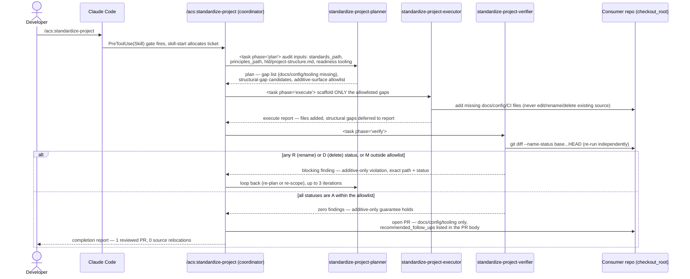

# Flow — /acs:standardize-project audit → scaffold → additive-only verify

The most safety-critical flow in the epic (D6). Modeled on the standard
hook-gated triad (`hook-gated-skill-run.md`) with the additive-only gate
made explicit at the verify phase.

Contract: the verifier never trusts the executor's self-report — it re-runs
`git diff --name-status` itself every iteration, mirroring how every other
acs verifier re-runs cheap checks rather than trusting recorded claims
(`code-verifier.md:9-11` "you never rubber-stamp... trust nothing recorded").
