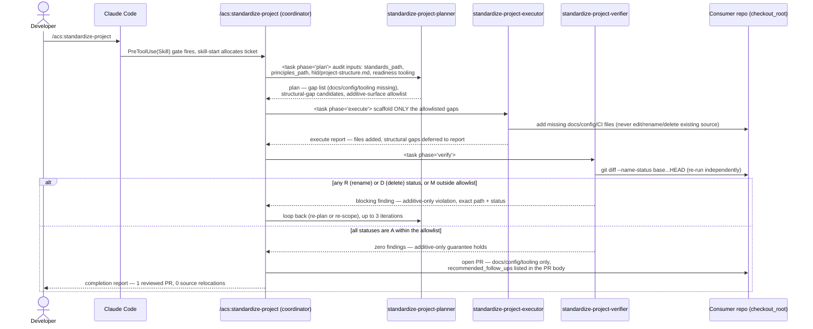

# Flow — /acs:standardize-project audit → scaffold → additive-only verify

The most safety-critical flow in the epic (D6). Modeled on the standard
hook-gated triad (`hook-gated-skill-run.md`) with the additive-only gate
made explicit at the verify phase.

Contract: the verifier never trusts the executor's self-report — it re-runs
`git diff --name-status` itself every iteration, mirroring how every other
acs verifier re-runs cheap checks rather than trusting recorded claims
(`code-verifier.md:9-11` "you never rubber-stamp... trust nothing recorded").

**E2E-2 delta note.** When `settings.e2e`/`suites.e2e` is set and
`.github/workflows/acs-e2e.yml` is missing, the executor's "add missing
docs/config/CI files" step (above) additionally scaffolds `acs-e2e.yml` +
`run-e2e.py` — reused verbatim from E2E-1's committed
`plugins/acs/templates/ci/` pair — under the SAME allowlist categories 1
("New CI workflow file(s)") + 2 ("…e2e runner scaffold config") this diagram
already governs. No new diagram, no new participant: the existing sequence
above already models this exact step. `/acs:standardize-project` never wires
branch protection itself; that stays with `/acs:init`.
