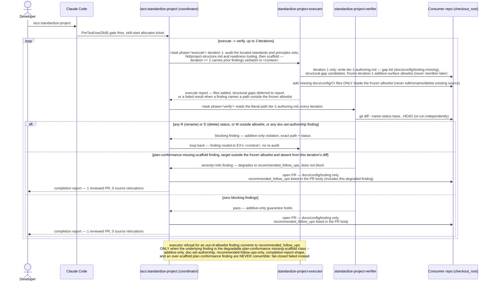

# Flow — /acs:standardize-project audit → scaffold → additive-only verify

The most safety-critical flow in the epic (D6). Modeled on the standard
hook-gated reflection loop (`hook-gated-skill-run.md`) with the additive-only
gate made explicit at the verify phase. There is no plan phase (ADR 0092):
iteration 1's executor audits first and records the audit — the gap list and
the frozen iteration-1 additive-surface allowlist — in its authoring notes,
`iter-1-authoring.md`, before it scaffolds anything; the verifier reads that
literal path every iteration.

```mermaid
sequenceDiagram
    actor Dev as Developer
    participant CC as Claude Code
    participant SP as /acs:standardize-project (coordinator)
    participant EX as standardize-project-executor
    participant VF as standardize-project-verifier
    participant Repo as Consumer repo (checkout_root)

    Dev->>CC: /acs:standardize-project
    CC->>SP: PreToolUse(Skill) gate fires, skill-start allocates ticket

    loop execute -> verify, up to 3 iterations
        SP->>EX: <task phase="execute"> iteration 1: audit the located standards and principles sets,<br/>hld/project-structure.md and readiness tooling, then scaffold —<br/>iteration >= 2 carries prior findings verbatim in <context>
        EX->>Repo: iteration 1 only: write iter-1-authoring.md — gap list (docs/config/tooling missing),<br/>structural-gap candidates, frozen iteration-1 additive-surface allowlist (never rewritten later)
        EX->>Repo: add missing docs/config/CI files ONLY inside the frozen allowlist (never edit/rename/delete existing source)
        EX-->>SP: execute report — files added, structural gaps deferred to report,<br/>or a failed result when a finding names a path outside the frozen allowlist
        SP->>VF: <task phase="verify"> reads the literal path iter-1-authoring.md, every iteration
        VF->>Repo: git diff --name-status base...HEAD (re-run independently)
        alt any R (rename) or D (delete) status, or M outside allowlist, or any doc-set-authorship finding
            VF-->>SP: blocking finding — additive-only violation, exact path + status
            SP->>EX: loop back — finding routed to EX's <context>, no re-audit
        else plan-conformance missing-scaffold finding, target outside the frozen allowlist and absent from this iteration's diff
            VF-->>SP: severity=info finding — degrades to recommended_follow_ups, does not block
            SP->>Repo: open PR — docs/config/tooling only,<br/>recommended_follow_ups listed in the PR body (includes this degraded finding)
            SP-->>Dev: completion report — 1 reviewed PR, 0 source relocations
        else zero blocking findings
            VF-->>SP: pass — additive-only guarantee holds
            SP->>Repo: open PR — docs/config/tooling only,<br/>recommended_follow_ups listed in the PR body
            SP-->>Dev: completion report — 1 reviewed PR, 0 source relocations
        end
    end

    Note over SP,EX: executor refusal for an out-of-allowlist finding converts to recommended_follow_ups<br/>ONLY when the underlying finding is the degradable plan-conformance missing-scaffold class --<br/>additive-only, doc-set-authorship, recommended-follow-ups-only, completion-report-shape,<br/>and an over-scaffold plan-conformance finding are NEVER convertible: fail-closed failed instead
```

Contract: the verifier never trusts the executor's self-report — it re-runs
`git diff --name-status` itself every iteration, mirroring how every other
acs verifier re-runs cheap checks rather than trusting recorded claims
(`code-verifier.md:9-11` "you never rubber-stamp... trust nothing recorded").
The allowlist it re-reads is the one iteration 1's executor froze in
`iter-1-authoring.md` (MAR-302 provenance, carried over from the plan
artifact it replaced under ADR 0092): the executor's writable surface is
monotonically non-increasing across iterations, and the verifier judges every
iteration against that same literal path rather than a per-iteration
re-derivation.

**E2E-2 delta note.** When `settings.e2e`/`suites.e2e` is set and
`.github/workflows/acs-e2e.yml` is missing, the executor's "add missing
docs/config/CI files" step (above) additionally scaffolds `acs-e2e.yml` +
`run-e2e.py` — reused verbatim from E2E-1's committed
`plugins/acs/templates/ci/` pair — under the SAME allowlist categories 1
("New CI workflow file(s)") + 2 ("…e2e runner scaffold config") this diagram
already governs. No new diagram, no new participant: the existing sequence
above already models this exact step. `/acs:standardize-project` never wires
branch protection itself; that stays with `/acs:setup`.
