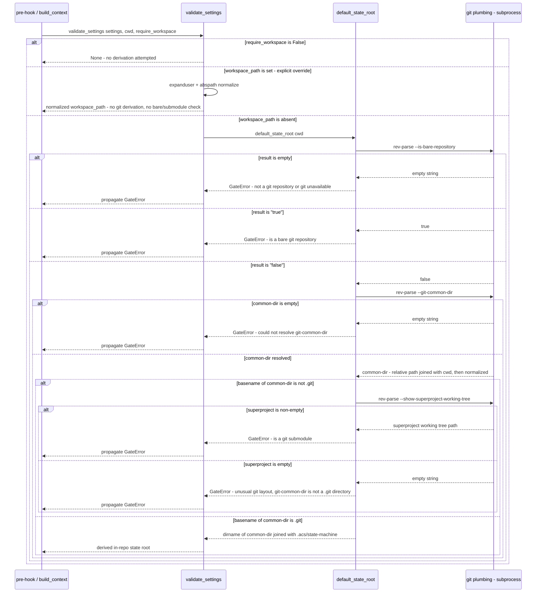

# Flow — State-root resolution

Every gated skill run resolves its workspace partition root through
`build_context` -> `validate_settings` in `acs_lib.py`. When
`require_workspace` is `True` (the default for every pre-hook) and the
loaded settings carry no explicit `workspace_path`, `validate_settings`
derives one via the new `default_state_root(cwd)` helper instead of
rejecting the value — the settings key is now optional, not a mandatory
outside-the-repo pointer. `default_state_root` walks git plumbing directly
(`_git`) rather than reusing `main_repo_root`, because `main_repo_root`
cannot itself distinguish a bare or submodule checkout from a normal one; it
raises a distinct `GateError` for each layout it cannot safely anchor a
state root to. See the companion `state-root-resolution.evidence.md`
sidecar for the code anchor this doc would otherwise cite inline.

## Sequence diagram

Failure shapes: every raised `GateError` above propagates unchanged through
`validate_settings` to the pre-hook, which exits 2 with the `GateError`'s
message and blocks the skill run (the same hook-gate mechanism traced in
`hook-gated-skill-run.md`) — there is no fallback or default-of-last-resort;
the caller is told to set an explicit `workspace_path` override. The success
leg never raises: a normal checkout, or a linked worktree of one, resolves
to the same `<main-checkout>/.acs/state-machine` path (proven for a linked
worktree by `tests/acs/test_acs_lib_state_locks.py`'s
`TestWorktreeSharedStateRoot` — the derived state root and repo-partition id
are identical from the main checkout and a linked worktree, while
`checkout_id` still differs between them, so concurrent locks from either
checkout land in the same partition). The `require_workspace=False` leg
(used by hooks that do not need a workspace, e.g. read-only checks) never
calls `default_state_root` at all and always returns `None`.
