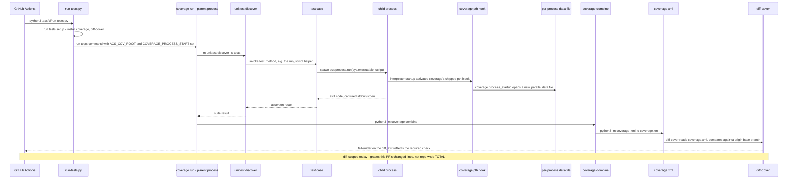

# Flow — tests-coverage-gate

This repo's own `Tests & coverage` required check (job name defined in
`acs-tests.yml:29`) runs `.acs/settings.json`'s `tests.command`. This
diagram captures the **intermediate** shape MAR-175 lands — `coverage
combine` feeding `coverage xml` feeding `diff-cover`, diff-scoped against
the PR's own changed lines — not the post-MAR-174 repo-wide `coverage
report --fail-under` end state that a later, separate change flips this
gate to. See the companion `tests-coverage-gate.evidence.md` sidecar for
the code anchors this doc would otherwise cite inline, and
MAR-168/design.md:561-588 for the design's own (post-flip) version of this
diagram, adapted here to the shape actually committed today.

## Sequence diagram

`coverage combine` merges every child process's parallel data file
(populated via coverage's own shipped subprocess-startup hook, activated by
`COVERAGE_PROCESS_START`) before `coverage xml` renders the merged result,
so `diff-cover` grades real, subprocess-inclusive measurement instead of an
empty or parent-process-only data file. `diff-cover`'s `--compare-branch`
flag scopes the check to lines changed against the PR's base branch — a
repo-wide TOTAL only becomes the gate once a later, separate change flips
`tests.command`'s tail from `coverage xml && diff-cover` to `coverage
report --fail-under=$ACS_COVERAGE`.

This doc covers this repo's own gate instance. The generic mechanism
(`acs-tests.yml` plus `.acs/ci/run-tests.py`, scaffolded by `/acs:init` for
any consumer repo) is unchanged by this measurement fix — no `plugins/`
file is touched.
