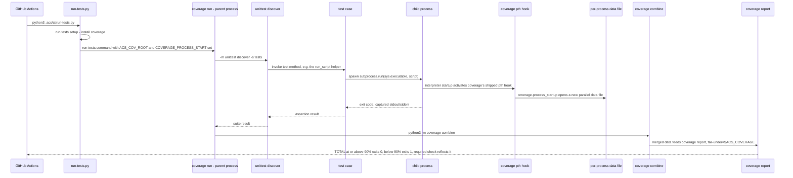

# Flow — tests-coverage-gate

This repo's own `Tests & coverage` required check (job name defined in
`acs-tests.yml:29`) runs `.acs/settings.json`'s `tests.command` — `coverage
combine` feeding `coverage report --fail-under`, graded repo-wide against
the whole measured `source` tree. See the companion
`tests-coverage-gate.evidence.md` sidecar for the code anchors this doc
would otherwise cite inline, and MAR-168/design.md:576-603 for the design's
own version of this diagram.

## Sequence diagram

`coverage combine` merges every child process's parallel data file
(populated via coverage's own shipped subprocess-startup hook, activated by
`COVERAGE_PROCESS_START`) before `coverage report` grades the merged
result, so the gate reflects real, subprocess-inclusive measurement instead
of an empty or parent-process-only data file. `coverage report
--fail-under=$ACS_COVERAGE` grades the whole measured `source` tree
repo-wide — not just the PR's own changed lines.

This doc covers this repo's own gate instance. The generic mechanism
(`acs-tests.yml` plus `.acs/ci/run-tests.py`, scaffolded by `/acs:initialize` for
any consumer repo) is unchanged by this measurement fix — no `plugins/`
file is touched.
