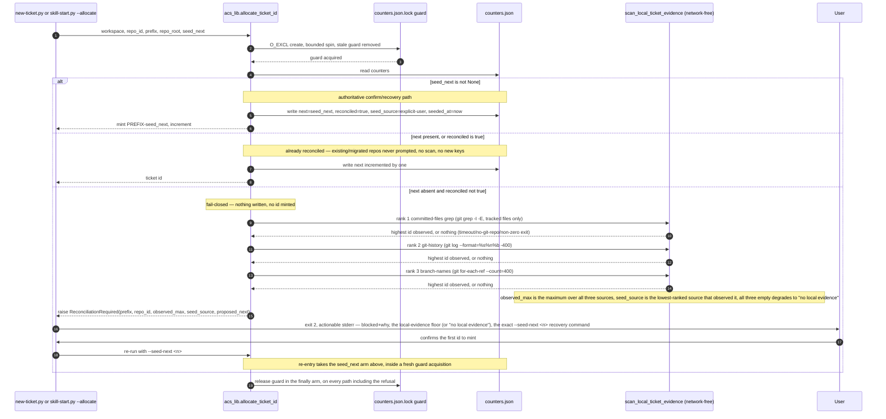

# Flow — Ticket-id first-allocate reconciliation

`allocate_ticket_id` (`acs_lib.py`) gains a fail-closed, network-free
reconciliation gate inside its existing O_EXCL critical section (MAR-402).
The first allocation for a `(repo_id, prefix)` partition that has never
allocated an id refuses with exit 2 unless a confirmable local-evidence
proposal is confirmed by a human; an already-populated `counters.json` is
treated as already reconciled, with no prompt and no scan. Both call sites —
`new-ticket.py` and `skill-start.py --allocate` (including its
product-level-skill path) — reach the same gate, so neither can silently
bypass it.

## Sequence — refusal, evidence scan, confirm, and steady state

Local evidence is a **floor, not the truth** — the tracker may hold higher
ids than any local source can observe, which is why the proposal is always
confirmable, never authoritative, and why the gate fails closed on no
evidence rather than defaulting to 1.
