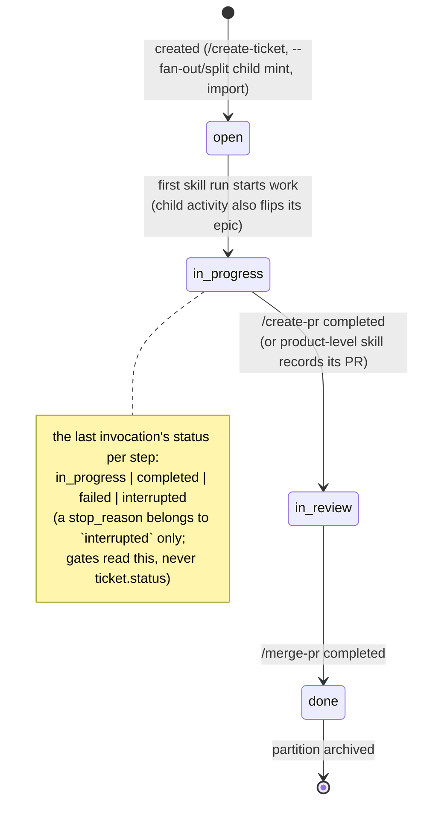
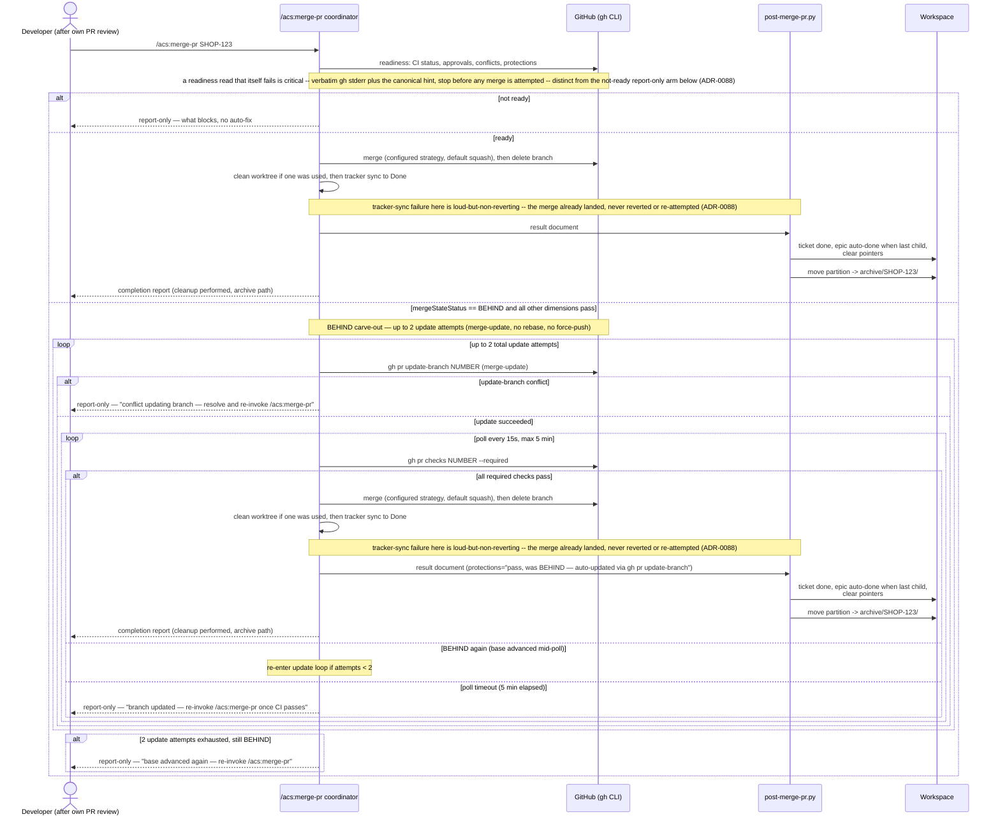

# Flow — Ticket lifecycle & merge

## Status lifecycle

## Merge & archive sequence

Epic auto-management: **In Progress** on first child activity (skill-start),
**Done** when the last child merges (post-merge-pr checks siblings via the
index) — both performed by the deterministic layer, not prose. Child mint
never happens during an epic's own creation run: it happens only in a
`--fan-out` run (after the epic's design is approved) or a split/restructure
run.

## The ticket carries no classification fields

MAR-56 put three on every ticket at mint time — `size`, `stakes`, and the
`lane` cache `derive_lane` computed from them — mirrored into the run ledger
and `tickets-index.json` so metrics could slice by lane.
ADR-0095 retired all three. They were a guess made at ticket time, before
anyone had read the code, and every later mechanism (mid-flight escalation,
its audit trail, the user-confirmed de-escalation writer) existed to revise
that guess safely.

Rigor now lives on the PLAN, not the ticket and not the pipeline:
`/acs:create-impl-plan` judges the change onto one delivery path from the
plan's own scope and writes `delivery_path` plus a one-sentence reason into
the plan's `## Contract` block (ADR-0098). There is no second writer and no
ledger copy. `ticket.json` is unchanged by that judgement, and a ticket minted
by an older build that still carries `size`, `stakes` or `lane` is read as if
it did not.
