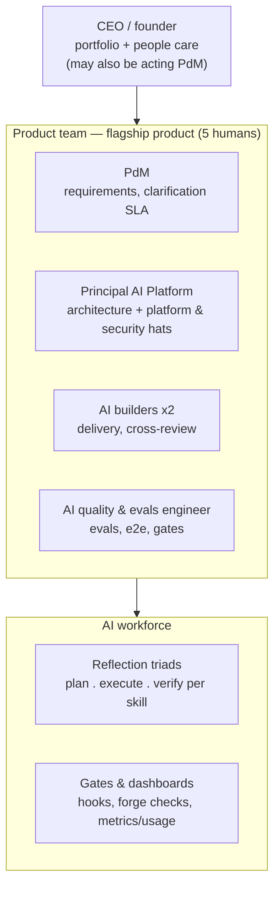
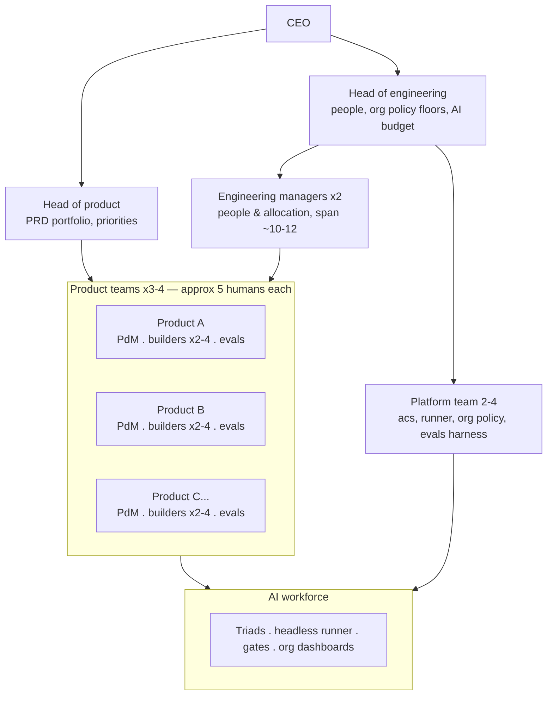

# The AI-native operating model

> **Public companion — sanitized.** The PRD operating model (**G33/G34/G35,
> C-18/C-19** in [prd.md](prd.md)) is the governed source of truth wherever
> this document and the PRD could disagree. Where this document is more
> granular than the PRD, it is generic guidance that composes with — never
> overrides — the PRD's model. The internal, unsanitized version of this
> document is maintained outside this repo.

## 1. Purpose

GMS ships commercial software products — flagship: **the flagship external consumer product**, an agentic SaaS product — with a small senior human team operating an AI delivery platform (acs). The organization is designed around one measurable property: **human headcount scales with decision and review load, never with build volume.** Build capacity lives in the AI workforce; humans own decisions, gates, and accountability.

## 2. Operating principles

1. **Roles are decision rights.** Every role is defined by which levels of the
   conformance chain it decides on (PRD → architecture → standards → design →
   specs → code → release → operate) — not by who does the labor. AI triads do
   the labor.
2. **WIP is capped by human review bandwidth.** Every PR is human-reviewed
   before merge; that review capacity — not build capacity — sets the team's
   throughput. Every seat carries a review quota (the number is team policy).
3. **Enforcement lives at the forge.** Required status checks, branch
   protection, and CODEOWNERS enforce process regardless of which editor or
   agent produced a change. Client-side hooks are fast feedback, never the
   security boundary.
4. **One agent core, many frontends.** Every capability = shared core (skills,
   runner, connectors, evals) + a thin frontend per audience. No department
   ever builds its own agent stack.
5. **Unattended means full rigor.** Any run without a human watching executes
   the highest-rigor lane and always stops before merge (PRD constraint
   C-18). No configuration can weaken this.
6. **Hire by splitting overloaded hats, on triggers.** New seats come from an
   existing hat exceeding a defined threshold (§9) — never from inventing a
   new kind of role.

## 3. Structure at a glance

| Layer | Contains | Exists from |
|---|---|---|
| Leadership | CEO; later Head of Product + Head of Engineering; EMs | CEO now; splits per §9 |
| Delivery teams | Product team ×N (one per product) + the AI Platform team | 1 product team now; platform is a hat |
| AI workforce | Reflection triads, headless runner, gates, dashboards | Now |

### 3.1 Small org — one product (stage 0-1: 5-6 humans)

One product team; leadership and the platform are hats carried by existing
people, not layers.

Seat #6 (platform/security engineer) joins under the Principal — the platform
hat's first split, restoring the two-human review pair for platform changes.

### 3.2 Large org — multiple products (stage 3: 3-4 products, 20-25 humans)

The product team stamps out once per product; leadership splits; the
platform hat has become a team; the AI workforce row grows (runner, org
dashboards) so the human layers do not.

The path from 3.1 to 3.2 is §9's stage table: nothing is redefined — seats
multiply, hats split into teams on triggers, and only two role types are
net-new hires (platform engineers, engineering managers).

## 4. The product team (template, one per product)

**Purpose:** own one product end-to-end — from requirements through operated
releases — through the acs pipeline.

| Seat | Mission | Decides on | Operates (skills) | Answers for | Failure mode to guard |
|---|---|---|---|---|---|
| **PdM** (1) | The right product gets built | PRD, roadmap, tickets, priorities, requirement clarifications | create-prd, create-ticket, metrics | Feature-to-goal tracing; **same-day clarification SLA**; release content | Clarification latency silently becoming pipeline latency |
| **Principal AI Platform** (shared, dept-level) | The product is built right | Architecture, design sign-off, standards, platform + org policy — at a **declared capacity split** | create-architecture, create-design approval, init; future standardize-project / create-standards | Architecture conformance; high-stakes review; policy floors | Two-hat overload; becoming the review bottleneck |
| **AI Product Builder** (2-4) | Tickets land | Implementation choices within spec; lane escalation acceptance | create-spec, code, create-pr, merge-pr, ship, handoff | TDD/coverage on own tickets; cross-review quota | Being measured on code written instead of tickets landed + review quality |
| **AI Quality & Evals Engineer** (1, shareable across 2 small teams) | The gates stay trustworthy | Test strategy, eval suites, coverage/e2e policy, release quality bar | e2e config, metrics/usage gate-health; future create-quality, test | Verifier efficacy; per-release eval baselines; product evals (fairness, reproducibility, evidence) | Sliding into manual per-PR testing, duplicating the verifier |

**Headcount:** 4-6 per product team, **minimum 4**, **typical 5**.

**Rotating hats (never seats):** tech lead (per team, once the Principal spans
multiple teams) and ops/release (release cut, incident response; every
incident ends in a runbook update or ticket).

**Instantiation rules:** a new product = a new instance of this table.
Charters copy unchanged. The evals seat may be shared across two small teams;
the Principal spans 2-3 teams within a department.

## 5. The AI Platform team

**Purpose:** own the delivery system as an internal product — the acs plugin,
the marketplace and its quality bar, the headless runner, org-level
policy/defaults distribution, and the eval harness. Its customers are the
product teams.

**Composition by stage:**

| Stage | Team | Trigger |
|---|---|---|
| Now | A hat on the Principal | — |
| Seat #6 | Principal + platform engineer (security focus) | First hire after the founding team — restores the two-human review pair for platform changes |
| Runner in production | + runner/infra engineer | The headless runner is production-relied-upon (availability obligation, pager) |
| 3-4 consuming teams | + evals engineer (and/or acs core engineer) | Eval-coverage ratio flatlines two releases, or interrupt load shreds the Principal's architecture time |

**Scaling rule (normative):** platform headcount scales with **review
pairing + bus factor (floor of 2), availability commitments, and
consuming-team count — never with feature volume.** Features are triad
work. Two people indefinitely is a legitimate outcome.

## 6. The leadership layer

| Role | Charter | Materializes |
|---|---|---|
| **CEO/founder** | Portfolio, final product calls; today also people care and (optionally) acting PdM | Now |
| **Head of Product** | PRD portfolio and priorities across products | Splits off the CEO at 3-4 products |
| **Head of Engineering** | People managers, org policy floors, marketplace quality bar, AI-spend budget across teams | Splits off at 3-4 teams |
| **Engineering manager(s)** | **People and allocation only**: growth, hiring, performance; review-bandwidth economics across teams; AI-spend per team; reading failure dashboards for escalation. Span ~10-12 (wider than traditional — no status-chasing, no process-policing) | ~12-15 humans |

Managers do **not** acquire a step in the conformance chain — the chain's
gates already have owners. A manager's interface to delivery is dashboards
and gates they tune, not meetings they run.

## 7. The AI workforce

The layer where build capacity lives. Owned by the platform team, operated by
every team.

- **Reflection triads** (planner/executor/verifier per skill): do the
  analysis, authoring, and independent verification inside every pipeline
  step. The verifier gates in every lane; executor self-reports are never
  trusted as evidence.
- **Headless runner:** unattended `/acs:ship` — ticket in, reviewed PR out —
  triggerable from tracker, chat, or CLI. Always full-verify lane, always
  stops before merge (C-19).
- **Gates and dashboards:** hook gating, forge checks, coverage/e2e
  hard-fails; delivery metrics, AI-spend usage, failure-mode observability
  dashboards.

## 8. Cross-cutting responsibilities (RACI)

| Function | Accountable | Responsible day-to-day | Automated by |
|---|---|---|---|
| Delivery (what/when) | PdM | Builders per ticket; the pipeline is the delivery manager | Gates, verifier, merge readiness, release cut |
| Deployment & infra | Principal / platform team | Builders deploy via CI/CD; incidents to on-call rotation | create-project scaffolds CI/CD; create-operations runbooks; failure-mode dashboards |
| Security — pipeline & infra | Principal | Nobody manually | Secret scan, conventions gate, verifier security dimension, high-stakes escalation, branch protection, org policy floors |
| Security — AI-specific (prompt injection, exfiltration, fairness) | AI Quality & Evals Engineer | Adversarial eval suites per release | Same eval harness; attacks become regression fixtures |
| Security — compliance (privacy, PII, retention) | PdM (as product requirements) | Builders implement as gated tickets | Conformance chain + verifier |
| Quality & evals — platform skills | Principal (accountable) | Evals engineer (harness, baselines); **skill shippers write trigger evals in the same PR** | CI guardrail; monotonic coverage ratio; per-release baseline |
| Release & on-call | Ops/release rotation hat | 3-person rotation (Principal + builders; evals engineer joins later) | One-command release cut; runbooks |

External pen-testing ahead of a commercial launch is a budget line, not a
hire.

## 9. Scaling stages and hiring order

| Stage | Humans | What changes | Trigger |
|---|---|---|---|
| 0 (now) | 5 | One product team; leadership + platform collapsed into founder and Principal | — |
| 1 | 6-8 | Platform/security engineer (seat #6); runner ships; evals engineer shared | First hire |
| 2 | 10-15 | Second/third product team instantiated; platform becomes a pair+; **first EM** | ~12-15 humans for the EM; teams per product demand |
| 3 | 20+ | Head of Product / Head of Engineering split; departments formalized; platform 3-4 | 3-4 products/teams |

**Hiring order:** platform/security engineer → second product team → EM →
Head-of split. Titles stay modest until scale demands headroom.

## 10. Anti-patterns (things this operating model explicitly rejects)

1. **Manager as status layer** — re-manualizing what dashboards and gates
   automated.
2. **QA as manual tester** — duplicating the verifier; the evals engineer owns
   the verification *system*.
3. **Platform hiring on feature volume** — features are triad work; see §5
   scaling rule.
4. **Per-department agent stacks** — one shared core; new capability = a
   frontend + skill content only.
5. **A GMS-built desktop app or developer coding SaaS** — vendors own those
   surfaces; the org owns the pipeline, connectors, and governance.
6. **Fast lanes for unattended runs** — structurally impossible per C-18/C-19;
   treat any attempt as a defect.
7. **Never name unreleased commercial products in public repos** — including
   branch names, commit messages, and PR titles.

## Appendix A — SDLC phase to operating skill to accountable role

| Phase | Skill | Accountable |
|---|---|---|
| Product definition | create-prd | PdM |
| Architecture | create-architecture | Principal |
| Bootstrap | create-project (greenfield); standardize-project (future) | Principal |
| Backlog | create-ticket + tracker sync | PdM |
| Design | create-design (+ sign-off) | Principal |
| Spec → code → PR → merge | create-spec, code, create-pr, merge-pr, ship | Builders |
| Standards | create-standards / create-principles (future) | Principal |
| Test strategy & regression | create-quality, test (future) | Evals engineer |
| Release | release (future) | Ops hat |
| Deploy | *(no skill by design — release tag triggers repo CD)* | Ops hat |
| Operate & observe | metrics, usage, failure-mode dashboards, create-operations (future) | Ops hat / evals engineer |
| Governance | init, install-hooks, org policy | Principal |

---

See [prd.md](prd.md) for the governed operating-model goals and constraints,
and [roadmap.md](roadmap.md) for how this model's platform-team stages map to
delivery waves.
