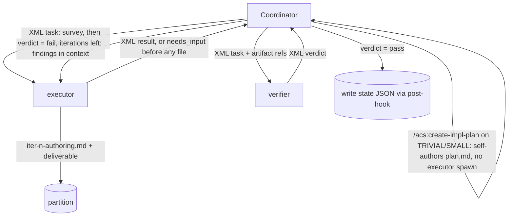

# Reflection & Subagent Architecture

## Coordinator–subagents pattern

The workflow is built on a **coordinator–subagents** architecture:

- For each skill invocation, a **coordinator** (the main agent running the
  skill) orchestrates dedicated **subagents**.
- The coordinator performs **dynamic decomposition**: it breaks the skill's
  work into subagent tasks based on the actual ticket/specs at hand (e.g. one
  executor task per spec), rather than a fixed, hard-coded task list.
- The coordinator MUST NOT keep conversation history between workflow steps.
  Everything a later step needs is read from JSON files in the workspace
  (see [workspace-and-state.md](workspace-and-state.md)).

## Reflection pattern: execute → verify

The twelve **authoring skills** (analyze-ticket, create-impl-plan,
create-api-contract, create-test-docs, create-e2e-tests, docs-sync, create-prd,
create-design, create-architecture, create-project, standardize-project,
create-requirements), `code` and `create-docs` MUST apply the Reflection
pattern as an **execute–verify cycle**, with a **different subagent for each
phase**. No skill has a plan phase (ADR-0092): for an authoring skill the
deliverable IS the document, and a plan for it is a second copy of the
writing — so iteration 1's executor **surveys first** (mode, inputs,
evidence, open questions), records the survey in its authoring notes
(`iter-<n>-authoring.md`), and authors the deliverable from them; an open
decision comes back as `needs_input` BEFORE any file is written; the
verifier judges the deliverable fresh, against those notes among its other
dimensions (`authoring-conformance`). `create-docs` was the first to take
this shape (ADR-0094); the other twelve followed in ADR-0092's stage 2.
`code` runs the same cycle against a plan `/acs:create-impl-plan` wrote
(ADR-0089). **`/acs:create-impl-plan` is the one skill whose deliverable is
itself a plan, and its execute phase is lane-conditional (MAR-72,
ADR-0074):** on STANDARD/COMPLEX its executor's survey (the former
`code-planner` charter) renders the `plan.md` draft; on TRIVIAL/SMALL the
coordinator authors `plan.md` itself and spawns no executor at all, against
the identical artifact contract — verify stays unconditional on every lane.
Each phase runs in a separate context window so the verify phase judges the work
fresh rather than rubber-stamping its own output. The table below shows the
two phases and their responsibilities for a representative skill:

| Phase | Subagent (example for `/code`) | Responsibility |
|-------|--------------------------------|----------------|
| Execute | `code-executor` | Carry out the approved plan; produce the skill's artifacts (code, tests, docs). For an authoring skill the executor first surveys and records `iter-<n>-authoring.md`, then authors the document from it. |
| Verify | `code-verifier` | Independently check the executor's output against the gated upstream contracts and the skill's quality bar — for an authoring skill also against its authoring notes — and report pass/fail with findings. |

### Apply-work skills: inline shape (MAR-55 invariant (b))

The **apply-work** group — `/acs:create-pr`, `/acs:merge-pr`, and
`/acs:create-ticket` — does **not** apply the Reflection pattern. These skills
are inline and deterministic: the coordinator handles the work directly,
optionally delegating to at most one executor subagent. No plan-phase subagent
and no verify-phase subagent are spawned — this holds in every lane. Upstream
quality is gated by the code-verifier (before the PR is opened or merged) or by
the user-confirmation gate (at ticket creation); there is no in-skill verify
phase for these three skills.

Requirements:

- The two phases MUST be separate subagents (separate context windows), so
  the verifier judges the work fresh rather than rubber-stamping its own
  output.
- On verification failure, the cycle reflects: the coordinator feeds the
  verifier's findings back into another iteration. For every skill that
  runs the cycle, findings feed the **executor's** `<context>` on the next
  iteration — execute → verify only, with no plan phase in between. The
  per-iteration re-plan went first (MAR-71, slice 1b of MAR-69, for
  `/acs:code`; MAR-300 for `/acs:docs-sync`; MAR-301 for
  `/acs:create-project`; MAR-302 for `/acs:standardize-project`; MAR-305 for
  `/acs:create-prd` and the four doc-set legs since folded into
  `/acs:create-docs` (ADR-0094); then `/acs:create-architecture`,
  `/acs:create-design`, and `/acs:create-requirements`); ADR-0092 then
  retired the plan phase itself. On iteration 2+ the executor's authoring
  notes carry a **Findings addressed** section mapping each finding to what
  changed. For `/acs:create-impl-plan` on TRIVIAL/SMALL specifically there
  is no executor to feed back into — the plan was coordinator-authored with
  zero executor spawns; escalating mid-flight to STANDARD/COMPLEX never
  retro-spawns one either (MAR-72, D-3). No other skill has a
  lane-conditional executor — each runs a fixed iteration cap of 3 in every
  lane; only `/acs:code`'s cap is lane-driven (below).
  - The cycle runs at most **lane-driven iterations**:
    - **TRIVIAL/SMALL lanes** (low/normal stakes): at most **1 iteration** (light
      verify — single verifier pass that may iterate once on blocking findings;
      cap = `VERIFY_ITERATION_CAP["light"]` = 1).
    - **STANDARD/COMPLEX lanes**, or any **high-stakes** ticket: at most
      **3 iterations** (full verify — execute → verify loop against the plan
      `/acs:create-impl-plan` approved before it starts, never a
      per-iteration re-plan, + full 16-dimension, multi-lens review + e2e
      when configured; an iteration is one execute+verify round; cap =
      `VERIFY_ITERATION_CAP["full"]` = 3). Full verify's 16 dimensions are
      split across 4 parallel independent lenses (each reading a distinct
      evidence source), followed by a coordinator-performed
      confidence-scoring/adversarial merge pass before findings count; light
      verify keeps today's single-subagent, 15-dimension pass unchanged.
    - When `ticket.lane` or `ticket.stakes` are absent or unrecognized, default
      conservatively to full (3-iteration ceiling).
    - On hitting the lane's cap with findings remaining, the skill stops and
      records its findings and stop reason in its state file.

  **Absolute invariants — apply in every lane regardless of verify depth:**

  - The **verifier subagent is the in-loop quality gate in every lane** (C-5).
    Light verify differs from full only in iteration ceiling; the verifier always
    runs. There is no inline human-approval gate; the human-in-the-loop
    checkpoint is the PR review before merge.
  - The **TDD/coverage gate runs in full in every lane and is never trimmed by
    verify-depth selection** (invariant a, MAR-55). Depth selection is not a
    verify dimension that light mode drops.

  **Mid-flight ceiling raise on escalation (MAR-57).** The lane-driven ceiling
  stated above is the *initial* ceiling, computed at the start of the `/code`
  run. If an in-flight escalation trigger fires mid-run (verifier finding of
  higher stakes/size, a `high_stakes_paths` glob match on a touched file, or an
  explicit user/agent request), the coordinator recomputes the ceiling via
  `VERIFY_ITERATION_CAP[verify_depth(new_lane, new_stakes)]` and raises the
  in-flight ceiling **monotonically** — it is never lowered. A ticket that
  starts at a TRIVIAL/SMALL ceiling (1 iteration) and escalates to
  STANDARD/COMPLEX (3 iterations) immediately acquires the full 3-iteration
  ceiling for all remaining iterations. The absolute invariants above (verifier
  always runs in every lane; TDD/coverage gate immutable in every lane) hold
  regardless of any in-flight ceiling change. Every escalation event is
  durably recorded — not just a ceiling change — via `record_escalation_event`
  appending a fixed 13-field event (from/to lane, from/to axes, trigger,
  source, ceiling before/after, direction, confirmation ref) to
  `runs[-1].escalations` on `code-state.json` (MAR-106), so no lane change is
  silent. Re-selection happens at the iteration-start **detection point**: the
  start of each iteration, after the prior verifier and before the current
  execute — so an escalation always lands before the next verifier pass
  (MAR-107 D4). When a fast lane (TRIVIAL/SMALL) crosses the fold boundary
  into a full lane (STANDARD/COMPLEX), the former fold-boundary stage re-entry
  no longer applies: since ADR 0066 every lane authors its spec content inside
  the plan `/acs:create-impl-plan` writes (ADR 0089), so there is no decomposition stage left to
  re-enter — the crossing raises the verify depth and the in-flight iteration
  ceiling only, monotonically and never lowered (`code/SKILL.md`'s "In-loop
  escalation check" and "Spec authoring fold" sections). The lane/axes are never *automatically* downward — the
  one exception is a user-confirmed de-escalation (MAR-108), offered only at
  an iteration or run boundary, never mid-iteration, requiring an explicit
  `AskUserQuestion` confirmation recorded via `clarify.py` before the
  dedicated `confirm_deescalation` writer (`acs_lib/state.py`) is called with that
  ledger reference. `confirm_deescalation` is unreachable without a resolved,
  answered `clarify_ref`, and every such drop is durably audited exactly like
  an upward event (`direction: "down"`, non-null `confirmation_ref`) — no
  lane change, up or down, is ever silent.

- Subagent naming convention: `<skill>-executor`, `<skill>-verifier`; no
  skill ships a `<skill>-planner` (ADR-0092).
  31 agent files exist on disk in total — exactly the roles
  `workflows/phases.yaml` declares (ADR-0092), so none is orphaned — an
  executor and a verifier for each hooked skill prefix
  that runs the cycle, and an executor only for the three apply-work skills;
  before the skills-independence refactor there were fifteen skill prefixes
  with agent files, and there are seventeen now. **Fourteen** skills run the
  execute→verify cycle: the **twelve** authoring skills listed in the heading
  above — which include the five Build/Test skills the refactor added
  (`analyze-ticket`, `create-impl-plan`, `create-api-contract`,
  `create-test-docs`, `create-e2e-tests`) — plus `code`, which runs it
  against a plan another skill approved, and `create-docs`. Three prefixes
  belong to the **apply-work** skills, which run inline and never spawn a
  verify-phase subagent (see the "Apply-work skills" subsection above).
- For the **apply-work** group, only the executor-suffix agent file may be
  delegated to at most once per invocation; their former plan-phase and
  verify-phase agent files were deleted by ADR-0092 (the skills already
  forbade spawning them). See the "Apply-work skills" subsection above for
  the full inline shape.
- Each role's **model and reasoning effort are user-configurable** in
  `settings.json` (`models.executor` / `verifier`, with per-skill overrides;
  a `models.planner` entry is still accepted but inert — no skill spawns
  one); unset values inherit the parent context's model and effort
  ([configuration.md](configuration.md#subagent-models)).

> **Note:** the `code-verifier` carries the broadest verification scope: in
> addition to spec conformance, tests, and coverage, it reviews the whole
> changeset (business logic, features, quality, technical standards
> (conformant with the `standards/` doc set at `standards_path` when
> configured; falls back to documented architecture when unset),
> architecture, system design, security, documentation, and
> **Simplicity & scope** — overcomplication and out-of-scope edits are
> blocking). There is no separate review skill — see [skills.md](skills.md).
>
> **Verifier anchoring**: a verifier judges the work against the **gated
> upstream contracts** (specs, ticket, design), never against the
> same-iteration author's own claims — an unverified survey must not be able
> to certify the work it shaped. The authoring notes' contribution to
> verification is a floor, never a ceiling: the `authoring-conformance`
> dimension checks that the deliverable is what the notes surveyed and
> re-opens every citation the notes make, and a draft with no notes behind
> it is a blocking finding on its own; verifiers never read executor
> reasoning — only artifacts.
>
> **Bounded exception — `/acs:code` plan conformance (MAR-74, slice 4 of
> MAR-69, ADR 0073)**: for `/acs:code` alone, and for the `code-verifier`'s
> plan-conformance dimension (15) alone, the approved plan's `## Executor
> tasks & file map` and its folded `Approach`/`API/data changes` content are
> additionally a bounded conformance contract. The dimension is active only
> while the verifier itself computes — never from a coordinator-relayed
> value — that `<partition>/phases/code/plan-approval.json` exists and
> parses, carries `eligible: true` and `plan_path == phases/code/plan.md`,
> and pins a `plan_sha256` equal to the current `plan.md` bytes; when any
> condition fails the dimension reports an evidenced **N/A**, never a block.
> The hazards ADR-0004 named are structurally absent in exactly this case:
> the approval is a deterministic non-LLM predicate over the plan's own
> bytes (MAR-73), and since MAR-71 the plan is not a same-iteration artifact
> at all — it is authored once, before the loop. The dimension is strictly
> **subordinate to acceptance-criteria conformance** (dimension 1): an
> approved plan is never evidence that an acceptance criterion is satisfied.
> Everywhere else — every other dimension, every other skill, and every case
> where the record is absent or does not hold — the rule above stands
> unchanged, the plan a floor and never a ceiling. When the plan itself is
> wrong, the boundary-gated, `clarify.py`-recorded revocation path
> (`plan-superseded-<k>.md`) revises and re-approves it instead of bending
> the rule.
>
> **Spec-time vs. code-time simplicity (MAR-88)**: the plan's author
> (`create-impl-plan-executor`'s survey — the former `code-planner` charter —
> on STANDARD/COMPLEX; the coordinator on TRIVIAL/SMALL, **best-effort**,
> MAR-72)
> evaluates each decomposition for a **materially** simpler alternative
> meeting the **same acceptance criteria**, and **surfaces** (never blocks) a
> finding to the user/spec owner for a **decision** — a spec-time check on
> the chosen **approach**, before any code exists. `code-verifier` dimension
> 12 ("Simplicity & scope") is a code-time, **blocking** check on the
> **code** the executor wrote against the already-accepted spec. The two
> never double-count: they inspect different artifacts (approach vs. diff) at
> different times, so a decomposition accepted at spec time is never
> re-litigated by dimension 12 — it only judges conformance and internal
> simplicity of the code against that accepted spec.



A failing verdict with iterations left routes straight back to the
**executor** (`EX`) with the findings in its `<context>` — there is no plan
phase to route to (ADR-0092); the survey was made once, by iteration 1's
executor, and the notes it left are what the verifier judged against. **The
`CO -->|XML task| EX` edge is lane-conditional for `/acs:create-impl-plan`
only (MAR-72, ADR-0074):** it fires on STANDARD/COMPLEX; on TRIVIAL/SMALL
the coordinator instead takes the self-loop edge above, authoring `plan.md`
itself with zero executor spawns.

## Coordinator ↔ subagent communication: XML

- All communication between the coordinator and subagents MUST use a defined
  **XML format** — both task assignments (coordinator → subagent) and results
  (subagent → coordinator).
- Messages MUST be **validated against a formal schema (XSD)** shipped with
  the plugin, so malformed messages fail fast instead of silently degrading
  the pipeline.
- The format SHOULD carry, at minimum: ticket id, skill, phase, task
  description, references to workspace input files, and (on the way back)
  status, findings, error details, and output file references.

**[ASSUMPTION]** Illustrative shape — the concrete schema is to be defined
during design:

```xml
<task skill="code" phase="execute" ticket-id="SHOP-123">
  <objective>Implement spec 02-api-endpoints</objective>
  <inputs>
    <file>specs/02-api-endpoints.md</file>
    <file>plan.json</file>
  </inputs>
  <constraints>
    <tdd>true</tdd>
    <coverage-target>90</coverage-target>
  </constraints>
</task>

<result skill="code" phase="execute" ticket-id="SHOP-123" status="completed">
  <outputs>
    <file>code-progress.json</file>
  </outputs>
  <findings>…</findings>
  <errors>…</errors>
  <stop-reason>…</stop-reason>
</result>
```

## File-based state instead of conversation memory

- Subagents MUST write their **states, findings, error details, and stop
  reasons** into JSON files in the workspace folder. Concretely, every phase
  writes its own artifact into `<partition>/phases/<skill>/`: an authoring
  executor its `iter-<n>-authoring.md` (the survey the deliverable was
  authored from, then the findings addressed; `/acs:create-impl-plan`'s
  deliverable is itself the single per-ticket `plan.md` — MAR-70 — written
  once per run), each executor `iter-<n>-execute[-<k>].json` (artifacts
  produced, repo files changed, commands run with outcomes), the verifier
  `iter-<n>-verify.md` (every check with evidence, every finding in detail).
  No skill writes `iter-<n>-plan.md` any more (ADR-0092).
  `/acs:code` additionally persists `phases/code/plan-approval.json` on
  STANDARD/COMPLEX — written by `plan-approval.py`, **not** by a subagent
  (MAR-73, slice 3 of MAR-69). XML results reference these files, never
  inline their bodies.
- **Grounding**: every subagent decision, claim, and finding MUST be traceable
  to a source read or run in that task — cited file/section next to the
  statement, or the quoted command and output. A missing input is an error,
  not a guess; an unverifiable point is an explicit assumption with rationale;
  verifiers treat ungrounded authoring notes/reports as blocking findings.
- Native **plan mode is not used** for the executor's survey: executors and
  verifiers are spawned subagents with no user to give **human/interactive**
  approval to a survey, and resumability comes from the phase artifacts plus
  gates. This is unaffected by `/acs:create-impl-plan`'s deterministic
  plan-approval record (MAR-73, slice 3 of MAR-69) — a machine conformance
  verdict over the plan's own bytes, never an interactive gate. The
  verifier's read-only discipline is enforced by its tool allowlist (read
  tools + Write solely for its own phase artifact); executors may not spawn
  agents or invoke skills, and their writes are bounded by the file-map
  guard.
- The coordinator MUST persist each phase's output (authoring notes and
  executor results, verifier verdict) to the ticket partition **at the phase boundary**,
  before starting the next phase — a context loss or crash never loses more
  than the in-flight phase
  ([workflow.md](workflow.md#resuming-a-ticket)).
- The coordinator reads these files to decide the next action; it never
  depends on having seen earlier messages.
- This makes every step **resumable** (a crashed or interrupted skill can be
  re-run and continue from recorded state) and **inspectable** (the user can
  audit any step's reasoning trail in the workspace).

## Decomposition & concurrency rules

- Decomposition is **exclusively the coordinator's job**: executor and
  verifier subagents MUST NOT spawn their own sub-subagents. This keeps
  the state files and the XML message flow predictable.
- The coordinator MAY run **multiple executors in parallel** within one
  skill (e.g. one executor per spec in `/code`), provided their outputs do
  not conflict; the verifier runs after all parallel executors complete and
  judges the combined result.
- The exact XSD is defined during design; the XML shapes in this document
  are illustrative.
