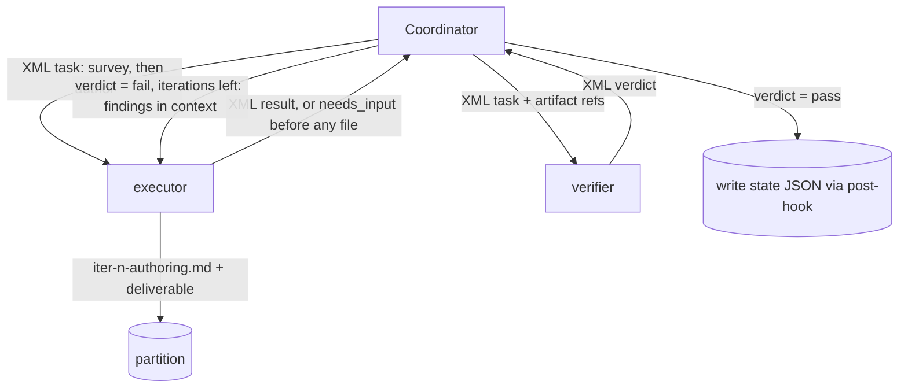

# Reflection & Subagent Architecture

## Coordinator–subagents pattern

The workflow is built on a **coordinator–subagents** architecture:

- For each skill invocation, a **coordinator** (the main agent running the
  skill) orchestrates dedicated **subagents**.
- The coordinator performs **dynamic decomposition**: it breaks the skill's
  work into subagent tasks based on the actual ticket/specs at hand (e.g. one
  executor task per spec), rather than a fixed, hard-coded task list.
- The coordinator MUST NOT keep conversation history between workflow steps.
  Everything a later step needs is read from JSON files in the workspace
  (see [workspace-and-state.md](workspace-and-state.md)).

## Reflection pattern: execute → verify

The twelve **authoring skills** (analyze-requirements, create-impl-plan,
create-api-contract, create-test-docs, create-e2e-tests, docs-sync, create-prd,
create-design, create-architecture, create-project, standardize-project,
create-requirements), `code` and `create-docs` MUST apply the Reflection
pattern as an **execute–verify cycle**, with a **different subagent for each
phase**. No skill has a plan phase (ADR-0092): for an authoring skill the
deliverable IS the document, and a plan for it is a second copy of the
writing — so iteration 1's executor **surveys first** (mode, inputs,
evidence, open questions), records the survey in its authoring notes
(`iter-<n>-authoring.md`), and authors the deliverable from them; an open
decision comes back as `needs_input` BEFORE any file is written; the
verifier judges the deliverable fresh, against those notes among its other
dimensions (`authoring-conformance`). `create-docs` was the first to take
this shape (ADR-0094); the other twelve followed in ADR-0092's stage 2.
`code` runs the same cycle against a plan `/acs:create-impl-plan` wrote
(ADR-0089). **`/acs:create-impl-plan` is the one skill whose deliverable is
itself a plan**, and its executor's survey (the former `code-planner`
charter) renders the `plan.md` draft on every run. MAR-72/ADR-0074 made that
execute phase lane-conditional — the coordinator authored the plan itself on
TRIVIAL/SMALL, spawning no executor — and ADR-0095 removed the fork with the
lanes: this skill runs BEFORE any delivery path exists, because `plan.md` is
the artifact the path is judged from, so there is nothing to condition on.
Each phase runs in a separate context window so the verify phase judges the work
fresh rather than rubber-stamping its own output. The table below shows the
two phases and their responsibilities for a representative skill:

| Phase | Subagent (example for `/code`) | Responsibility |
|-------|--------------------------------|----------------|
| Execute | `code-executor` | Carry out the approved plan; produce the skill's artifacts (code, tests, docs). For an authoring skill the executor first surveys and records `iter-<n>-authoring.md`, then authors the document from it. |
| Verify | `code-verifier` | Independently check the executor's output against the gated upstream contracts and the skill's quality bar — for an authoring skill also against its authoring notes — and report pass/fail with findings. |

### Apply-work skills: inline shape (MAR-55 invariant (b))

The **apply-work** group — `/acs:create-pr`, `/acs:merge-pr`, and
`/acs:create-ticket` — does **not** apply the Reflection pattern. These skills
are inline and deterministic: the coordinator handles the work directly,
optionally delegating to at most one executor subagent. No plan-phase subagent
and no verify-phase subagent are spawned — this holds on every delivery path.
Upstream
quality is gated by the code-verifier (before the PR is opened or merged) or by
the user-confirmation gate (at ticket creation); there is no in-skill verify
phase for these three skills.

Requirements:

- The two phases MUST be separate subagents (separate context windows), so
  the verifier judges the work fresh rather than rubber-stamping its own
  output.
- On verification failure, the cycle reflects: the coordinator feeds the
  verifier's findings back into another iteration. For every skill that
  runs the cycle, findings feed the **executor's** `<context>` on the next
  iteration — execute → verify only, with no plan phase in between. The
  per-iteration re-plan went first (MAR-71, slice 1b of MAR-69, for
  `/acs:code`; MAR-300 for `/acs:docs-sync`; MAR-301 for
  `/acs:create-project`; MAR-302 for `/acs:standardize-project`; MAR-305 for
  `/acs:create-prd` and the four doc-set legs since folded into
  `/acs:create-docs` (ADR-0094); then `/acs:create-architecture`,
  `/acs:create-design`, and `/acs:create-requirements`); ADR-0092 then
  retired the plan phase itself. On iteration 2+ the executor's authoring
  notes carry a **Findings addressed** section mapping each finding to what
  changed. Every skill runs a fixed iteration cap of 3. `/acs:code` used to
  vary by the recorded DELIVERY PATH; it no longer does, because the cap
  governs the REVIEW and the review left (§3.5). What the delivery path still
  decides is how many executors run:
  - `/acs:code`'s legs each state their own executor shape in their own
    SKILL.md rather than looking one up:
    - **`trivial` and `small`**: one executor, rarely two on `small`, and only
      when the plan's file map splits cleanly in two.
    - **`standard` and `complex`**: executors partition the plan's file map,
      and `complex` adds a final **integration executor** over the seams
      between the partitions. Both work against the plan
      `/acs:create-impl-plan` published before the run started, never a
      per-iteration re-plan.

    The iteration ceiling is **not** a property of the path. It is
    `ship.yaml`'s `loops[].max_iterations` — one cap, the same on every path —
    because it governs the review, and `/acs:code` has no review. So is the
    reviewer's depth: `/acs:review-code` measures the changeset in front of it
    and fans lens B out when the diff warrants it, and neither `/acs:code` nor
    `ship.yaml` passes it a lens count.

- Subagent naming convention: `<skill>-<role>.md`, where the roles are
  `executor`, `verifier`, `lens` and `adjudicator`; no skill ships a
  `<skill>-planner` (ADR-0092).
  32 agent files exist on disk in total — exactly the roles
  `skills/<name>/acs.yaml` declares, so none is orphaned, and a skill is a
  DIRECTORY rather than an entry in a registry file.

  **Thirteen** skills run the execute→verify cycle: the **twelve** authoring
  skills listed in the heading above — which include the five Build/Test
  skills the skills-independence refactor added (`analyze-requirements`,
  `create-impl-plan`, `create-api-contract`, `create-test-docs`,
  `create-e2e-tests`) — plus `create-docs`.

  **Four** prefixes are executor-only. Three are the **apply-work** skills,
  which run inline and never spawn a verify-phase subagent (see the
  "Apply-work skills" subsection above). The fourth is `code`: its verifier
  left for `/acs:review-code`, because an implementer that grades its own
  output gave per-finding adjudication to one delivery path out of four and
  ran the full unit suite inside an iteration that might be discarded.

  **One** prefix is neither: `review-code` owns a `lens` and an
  `adjudicator`. That is not a pair and is not meant to be — five lenses
  raise candidate findings in parallel and one fresh-context adjudicator per
  finding tries to refute it, so the two roles fan out independently of each
  other.
- For the **apply-work** group, only the executor-suffix agent file may be
  delegated to at most once per invocation; their former plan-phase and
  verify-phase agent files were deleted by ADR-0092 (the skills already
  forbade spawning them). See the "Apply-work skills" subsection above for
  the full inline shape.
- Each role's **model and reasoning effort are user-configurable** in
  `settings.json` (`models.executor` / `verifier`, with per-skill overrides;
  a `models.planner` entry is still accepted but inert — no skill spawns
  one); unset values inherit the parent context's model and effort
  ([configuration.md](configuration.md#subagent-models)).

> **Note:** the `code-verifier` carries the broadest verification scope: in
> addition to spec conformance, tests, and coverage, it reviews the whole
> changeset (business logic, features, quality, technical standards
> (conformant with the `standards/` doc set at `standards_path` when
> configured; falls back to documented architecture when unset),
> architecture, system design, security, documentation, and
> **Simplicity & scope** — overcomplication and out-of-scope edits are
> blocking). There is no separate review skill — see [skills.md](skills.md).
>
> **Verifier anchoring**: a verifier judges the work against the **gated
> upstream contracts** (specs, ticket, design), never against the
> same-iteration author's own claims — an unverified survey must not be able
> to certify the work it shaped. The authoring notes' contribution to
> verification is a floor, never a ceiling: the `authoring-conformance`
> dimension checks that the deliverable is what the notes surveyed and
> re-opens every citation the notes make, and a draft with no notes behind
> it is a blocking finding on its own; verifiers never read executor
> reasoning — only artifacts.
>
> **Bounded exception — `/acs:code` plan conformance (MAR-74, slice 4 of
> MAR-69, ADR 0073)**: for `/acs:code` alone, and for the `code-verifier`'s
> plan-conformance dimension (15) alone, the approved plan's `## Executor
> tasks & file map` and its folded `Approach`/`API/data changes` content are
> additionally a bounded conformance contract. The dimension is active only
> while the verifier itself computes — never from a coordinator-relayed
> value — that `<partition>/phases/code/plan-approval.json` exists and
> parses, carries `eligible: true` and `plan_path == phases/code/plan.md`,
> and pins a `plan_sha256` equal to the current `plan.md` bytes; when any
> condition fails the dimension reports an evidenced **N/A**, never a block.
> The hazards ADR-0004 named are structurally absent in exactly this case:
> the approval is a deterministic non-LLM predicate over the plan's own
> bytes (MAR-73), and since MAR-71 the plan is not a same-iteration artifact
> at all — it is authored once, before the loop. The dimension is strictly
> **subordinate to acceptance-criteria conformance** (dimension 1): an
> approved plan is never evidence that an acceptance criterion is satisfied.
> Everywhere else — every other dimension, every other skill, and every case
> where the record is absent or does not hold — the rule above stands
> unchanged, the plan a floor and never a ceiling. When the plan itself is
> wrong, the boundary-gated, `clarify.py`-recorded revocation path
> (`plan-superseded-<k>.md`) revises and re-approves it instead of bending
> the rule.
>
> **Spec-time vs. code-time simplicity (MAR-88)**: the plan's author
> (`create-impl-plan-executor`'s survey — the former `code-planner` charter;
> MAR-72's best-effort fast path went with the lanes, ADR-0095, so the survey
> now runs on every plan)
> evaluates each decomposition for a **materially** simpler alternative
> meeting the **same acceptance criteria**, and **surfaces** (never blocks) a
> finding to the user/spec owner for a **decision** — a spec-time check on
> the chosen **approach**, before any code exists. `code-verifier` dimension
> 12 ("Simplicity & scope") is a code-time, **blocking** check on the
> **code** the executor wrote against the already-accepted spec. The two
> never double-count: they inspect different artifacts (approach vs. diff) at
> different times, so a decomposition accepted at spec time is never
> re-litigated by dimension 12 — it only judges conformance and internal
> simplicity of the code against that accepted spec.



A failing verdict with iterations left routes straight back to the
**executor** (`EX`) with the findings in its `<context>` — there is no plan
phase to route to (ADR-0092); the survey was made once, by iteration 1's
executor, and the notes it left are what the verifier judged against. **The
`CO -->|XML task| EX` edge fires for every skill on every run.** It was
lane-conditional for `/acs:create-impl-plan` (MAR-72, ADR-0074), which took a
coordinator self-loop on TRIVIAL/SMALL and spawned no executor; ADR-0095
removed both the lanes and that self-loop, so the diagram above has one
execute edge and no exception to it.

## Coordinator ↔ subagent communication: XML

- All communication between the coordinator and subagents MUST use a defined
  **XML format** — both task assignments (coordinator → subagent) and results
  (subagent → coordinator).
- Messages MUST be **validated against a formal schema (XSD)** shipped with
  the plugin, so malformed messages fail fast instead of silently degrading
  the pipeline.
- The format SHOULD carry, at minimum: ticket id, skill, phase, task
  description, references to workspace input files, and (on the way back)
  status, findings, error details, and output file references.
- The XSD is the contract's only declaration (ADR 0093): the validator
  derives its model from it at load time, `<constraint name>` is typed to
  the XSD's `constraintName` vocabulary so a misspelled delegation key
  fails at the coordinator, and the state-file schema declares the
  load-bearing `states` members, the `escalations` audit event and each
  finding's `severity`.

**[ASSUMPTION]** Illustrative shape — the concrete schema is to be defined
during design:

```xml
<task skill="code" phase="execute" ticket-id="SHOP-123">
  <objective>Implement spec 02-api-endpoints</objective>
  <inputs>
    <file>specs/02-api-endpoints.md</file>
    <file>plan.json</file>
  </inputs>
  <constraints>
    <tdd>true</tdd>
    <coverage-target>90</coverage-target>
  </constraints>
</task>

<result skill="code" phase="execute" ticket-id="SHOP-123" status="completed">
  <outputs>
    <file>code-progress.json</file>
  </outputs>
  <findings>…</findings>
  <errors>…</errors>
  <stop-reason>…</stop-reason>
</result>
```

## File-based state instead of conversation memory

- Subagents MUST write their **states, findings, error details, and stop
  reasons** into JSON files in the workspace folder. Concretely, every phase
  writes its own artifact into `<partition>/phases/<skill>/`: an authoring
  executor its `iter-<n>-authoring.md` (the survey the deliverable was
  authored from, then the findings addressed; `/acs:create-impl-plan`'s
  deliverable is itself the single per-ticket `plan.md` — MAR-70 — written
  once per run), each executor `iter-<n>-execute[-<k>].json` (artifacts
  produced, repo files changed, commands run with outcomes), the verifier
  `iter-<n>-verify.md` (every check with evidence, every finding in detail).
  No skill writes `iter-<n>-plan.md` any more (ADR-0092).
  `/acs:code` additionally persists `phases/code/plan-approval.json` on the
  `standard` and `complex` delivery paths — written by `plan-approval.py`,
  **not** by a subagent (MAR-73, slice 3 of MAR-69). XML results reference these files, never
  inline their bodies.
- **Grounding**: every subagent decision, claim, and finding MUST be traceable
  to a source read or run in that task — cited file/section next to the
  statement, or the quoted command and output. A missing input is an error,
  not a guess; an unverifiable point is an explicit assumption with rationale;
  verifiers treat ungrounded authoring notes/reports as blocking findings.
- Native **plan mode is not used** for the executor's survey: executors and
  verifiers are spawned subagents with no user to give **human/interactive**
  approval to a survey, and resumability comes from the phase artifacts plus
  gates. This is unaffected by `/acs:create-impl-plan`'s deterministic
  plan-approval record (MAR-73, slice 3 of MAR-69) — a machine conformance
  verdict over the plan's own bytes, never an interactive gate. The
  verifier's read-only discipline is enforced by its tool allowlist (read
  tools + Write solely for its own phase artifact); executors may not spawn
  agents or invoke skills, and their writes are bounded by the file-map
  guard.
- The coordinator MUST persist each phase's output (authoring notes and
  executor results, verifier verdict) to the ticket partition **at the phase boundary**,
  before starting the next phase — a context loss or crash never loses more
  than the in-flight phase
  ([workflow.md](workflow.md#resuming-a-ticket)).
- The coordinator reads these files to decide the next action; it never
  depends on having seen earlier messages.
- This makes every step **resumable** (a crashed or interrupted skill can be
  re-run and continue from recorded state) and **inspectable** (the user can
  audit any step's reasoning trail in the workspace).

## Decomposition & concurrency rules

- Decomposition is **exclusively the coordinator's job**: executor and
  verifier subagents MUST NOT spawn their own sub-subagents. This keeps
  the state files and the XML message flow predictable.
- The coordinator MAY run **multiple executors in parallel** within one
  skill (e.g. one executor per spec in `/code`), provided their outputs do
  not conflict; the verifier runs after all parallel executors complete and
  judges the combined result.
- The exact XSD is defined during design; the XML shapes in this document
  are illustrative.
