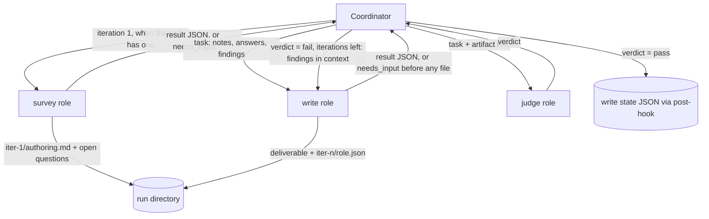

# Reflection & Subagent Architecture

## Coordinator–subagents pattern

The workflow is built on a **coordinator–subagents** architecture:

- For each skill invocation, a **coordinator** (the main agent running the
  skill) orchestrates dedicated **subagents**.
- The coordinator performs **dynamic decomposition**: it breaks the skill's
  work into subagent tasks based on the actual ticket/specs at hand (e.g. one
  implementer task per file-map partition), rather than a fixed, hard-coded
  task list.
- A skill spawns only the subagents its own logic needs, each named for the
  work it does (ADR-0109). Every role has a **kind**: `survey` (reads the
  repo, records notes and open questions, writes only its own workspace
  files), `write` (produces the deliverable) or `judge` (re-derives and
  judges fresh, read-only by charter).
- The coordinator MUST NOT keep conversation history between workflow steps.
  Everything a later step needs is read from JSON files in the workspace
  (see [workspace-and-state.md](workspace-and-state.md)).

## Reflection pattern: write → judge

The eleven **authoring skills** MUST apply the Reflection pattern as a
**write → judge cycle** over their own roles, with a **different subagent
for each role** (ADR-0109):

| Skill | Survey | Write | Judge |
|---|---|---|---|
| analyze-requirements | `analyze-requirements-impact-analyst` | `analyze-requirements-analyst` | `analyze-requirements-impact-reviewer` |
| create-prd | `create-prd-surveyor` | `create-prd-author` | `create-prd-reviewer` |
| create-architecture | `create-architecture-gap-analyst` (beside the architect's survey, when an HLD exists — ADR-0122) | `create-architecture-architect` | `create-architecture-reviewer` |
| create-design | — | `create-design-designer` | `create-design-design-reviewer` |
| create-data-design | `create-data-design-gap-analyst` (beside the designer's survey, when the feature's `data/` holds documents — ADR-0126) | `create-data-design-designer` | `create-data-design-reviewer` |
| create-flows | `create-flows-gap-analyst` (beside the designer's survey, when the feature's `flows/` or `components/` hold documents — ADR-0126) | `create-flows-designer` | `create-flows-reviewer` |
| create-impl-plan | — | `create-impl-plan-planner` | `create-impl-plan-plan-reviewer` |
| create-api-contract | `create-api-contract-gap-analyst` (beside the contract-author's survey, over the feature's `api/` documents — ADR-0134) | `create-api-contract-contract-author` | `create-api-contract-contract-reviewer` |
| create-test-docs | — | `create-test-docs-test-designer` | `create-test-docs-trace-reviewer` |
| create-e2e-tests | — | `create-e2e-tests-test-writer` | `create-e2e-tests-suite-runner` |
| docs-sync | — | `docs-sync-doc-updater` | `docs-sync-drift-reviewer` |

No skill has a plan phase before its writer (ADR-0092): for an authoring
skill the deliverable IS the document, and a plan for it is a second copy of
the writing. Where the work has two jobs — a read-only survey that ends in
questions, then a write after the answers — the jobs are two roles: the
**survey role** runs on iteration 1 only (mode, inputs, evidence, open
questions), records the survey in the authoring notes
(`iter-1/authoring.md`) and freezes them, and the **write role** authors the
deliverable from the notes and the answers. Where there is no survey role,
iteration 1's writer **surveys first** and records the survey in the same
notes. Either way an open decision comes back as `needs_input` BEFORE any
file is written, and the **judge** judges the deliverable fresh, against
those notes among its other dimensions (`authoring-conformance`).
**`/acs:create-impl-plan` is the one skill whose deliverable is itself a
plan**: its `planner` (the former `code-planner` charter) renders the
`plan.md` draft on every run. MAR-72/ADR-0074 made that phase
lane-conditional — the coordinator authored the plan itself on TRIVIAL/SMALL,
spawning no subagent — and ADR-0095 removed the fork with the lanes: this
skill runs BEFORE any delivery path exists, because `plan.md` is the artifact
the path is judged from, so there is nothing to condition on. Each role runs
in a separate context window so the judge judges the work fresh rather than
rubber-stamping its own output.

`/acs:code` is the exception the table cannot show: it spawns implementers
only (`code-implementer`, one per file-map partition). Its review is a STEP of
its own (`/acs:review-code`), not a role inside it — see "The changeset
review" below.

### Apply-work skills: inline shape (MAR-55 invariant (b))

The **apply-work** group — `/acs:create-pr`, `/acs:merge-pr`, and
`/acs:create-ticket` — does **not** apply the Reflection pattern. These skills
are inline and deterministic: the coordinator handles the work directly,
following its `references/` (`materialize.md`, `publish.md`, `merge.md`), and
spawns no subagent — this holds on every delivery path.
Upstream
quality is gated by `/acs:review-code` (before the PR is opened or merged) or by
the user-confirmation gate (at ticket creation); there is no in-skill verify
phase for these three skills.

Requirements:

- Each role MUST be a separate subagent (a separate context window), so
  the judge judges the work fresh rather than rubber-stamping its own
  output.
- On a failing judgement, the cycle reflects: the coordinator feeds the
  judge's findings back into another iteration. For `/acs:code` the same
  motion is a WORKFLOW loop rather than an in-skill one — `/acs:review-code`
  records blocking findings and `ship.yaml`'s `loops[]` sends the cursor back
  to `code` — and the routing is identical at both scales. For every skill
  that runs the cycle, findings feed the **write role's** `<context>` on the
  next iteration — write → judge, with no plan phase in between and no second
  survey. The
  per-iteration re-plan went first (MAR-71, slice 1b of MAR-69, for
  `/acs:code`; MAR-300 for `/acs:docs-sync`; MAR-301 for
  `/acs:create-project`; MAR-302 for `/acs:standardize-project`; MAR-305 for
  `/acs:create-prd` and the four doc-set legs since folded into
  `/acs:create-docs` (ADR-0094, itself removed by ADR-0124); then `/acs:create-architecture`,
  `/acs:create-design`, and `/acs:create-requirements`); ADR-0092 then
  retired the plan phase itself. On iteration 2+ the writer's authoring
  notes carry a **Findings addressed** section mapping each finding to what
  changed. Every skill runs a fixed iteration cap of 3. `/acs:code` used to
  vary by the recorded DELIVERY PATH; it no longer does, because the cap
  governs the REVIEW and the review left (§3.5). What the delivery path still
  decides is how many implementers run:
  - `/acs:code`'s legs each state their own implementer shape in their own
    SKILL.md rather than looking one up:
    - **`trivial` and `small`**: one implementer, rarely two on `small`, and only
      when the plan's file map splits cleanly in two.
    - **`standard` and `complex`**: implementers partition the plan's file map,
      and `complex` adds a final **integration implementer** over the seams
      between the partitions. Both work against the plan
      `/acs:create-impl-plan` published before the run started, never a
      per-iteration re-plan.

    The iteration ceiling is **not** a property of the path. It is
    `ship.yaml`'s `loops[].max_iterations` — one cap, the same on every path —
    because it governs the review, and `/acs:code` has no review. So is the
    reviewer's depth: `/acs:review-code` measures the changeset in front of it
    and fans lens B out when the diff warrants it, and neither `/acs:code` nor
    `ship.yaml` passes it a lens count.

    **The path is judged once.** `/acs:create-impl-plan` records
    `delivery_path` in the plan's `## Contract` block, from the work itself,
    before any delivery path exists. Nothing re-judges it: `/acs:code`
    dispatches to the leg the plan names, a leg that believes the path is
    wrong says so with `stop_reason: needs_input` rather than behaving like
    another leg, and there is no mid-run escalation, de-escalation or
    recompute to reach for. The ceiling never moves mid-run because nothing
    it depends on does.

    **Absolute invariants.** Two things the delivery path never scales, and
    they are the reason scaling everything else is safe:

    1. **The review always runs, on every delivery path.** `/acs:review-code`
       is a step of `ship.yaml`, not an option a cheap path may decline: the
       five lenses, the per-finding adjudication and the final gate are the
       same on `trivial` as on `complex`. A path chooses how much work the
       implementation is divided into, never whether the work is judged.
    2. **The TDD discipline and the coverage gate are never trimmed.** The
       final gate runs the build, the lint, the full unit suite and coverage
       in full, once, on the iteration that survives review — the one place
       the full suite runs. A path may not lower the coverage threshold,
       narrow the suite, or substitute the tests a leg happened to run for
       the gate's own run.

- Subagent naming convention: `<skill>-<role>.md`, where the role is named
  for what it does for that skill and is listed, with its kind, in
  `acs_lib.skills.ROLE_KINDS`. 34 agent files exist on disk in total — every
  one resolves to a shipped skill and a known role, so none is orphaned, and
  a skill is a DIRECTORY rather than an entry in a registry file.

  **Eleven** skills run the write → judge cycle: all **eleven** authoring
  skills in the table above — which include the five Build/Test skills the
  skills-independence refactor added (`analyze-requirements`,
  `create-impl-plan`, `create-api-contract` — a Design skill since
  ADR-0134 — `create-test-docs`, `create-e2e-tests`). One of them
  (`create-prd`) adds a surveyor, one (`analyze-requirements`) an impact
  analyst per code area (ADR-0114), and four (`create-architecture`,
  `create-api-contract`, `create-data-design`, `create-flows`) a gap analyst
  beside their survey over the documents they revise (ADR-0122, ADR-0126,
  ADR-0134).

  **One** prefix is write-only: `code`, whose implementers are judged by
  `/acs:review-code`, because an implementer that grades its own output gave
  per-finding adjudication to one delivery path out of four and ran the full
  unit suite inside an iteration that might be discarded.

  **One** prefix is judge-only: `review-code` owns a `lens` and an
  `adjudicator`. That is not a pair and is not meant to be — five lenses
  raise candidate findings in parallel and one fresh-context adjudicator per
  finding tries to refute it, so the two roles fan out independently of each
  other.

  **One** prefix is survey-only: `audit-design`, whose gap analysts compare
  the architecture set with the code and report; the skill is read-only and
  writes nothing for a judge to judge (ADR-0122).

  **One** prefix pairs a survey with a judge and no writer: `audit-security`,
  whose auditors raise candidate security findings and one fresh-context
  adjudicator per candidate tries to refute it, as `review-code`'s
  adjudicators do — a filter on findings, not a loop over a deliverable
  (ADR-0123).

  The three **apply-work** skills own no agent file at all (see the
  "Apply-work skills" subsection above).
- Each role's **model and reasoning effort are user-configurable** in
  `settings.json` per skill and role (`models.<skill>.<role>`); unset
  values inherit the parent context's model and effort
  ([configuration.md](configuration.md#subagent-models)).

> **Note:** the **changeset review** carries the broadest scope, and it is a
> step of its own rather than a phase inside `/acs:code`. `/acs:review-code`
> runs five lenses in parallel — acceptance conformance, defects, contracts
> and regressions, security and operability, and craft (which includes
> **Simplicity & scope**: overcomplication and out-of-scope edits are
> blocking) — over the whole changeset, against the repo's `standards/` doc
> set when it has one and the documented architecture when it has none. Every candidate finding then goes to a **fresh-context adjudicator**
> prompted to refute it, and only what survives refutation is recorded.
> Findings carry a `kind`, not a dimension number: the numbered dimension
> list is retired, because a finding's identity is its claim and its
> evidence, not its position in a table.
>
> **Reviewer anchoring**: the review judges the work against the **gated
> upstream contracts** (the plan, the ticket, the design), never against the
> same-iteration author's own claims — an unverified survey must not be able
> to certify the work it shaped. For an authoring skill, its judge applies
> the same rule to the authoring notes: the notes' contribution is a floor,
> never a ceiling — the check is that the deliverable is what the notes
> surveyed, every citation the notes make is re-opened, and a draft with no
> notes behind it is a blocking finding on its own. Neither a judge nor a
> lens reads a writer's reasoning — only artifacts.
>
> **Bounded exception — plan conformance**: for the review of a `/acs:code`
> changeset alone, the approved plan's `## Executor tasks & file map` and its
> folded `Approach`/`API/data changes` content are additionally a bounded
> conformance contract. It applies only while the reviewer itself computes —
> never from a coordinator-relayed value — that the run's
> `plan-approval.json` exists and parses, carries `eligible: true`, names the
> run's `plan.md`, and pins a `plan_sha256` equal to that file's current
> bytes; when any condition fails, the check reports an evidenced **N/A**,
> never a block. The hazards ADR-0004 named are structurally absent in
> exactly this case: the approval is a deterministic non-LLM predicate over
> the plan's own bytes (MAR-73), and the plan is not a same-iteration
> artifact at all — it is authored once, by an earlier step, before the loop.
> Plan conformance is strictly **subordinate to acceptance conformance**: an
> approved plan is never evidence that an acceptance criterion is satisfied.
> Everywhere else — every other finding kind, every other skill, and every
> case where the record is absent or does not hold — the rule above stands
> unchanged, the plan a floor and never a ceiling. When the plan itself is
> wrong, `stop_reason: plan_superseded` re-runs `/acs:create-impl-plan` and
> re-judges from the corrected plan instead of bending the rule.
>
> **Spec-time vs. code-time simplicity (MAR-88)**: the plan's author
> (`create-impl-plan-planner`'s survey — the former `code-planner` charter;
> MAR-72's best-effort fast path went with the lanes, ADR-0095, so the survey
> now runs on every plan)
> evaluates each decomposition for a **materially** simpler alternative
> meeting the **same acceptance criteria**, and **surfaces** (never blocks) a
> finding to the user/plan owner for a **decision** — a plan-time check on
> the chosen **approach**, before any code exists. The review's craft lens
> ("Simplicity & scope") is a code-time, **blocking** check on the **code**
> the implementer wrote against the already-accepted plan. The two never
> double-count: they inspect different artifacts (approach vs. diff) at
> different times, so a decomposition accepted at plan time is never
> re-litigated by the craft lens — it only judges conformance and internal
> simplicity of the code against that accepted plan.


```mermaid
flowchart TD
    CO[Coordinator] -->|iteration 1, when the skill has one| SV[survey role]
    SV -->|iter-1/authoring.md + open questions| WS[(run directory)]
    SV -->|result JSON, or needs_input| CO
    CO -->|task: notes, answers, findings| WR[write role]
    WR -->|deliverable + iter-n/role.json| WS
    WR -->|result JSON, or needs_input before any file| CO
    CO -->|task + artifact refs| JG[judge role]
    JG -->|verdict| CO
    CO -->|verdict = fail, iterations left: findings in context| WR
    CO -->|verdict = pass| ST[(write state JSON via post-hook)]
```

A failing verdict with iterations left routes straight back to the
**write role** (`WR`) with the findings in its `<context>` — there is no plan
phase to route to (ADR-0092), and the survey is never re-run: it was made
once, on iteration 1, and the notes it left are what the judge judged
against. **The `CO -->|task| WR` edge fires for every skill on every run.**
It was lane-conditional for `/acs:create-impl-plan` (MAR-72, ADR-0074), which
took a coordinator self-loop on TRIVIAL/SMALL and spawned no subagent;
ADR-0095 removed both the lanes and that self-loop, so the diagram above has
one write edge and no exception to it. Each role node stands for one instance
or a fan-out of the same role over disjoint slices (see
[Fan-out](#fan-out-parallel-writers-judges-and-surveys-adr-0110)); a fanned-out
`WR` is followed by its `slice="integration"` pass before `JG` runs.

## Coordinator ↔ subagent communication

- All communication between the coordinator and subagents MUST use a defined
  **JSON format** — both task assignments (coordinator → subagent) and results
  (subagent → coordinator).
- Results MUST be **validated against the JSON Schema** shipped with the
  plugin (`schemas/result.schema.json`, `schemas/verdict.schema.json`), in the
  hook, so a malformed result fails fast instead of silently degrading the
  pipeline.
- The format carries, at minimum: the run id, the step, the phase, the
  iteration, the task description, references to run-directory input files,
  and (on the way back) status, findings, error details, and output file
  references.
- The schemas are the contract's only declaration: the XSD and its validator
  are retired, because a second schema language for the same documents was a
  second place for the vocabulary to drift. A result is JSON, the hook
  validates it, and the step's `state.json` declares the load-bearing
  `states` members and each finding's `severity`.

Illustrative shape:

```jsonc
// the task the coordinator hands an implementer
{ "skill": "code", "phase": "implementer", "run_id": "SHOP-123", "iteration": 1,
  "objective": "Implement plan task 2 — the cart API handler",
  "inputs": ["steps/create-impl-plan/plan.md", "steps/code/iter-1/filemap.json"],
  "constraints": { "tdd": true, "coverage_target": 90 } }

// what it returns
{ "skill": "code", "phase": "implementer", "run_id": "SHOP-123", "iteration": 1,
  "status": "completed",
  "outputs": ["src/cart/api.py", "tests/cart/test_api.py"],
  "findings": [], "errors": [], "stop_reason": null }
```

## File-based state instead of conversation memory

- Subagents MUST write their **states, findings, error details, and stop
  reasons** into JSON files in the workspace folder. Concretely, every phase
  writes its own artifact into `<run>/steps/<skill>/iter-<n>/`, named after
  its role: whoever surveys writes `authoring.md` (the survey the deliverable
  was authored from, then the findings addressed; `/acs:create-impl-plan`'s
  deliverable is itself the single per-run `plan.md` — MAR-70 — written once
  per run, beside the iteration directories rather than inside one), each
  survey or write role `<role>.json` (parallel implementers
  `implementer-<k>.json`: artifacts produced, repo files changed, commands run
  with outcomes), each judge `<role>.md` (every check with evidence, every
  finding in detail). A sliced instance writes the same files with its slice
  id appended (`<role>-<id>.json`, `<role>-<id>.md`, `authoring-<id>.md`),
  joined into the unsliced names by `acs.py notes merge`. The SubagentStop
  hook files each returned message beside them as `<role>-message.xml`
  (`<role>-<id>-message.xml` for a slice). No skill writes a `plan.md` phase artifact any more
  (ADR-0092). `/acs:code` additionally persists
  `steps/code/plan-approval.json` on the `standard` and `complex` delivery
  paths — written by `plan-approval.py`, **not** by a subagent (MAR-73, slice
  3 of MAR-69). Results reference these files, never inline their bodies.
- **Grounding**: every subagent decision, claim, and finding MUST be traceable
  to a source read or run in that task — cited file/section next to the
  statement, or the quoted command and output. A missing input is an error,
  not a guess; an unverifiable point is an explicit assumption with rationale;
  judges treat ungrounded authoring notes/reports as blocking findings.
- Native **plan mode is not used** for a survey: every role is a spawned
  subagent with no user to give **human/interactive**
  approval to a survey, and resumability comes from the phase artifacts plus
  gates. This is unaffected by `/acs:create-impl-plan`'s deterministic
  plan-approval record (MAR-73, slice 3 of MAR-69) — a machine conformance
  verdict over the plan's own bytes, never an interactive gate. A survey or
  judge role's read-only discipline is enforced by its tool allowlist (read
  tools + Write solely for its own phase artifacts); write roles may not spawn
  agents or invoke skills, and their writes are bounded by the file-map
  guard, which is armed while any write role runs.
- The coordinator MUST persist each role's output (authoring notes,
  writer results, judge verdict) to the ticket partition **at the phase boundary**,
  before starting the next phase — a context loss or crash never loses more
  than the in-flight phase
  ([workflow.md](workflow.md#resuming-a-ticket)).
- The coordinator reads these files to decide the next action; it never
  depends on having seen earlier messages.
- This makes every step **resumable** (a crashed or interrupted skill can be
  re-run and continue from recorded state) and **inspectable** (the user can
  audit any step's reasoning trail in the workspace).

## Decomposition & concurrency rules

- Decomposition is **exclusively the coordinator's job**: no subagent MAY
  spawn its own sub-subagents. This keeps the state files and the message
  flow predictable.
- The coordinator MAY run **multiple writers in parallel** within one
  skill (e.g. one implementer per file-map partition in `/code`, one
  architect per HLD file in `/create-architecture`), provided their outputs do not conflict; the
  judge runs after all parallel writers complete and judges the combined
  result. Since ADR-0110 this is the default rather than an option — see
  below.
- The exact XSD is defined during design; the XML shapes in this document
  are illustrative.

### Fan-out: parallel writers, judges and surveys (ADR-0110)

A subagent cannot spawn a subagent, so every fan-out is the coordinator's. A
fan-out is N instances of the SAME agent, each over a disjoint **slice**,
spawned in ONE message and awaited together before the next phase.

- **Writers** MUST be fanned out by default, from iteration 1, whenever the
  deliverable splits into disjoint files (authors per feature area, architects
  per HLD/LLD file, scaffolders per allowlist slice, test-writers per suite
  file, doc-updaters per doc area, implementers per file-map partition). Each
  skill MUST state its partition rule: what one slice owns, how slices are
  named, and why two slices cannot overlap. A deliverable that is a single
  document keeps one writer, and the skill says so.
- **Judges** with five or more check dimensions MUST be fanned out by default
  into two or three named slices over disjoint dimensions. Each deterministic
  checker MUST run in exactly one slice, and a judge whose job is to run
  something once (a build, a suite) MUST keep that run in one slice.
- **Surveys** MUST be fanned out when the scope spans two or more disjoint
  top-level areas of the repo, one instance per area; the open questions of
  every slice MUST go to the user in ONE grouped clarification-ledger ask.
- **Cap.** At most `settings.parallel.max_agents` (default 4) instances per
  message ([ADR-0125](../../architecture/adr/0125-parallelism-in-skills.md)),
  unless the skill already sets its own smaller cap (`/acs:code-small` 2,
  `/acs:code-trivial` 1); beyond the cap,
  instances run in waves of that size. `/acs:review-code`'s five lenses are one
  message whatever the setting.
- **Jobs.** A long deterministic command a coordinator needs beside its
  agents (a build, a lint, a suite) MUST run as an `acs.py job` started in the
  same turn as the spawn and collected with one blocking `job wait`, never a
  `sleep` loop; a $0 check on a draft MUST run beside the judge spawn, its
  failures that iteration's findings.
- **Identity.** Each instance's task and result MUST carry `slice="<id>"` (an
  un-sliced instance omits it). A slice id is a short name of letters,
  digits, `_` and `-`; hyphens are allowed. A sliced instance writes
  `iter-<n>/<role>-<id>.json` (write or survey report),
  `iter-<n>/<role>-<id>.md` (judge report) or `iter-<n>/authoring-<id>.md`
  (survey notes), and the SubagentStop hook files its snapshot at
  `iter-<n>/<role>-<id>-message.xml`, so parallel siblings never overwrite
  each other.
- **Join.** The join MUST be deterministic, never the model merging prose:
  `acs.py notes merge` merges the slices' markdown by `## ` heading into the
  one file every downstream reader and checker expects (`authoring.md`,
  `<role>.md`) — the first input's preamble, each heading once in first-seen
  order, each slice's body in input order behind a slice marker. A missing
  slice MUST fail the merge.
- **Synthesis — joining is not synthesizing.** Where slices meet at a seam,
  the skill MUST reconcile them before the next phase:
  - after parallel writers and BEFORE the judge, ONE more instance of the same
    writer role MUST run with `slice="integration"` (generalising
    `/acs:code-complex`'s final integration implementer). It reconciles only
    the seams the skill names — shared terms and IDs, cross-references, index
    and overview files, shared fixtures and config — never a slice's
    substance; it MUST record every seam it changed in
    `iter-<n>/<role>-integration.json` and MUST return a conflict it cannot
    settle from the evidence as `needs_input`. It is skipped when one writer
    ran. The judge then judges the integrated result;
  - a single writer that consumes merged survey slices MUST reconcile
    contradictions between them under a `## Synthesis` section of its notes —
    the resolution with its evidence, or an open question — and MUST NOT
    silently pick one;
  - judge slices own disjoint dimensions, so the merge is their synthesis;
    the coordinator additionally MUST drop a finding that cites the same
    location and the same defect as another slice's finding, keeping the
    higher severity, and say so in the joined report.
- **Pass rule.** A sliced judge's iteration MUST pass only when EVERY slice
  returned `status="completed"` with zero blocking findings. Any slice's
  blocking finding blocks, every slice's findings go verbatim to the next
  writer, and a slice that failed or returned no usable result MUST fail the
  iteration — never "pass with a missing slice".
- **Resume.** A resumed iteration re-runs only the slices whose report is
  missing.
- **Shared working tree.** Parallel writers commit nothing (ADR-0127): each
  writes its own disjoint files into the one working tree and lists them in its
  report; the join is the reports plus the write guard below, and
  `/create-pr` commits the result.
- **Write guard.** With several writers live — slices of one skill, or the
  writers of a parallel group's members — a write is judged against its own
  writer's file map when the hook payload names the agent, else against the
  union of every live writer's scope, never against whichever writer started
  last ([hooks.md](hooks.md)).
