# End-to-End Workflow

## Pipeline

The `acs` plugin implements a multi-step delivery workflow. Every skill
belongs to exactly one of five **phases** — design, build, test, ship,
utility — declared in the registry `plugins/acs/workflows/phases.yaml`; and
the ORDER in which a ticket's build/test/ship steps run is **declared data,
not hook code**: it lives in `plugins/acs/workflows/ship.yaml`, which a
consumer repo MAY replace wholesale with `<repo>/.acs/workflows/ship.yaml`
(an override, never a merge).

Two requirements follow, and together they are what "pipeline" now means:

- **Every skill MUST be runnable on its own.** A skill's pre-hook MUST NOT
  refuse it for running before or after another skill; it checks only the
  inputs that skill reads plus a small set of safety brakes
  ([hooks.md](hooks.md)).
- **The declared order is authoritative for orchestration only.** `/ship`
  walks `ship.yaml` and nothing else; a skill invoked by hand out of that
  order MUST still run, after one advisory line on stderr.

`/create-ticket` and `/create-design` are **design** work that runs before
`/ship`; `/merge-pr` is **ship** work a human drives after review. None of
the three may appear in `ship.yaml` — it may name build, test and ship
skills only, and never `/merge-pr` or `/release`.

| Step (`ship.yaml` id) | Phase | Runs | Purpose (summary) |
|-----------------------|-------|------|-------------------|
| — `/create-ticket` | design | before `/ship` | Analyze & clarify requirements from the user prompt, codebase, and docs; create a ticket of type **epic**, **story**, or **task**. |
| — `/create-design` | design | before `/ship`, when `needs_design` | Analyze the ticket, codebase, and docs; evaluate options with trade-offs and produce an approved design (`design.md`): decision & rationale, architecture, contracts, risks, rollout. For an **epic**, the step that follows is `/acs:create-ticket <epic-id> --fan-out`, not implementation — the epic's own ticket is never implemented. |
| `analyze-ticket` | build | always | Read the ticket, the product docs and the codebase; write `analysis.md` — problem restated, impact map, recorded questions, assumptions, risks, refined acceptance criteria, and the `api_surface` verdict the walk branches on. A not-ready analysis returns `needs_input`. |
| `create-impl-plan` | build | `requires: design_approved` | The plan phase carved out of `/code`: planner agent, spec fold, executor file map, plan approval and the plan-revocation path, ending in an approved `plan.md`. |
| `create-api-contract` | build | `when: api_surface_changed` | Write `api-contract.md` — every endpoint/command/message the plan adds or changes, shapes, error codes, compatibility notes, examples, each traced to an acceptance criterion and a plan item — plus the machine-readable contract files under `contracts_path` when the repo keeps them. |
| `create-test-docs` | build | always | Write `test-cases.md`: `TC-n` cases typed unit \| integration \| e2e, each traced to an acceptance criterion, with preconditions, steps, expected result and target suite. Every acceptance criterion MUST be covered by at least one case. |
| `code` | build | always (`exclusive`) | Implement features / bug fixes / tasks using the **TDD pattern** against the approved `plan.md`, writing tests from `test-cases.md` when present. Its verifier reviews the changeset for business logic, features, quality, technical standards, architecture, system design, security, and documentation — see [Review feedback loop](#review-feedback-loop). |
| `create-e2e-tests` | test | `when: e2e_configured` | Write the ticket's e2e suites at the repo's configured e2e location, covering the e2e-typed rows of `test-cases.md`, committed on the ticket branch. Runs **in parallel with `docs-sync`** — both need only `code`. |
| `docs-sync` | build | always | Re-verify and complete the doc updates a ticket's changeset requires, re-deriving them independently from the branch diff (`git diff <default_branch>...HEAD`), `/code`'s `result.json` and the final code-verify artifact rather than from a hand-off summary; runs on the same ticket branch, adding commits to the existing changeset. |
| `run-e2e-tests` | test | `when: post_code_test_active` | Run this product's configured suites for the ticket (`--for-ticket <id>`), scoped from `test-cases.md`. On failure the step's `on_fail` relays back into `code`, bounded by `post_code_test_fix_loops_cap`. |
| `create-pr` | ship | `stop_after` | Create a pull request shipping the implementation. `/ship` stops here. |
| — `/merge-pr` | ship | after `/ship`, user-invoked | Review PR readiness and merge it if possible; when the readiness check fails, it is **report-only** (no automatic fixes). **User-invoked only**, after the user has reviewed the PR themselves — never auto-triggered by the pipeline. |

A step's condition is one of two kinds, and the difference is load-bearing:

- **`when: <predicate>`** — a false predicate means the step does not apply
  to this ticket. The walk records it `skipped` in `pipeline-state.json`
  (with the reason) and treats it as satisfied, so everything downstream of
  it proceeds.
- **`requires: <predicate>`** — a false predicate means the step is not
  allowed to proceed *yet*. The walk reports `blocked_by` with a human
  pointer (for example, "run /acs:create-design MAR-12 first") and lists no
  ready step; nothing downstream proceeds.

The predicate vocabulary is closed — a workflow file naming an unknown
predicate fails validation with its line number:

| Predicate | True when |
|-----------|-----------|
| `design_approved` | the ticket needs no design; or its own (or its parent epic's) `design.md` exists **and** the ledger records `/create-design` completed for that ticket. |
| `api_surface_changed` | `analysis.md`'s front matter declares `api_surface: true`. |
| `e2e_configured` | `settings.e2e` or `settings.suites.e2e` is configured ([configuration.md](configuration.md)). |
| `post_code_test_active` | `settings.post_code_test.enabled` when it is set; otherwise `e2e_configured`. |

```mermaid
flowchart LR
    U[User prompt] --> T[/create-ticket/]
    T -->|needs design, epic| D[/create-design/]
    D -->|epic: after design| FO[/create-ticket --fan-out/]
    FO -->|per child| A
    D -->|child inherits the design| A
    T -->|otherwise| A[/analyze-ticket/]
    A --> PL[/create-impl-plan/]
    PL -->|when api_surface_changed| AC[/create-api-contract/]
    PL --> TD[/create-test-docs/]
    AC --> TD
    TD --> C[/code/]
    C --> DS[/docs-sync/]
    C -->|when e2e_configured| E[/create-e2e-tests/]
    E -->|when post_code_test_active| RE[/run-e2e-tests/]
    DS --> P[/create-pr/]
    RE --> P
    P --> M[/merge-pr/]
```

`/create-design` runs only for tickets flagged **`needs_design: true`** —
set for **epics only**; stories/tasks are always `false`. Child tickets of
an epic do **not** repeat design: their `design_approved` predicate resolves
against the parent epic's `design.md`.

### Where a ticket's artifacts live

The workflow reads and writes two distinct stores, and a requirement in this
document belongs to exactly one of them:

- **The repo docs tree** — `<repo>/<settings.artifacts.tickets_path>/<ID>/`
  (default `docs/tickets/<ID>/`) holds the **human-facing ticket documents**:
  `ticket.md`, `design.md`, `analysis.md`, `api-contract.md`, `plan.md`,
  `test-cases.md`. They are committed on the ticket branch and reviewed in
  the PR like any other doc. Setting `artifacts.tickets_path` to `null`
  keeps every one of them in the workspace partition instead, exactly as
  before this split.
- **The workspace partition** — `<workspace>/<repo>/<ticket-id>/` holds the
  **run ledger**: `<skill>-state.json`, `pipeline-state.json`, phase
  artifacts, verdicts, `.lock`, `clarifications.json`, and the repo-level
  index/metrics files ([workspace-and-state.md](workspace-and-state.md)).

A ticket's `status` is **derived** from the ledger, never stored alongside
the ticket's own fields, so the two can no longer disagree
([workspace-and-state.md](workspace-and-state.md)).

## Step gating

Gating is **input gating and safety braking**, not order enforcement. The
pipeline's order lives in `ship.yaml` ([Pipeline](#pipeline)); a pre-hook's
job is to make sure the skill it guards can do its work at all, and to stop a
run that would be unsafe.

- Each hooked skill MUST be guarded by a **pre-hook**. Readiness means, at
  minimum: the `.acs` `settings.json` resolves, the `<ticket-id>` partition
  resolves, no other session holds the ticket's `.lock`, and every **input
  artifact the skill itself reads** exists. Examples: `/code` requires an
  approved `plan.md`; `/create-api-contract` requires `plan.md` **and** an
  `analysis.md` declaring `api_surface: true`; `/create-e2e-tests` requires a
  configured e2e suite **and** at least one e2e-typed case in
  `test-cases.md`; `/create-architecture` requires the PRD doc set.
- A pre-hook MUST NOT require that a *predecessor skill completed*. The
  primitive that did so was removed with the skills-independence refactor:
  running `/docs-sync` before `/code`, or `/create-pr` before `/docs-sync`,
  is allowed and produces whatever those skills can honestly produce from the
  inputs present.
- **Safety brakes stay**, because they protect correctness rather than
  sequence: epics are never implemented (`/code`, `/analyze-ticket` and
  `/create-impl-plan` refuse an epic with an actionable breakdown message);
  `/create-pr` refuses a ticket whose recorded `/code` run left
  `verifier_passed != true` (a ticket with **no** recorded code run is
  allowed through); `/merge-pr` requires a recorded PR reference; every
  hooked skill refuses while another session holds the lock.
- If a required input is missing, the pre-hook MUST exit with code **2**,
  which blocks the skill, and MUST name the artifact and the skill that
  produces it (e.g. "no plan.md found for SHOP-123 … — run
  /acs:create-impl-plan SHOP-123 first.").
- **Out-of-order is an advisory, never a refusal.** When a hooked skill runs
  whose `ship.yaml` `needs` are not satisfied for this ticket, the pre-hook
  MUST print exactly one stderr line naming the position — e.g.
  `acs: docs-sync normally follows code in ship.yaml; code has not completed
  for SHOP-123` — and exit **0**. The line is suppressed when
  `settings.workflow.advisories` is `false` (default `true`), when the skill
  is not a step of the resolved workflow, and whenever anything it needs
  cannot be read — an advisory MUST never turn into a blocked gate.
- Each hooked skill MUST be followed by a **post-hook** that writes the
  skill's own state into a JSON state file in the workspace
  (e.g. `post-code.py` writes `code-state.json`).

See [hooks.md](hooks.md) for hook details and
[workspace-and-state.md](workspace-and-state.md) for state file
requirements.

## Umbrella command: `/ship`

`/ship <ticket-id>` drives the declared pipeline end-to-end for **one
existing ticket**. It takes a **ticket id only**: a non-id argument MUST be
refused with a pointer at the design phase ("ship takes a ticket id; run
/acs:create-ticket \"<prompt>\" and then /acs:ship <id>"), and an epic id
with the design-and-fan-out pointer — an epic's own ticket is never
implemented.

`/ship` MUST NOT hard-code the order. It is a **loop over
`acs.py workflow next`**:

1. Ask `workflow next` for the ticket's READY steps, evaluated from
   `ship.yaml` against `pipeline-state.json`.
2. In `single` mode, invoke the one ready skill with its declared `args` and
   handle its handoff exactly as before (`completed` / `needs_input` /
   `failed` / `handed_off`).
3. In `parallel` mode, fan the ready steps out as **legs** — one subagent per
   step, each in its own git worktree on a leg branch cut from the ticket
   branch head, so two legs never share an index. When every leg has
   returned, merge each leg branch back into the ticket branch in file order;
   a conflict stops the pipeline naming both legs. A failed leg does not
   cancel its siblings — it is simply ready again on the next `workflow
   next`.
4. Repeat until `workflow next` reports `done` (its `stop_after` step, by
   default `create-pr`, is satisfied).

- `/ship` MUST **stop before `/merge-pr`** — the PR is landed separately
  after review; `merge-pr` may not appear in a workflow file at all.
- Every hook still runs on every step: `/ship` adds orchestration only and
  MUST NOT bypass pre/post hooks. Because gates no longer encode order,
  `/ship`'s walk is the only thing that sequences the pipeline — which is
  precisely why it reads the declared file rather than its own prose.
- SHOULD be resumable: re-running `/ship <ticket-id>` re-evaluates
  `workflow next` against the ledger and continues from whatever is ready.
- A step carrying `boundary: full_verify_stop` applies the full-verify
  pipeline boundary after it completes; a step carrying `on_fail` applies the
  bounded fix-loop counter; a step carrying `on_replan` is re-run (and then
  its dependants) when the ticket's `code` run ends with
  `stop_reason: plan_superseded`.
- `/ship` has no planner/executor/verifier of its own; each invoked skill
  runs its own reflection cycle.

### Context handoff between steps

`/ship` MUST keep its own context window small — a full pipeline cannot fit
every skill's transcript in one context:

- The `/ship` coordinator **invokes each step skill directly in its own
  context** (it holds the Agent tool the step needs to spawn its own
  planner/executor/verifier). Between steps it reads only `pipeline-state.json`,
  the ticket's own document (`ticket.md` in the docs tree, or `ticket.json`
  when `artifacts.tickets_path` is `null`), the output of
  `acs.py workflow next`, and the step's `<handoff>` / `result.json` — never
  the step's transcript — so its own context stays small.
  - Exception: `code`'s full reflection cycle runs inside the coordinator's
    own context, so at full verify depth the two rules are reconciled by
    the boundary stop after `code` rather than by compaction
    ([skills.md](skills.md#ship-umbrella)'s `/ship` entry; `ship/SKILL.md`
    "Full-verify pipeline boundary").
- A step returns only a **compact XML handoff result** (status, stop reason,
  artifact references — bounded to roughly a kilobyte); full detail lives in
  the workspace state files.
- Post-hooks maintain **`pipeline-state.json`** in the ticket partition — a
  small step ledger (per-step status, timestamps, handoff summaries). `/ship`
  reads this single file to pick the next step or resume, so its context can
  be **cleared or compacted at any step boundary** without losing the
  pipeline.

## Ticket context

Every workflow skill except `/create-ticket` operates on an existing ticket
and therefore MUST resolve a `<ticket-id>` before doing anything. Resolution
order:

1. **Explicit argument** — the user passes a ticket id when invoking the
   skill (e.g. `/code SHOP-123`). Always wins.
2. **Session context** — the ticket id is detected from the conversation
   history of the current session (e.g. the ticket was just created or
   discussed there).
3. **Branch name** — the ticket id is parsed from the current git branch
   name, which embeds it by convention (see formats in
   [configuration.md](configuration.md)).

If no ticket id can be resolved, the skill MUST stop and ask the user.

Note: pre/post **hooks** are deterministic scripts and cannot interpret
conversation history — they resolve the ticket id from the **per-checkout
pointer file** written by the coordinator at skill start
(`<workspace>/<repo>/sessions/<checkout-id>.json`), falling back to the
branch name. See [hooks.md](hooks.md) and
[workspace-and-state.md](workspace-and-state.md).

## Epic fan-out

An epic's own **creation** run MUST NOT propose a child breakdown and MUST
end with `children: []` — no children are minted at epic-creation time. Two
of `/create-ticket`'s modes mint children, and neither is the epic's own
creation run: a later `/acs:create-ticket <epic-id> --fan-out` run, invoked
**after** the epic's `/create-design` has completed, and a split/restructure
run, which mints children at the recorded seams (see
[skills.md](skills.md)). The `--fan-out` run mints children only (it does
not repeat the epic's own Steps 1-3); the proposed breakdown is derived from
the epic's `design.md` slice/seam content when a design exists, and is
presented and user-confirmed at the same Step-2 confirmation gate before any
child is minted. Each child ticket:

- gets its own `<ticket-id>` and its own workspace partition;
- runs its own pipeline (`/code` → … → `/merge-pr`) independently —
  enabling parallel work on children of the same epic.

The epic itself is a grouping/tracking ticket; implementation happens on the
children. The epic's status MUST be auto-managed:

- **In Progress** — as soon as work starts on any child;
- **Done** — when all of its children are merged.

Child hooks perform the parent updates: the first workflow skill run on a
child marks the epic In Progress; the last child's `post-merge-pr` marks it
Done.

## Inside each step: Reflection

Every one of the sixteen **triad-keeping** skills
MUST internally run a **plan → execute → verify** cycle using a dedicated
subagent per phase (e.g. `docs-sync-planner`, `docs-sync-executor`,
`docs-sync-verifier`) — with
one exception: for `/create-impl-plan`, the plan phase's dedicated subagent is
spawned on STANDARD/COMPLEX only; on TRIVIAL/SMALL the coordinator authors the
plan artifact itself, with zero planner spawns (MAR-72, ADR 0074). `/acs:code`
is the one hooked skill with **no planner of its own** — its plan phase became
`/create-impl-plan` — and runs execute → verify against that approved plan;
the execute and verify phases keep dedicated subagents in every lane, for
`/acs:code` and for every triad-keeping skill.
The three **apply-work** skills (`create-ticket`, `create-pr`, `merge-pr`)
run **inline** instead — the coordinator, optionally delegating to at most
one `<skill>-executor` subagent, spawns no planner and no verifier in any
lane. The coordinator orchestrates these subagents and communicates with
them in XML. Details in [reflection.md](reflection.md).

## Review feedback loop

Changeset review happens **inside `/code`**, performed by the
`code-verifier` — there is no separate review skill. The loop is
**automatic**:

- The `code-verifier` checks spec conformance, tests, and coverage, **and**
  reviews the whole changeset for business logic, features, quality,
  technical standards, architecture, system design, security, and
  documentation (affected docs updated and consistent with the code).
- When the verifier produces blocking findings, the coordinator MUST
  automatically run another remediation iteration: **re-execute, re-verify**
  (TDD still applies) — passing every finding to the next iteration's
  executor(s) in `<context>` with no intervening planner spawn; the plan is
  authored once, before iteration 1 (MAR-71, slice 1b of MAR-69).
- **All findings block** — there is no severity threshold; the loop runs
  until the verifier reports **zero findings**. When an `e2e` layer is
  configured ([configuration.md](configuration.md)), a **green e2e
  run** is part of the zero-findings bar.
- PRD **G13**'s e2e-integrity metric is validated **read-only** from artifacts this loop already produces: sub-metric (a) — 0 merges with a red e2e suite while the gate is enabled — reads each ticket's `merge-pr` `result.json` `states.readiness.ci` cross-checked against `"E2E suite"` being a required branch-protection status check; sub-metric (b) — 100% of user-facing-surface specs declare e2e impact — is enforced by this loop's own e2e-impact dimension above (no new mechanism). Until a repo wires the gate as a required check, sub-metric (a) holds vacuously (no gate-enabled window to violate); see `docs/product/prd.md`'s G13 line for the latest recorded result.
- The loop runs at most **3 iterations** (execute+verify rounds); if findings
  remain, `/code` stops and records the findings and stop reason in
  `code-state.json`.
- Only when the verifier passes does the `/create-pr` pre-hook gate open.
- Every iteration is recorded in the workspace state files (findings, fixes,
  stop reasons), so the loop is resumable and auditable like everything else.

## Statelessness between steps

The coordinator MUST NOT need conversation history to move from one step to
the next. Each step's subagents persist everything a later step needs —
states, findings, error details, stop reasons — as JSON files under
`<workspace>/<repo>/<ticket-id>/`. A user MUST be able to run each skill in a fresh
session (or a different worktree) and have the pipeline pick up where it left
off.

## Resuming a ticket

Resume works at three levels, all from workspace state alone:

1. **Between steps** — `pipeline-state.json` and the per-skill state files
   record what is complete; `acs.py workflow next` reads that ledger and
   names the step(s) now ready. Running any skill in any fresh session
   continues the pipeline — nothing has to be run in order to be allowed.
2. **Within `/ship`** — re-running `/ship <ticket-id>` re-evaluates
   `workflow next` against the same ledger and continues from whatever is
   ready ([Context handoff](#context-handoff-between-steps)).
3. **Mid-skill** — a run entry is appended with status **`in_progress`** by
   the coordinator at skill start and finalized by the post-hook, and the
   coordinator persists every phase output (plan, executor results, verifier
   verdicts) to the partition at each phase boundary. Even a hard crash that
   skips the post-hook therefore leaves evidence: `runs[-1].status ==
   "in_progress"` plus a stale `.lock` — downstream gates read "not
   completed". On re-run, the coordinator enters **reconcile mode**: verify
   which recorded work actually holds (e.g. re-run tests for specs marked
   implemented), then continue from the first unfinished phase. A crash can
   lose at most the in-flight phase.

The `.lock` file is **re-entrant for the same checkout**: resuming from the
same worktree reclaims its own lock; only other sessions are blocked.

## Session handoff

A long session can deliberately hand a ticket off to a fresh session — a
handoff is a *planned* resume, so it can do better than crash recovery:

1. **Flush** — the coordinator persists all in-flight work to the ticket
   partition, including soft context that phase boundaries have not captured
   yet: user clarifications and decisions, partial findings of the current
   phase, discovered gotchas.
2. **Mark** — the current run entry is finalized with status
   **`handed_off`** plus a **handoff summary**: what is done, what is in
   flight, next actions, and any decisions not yet reflected in other files.
3. **Release** — the `.lock` is released, so any session (not only the same
   checkout) can take over.
4. **Take over** — in the new session the user re-runs the same skill (or
   `/ship`); the ticket resolves via argument, pointer file, or branch name.
   The coordinator sees `runs[-1].status == "handed_off"`, reads the handoff
   summary, runs a light reconcile (recorded state is trusted but cheaply
   verified, e.g. by running the tests), and continues.

Triggers: the user invokes the **`/handoff`** utility skill explicitly, and
every workflow skill's coordinator SHOULD perform the same flush proactively
when it detects its context window running low — never burn the last of the
context on work that would be lost with the session.

Scope: handoff targets a new session on the **same machine/checkout** — the
state machine lives in the repo's main checkout at `.acs/state-machine/`, or
at an explicit `workspace_path` override (ADR-0086). Cross-machine handoff
would require a shared or synced workspace — out of scope for now.

## Parallel work

- The workspace is partitioned by repo, then by `<ticket-id>`
  (`<workspace>/<repo>/<ticket-id>/`), so multiple tickets — across one or
  many consumer repos — can progress independently and in parallel.
- Because the workspace is resolved from the repo's main checkout (`git
  rev-parse --git-common-dir`), every linked worktree resolves to the same
  `.acs/state-machine/` tree, so the same ticket pipeline can run inside a
  dedicated git worktree without state colliding with other worktrees
  (ADR-0086).
- A second, narrower mechanism layers cross-*skill*, phase-level fan-out on
  top of the above: `/acs:create-docs` mints one delivery ticket per
  eligible doc-bootstrap skill and runs each phase (plan, then execute,
  then verify) as a parallel batch across both tickets, rather than running
  the skills one after another — reusing the same worktree-per-ticket
  primitive per leg, with each leg entering its own worktree at its own
  Branch step, before that leg's Execute phase.
  See `docs/architecture/lld/flows/doc-bootstrap-fanout.md`.
- A third mechanism, **step-level fan-out within one ticket**, comes from the
  declared workflow itself: when `acs.py workflow next` finds more than one
  READY step, none of them `exclusive`, and `max_parallel` greater than 1, it
  reports `mode: parallel` and lists up to `max_parallel` steps. `/ship` then
  runs each as a **leg** — its own subagent, its own git worktree, its own leg
  branch cut from the ticket branch head — and merges the leg branches back
  into the ticket branch in file order when every leg has returned. In the
  default `ship.yaml` this is what makes `create-e2e-tests` and `docs-sync`
  run side by side: both need only `code`. A step marked `exclusive: true`
  (`code`) always runs alone.

## Product-level architecture

Tickets flow through the pipeline; the **product architecture doc set** —
bootstrapped by the product-level `/create-architecture` skill
([skills.md](skills.md)) at `architecture_path` in the consumer repo —
is the stable frame around it.

Above the architecture sits the **PRD** (`prd_path`, bootstrapped and
amended by `/create-prd`): vision, goals with success metrics, prioritized
features, and product-level NFRs. The architecture is designed and verified
to satisfy it, and `/create-ticket` traces tickets to its features —
flagging any requested capability that diverges from it.

- **Input**: `/create-ticket` reads the PRD and the architecture doc set
  when analyzing requirements; `/create-design` designs against the doc
  set; a per-ticket design conforms to the documented architecture or
  explicitly states the architecture changes it requires.
- **Output**: `/code` updates the doc set whenever a change alters the
  architecture — both **HLD** (C4 views, data model, deployment) and
  **LLD**, merging the ticket design's new or changed sequence diagrams
  into `lld/flows/`; the `code-verifier`'s documentation dimension checks
  that consistency.
- **Enforcement (docs current by induction)**: the `code-verifier` makes a
  positive, evidenced architectural-impact determination from each diff —
  impact without matching doc changes in the same changeset is a blocking
  finding, and "no impact" is a conclusion, never a default. Drift from
  commits that bypassed the pipeline is repaired **boy-scout style**: design
  and code planners check the touched area's docs against current code and
  schedule stale sections for repair with the ticket; widespread drift
  triggers a recommended `/create-architecture` re-run.

The conformance chain is **PRD → architecture → principles → standards → design → code**, each level verified against the one above it.

### Living requirements

Per-ticket specs are change-deltas and are archived with their tickets; the
**current** behavioral contract of the product accumulates in the living
requirements doc set (`requirements_path`, default `docs/requirements/`, one
markdown file per feature area):

- **Input**: `/create-ticket` reads the touched areas'
  requirements files as the current behavior; a request or spec that
  contradicts standing behavior MUST be flagged (deliberate change vs.
  mistake), like a PRD divergence.
- **Output**: `/code`'s documentation step merges the merged ticket's
  acceptance criteria and behavior-defining clarifications (answered/assumed
  ledger entries that define behavior) into the area's requirements file —
  same changeset, same induction as the architecture doc set; the
  `code-verifier`'s documentation dimension blocks a behavioral change whose
  requirements file was not updated.
- The set grows organically from ticket #1 — OR is bootstrapped in one run
  via `/acs:create-requirements` (brownfield reverse-engineer, greenfield
  elicit, or amend an existing set); either way, `/code`'s documentation step
  continues to accrete acceptance criteria and behavior-defining
  clarifications into the touched area file afterward. Brownfield
  repos MAY seed area files during `/create-prd`'s baseline analysis.

## Starting a fresh product

For a greenfield product, the product-level skills run before the first
ticket:

1. Create the empty git repo (user) and run **`/setup`** (workspace +
   settings).
2. **`/create-prd`** — elicit the product definition from the user: vision,
   problem, personas, goals with success metrics, prioritized features,
   product-level NFRs, constraints; shipped as the PRD doc set.
3. **`/create-architecture`** — design the system to satisfy the PRD;
   produce the full system design (HLD + LLD).
4. **`/create-project`** — scaffold the repo skeleton from that
   architecture: layout, build, **test framework + coverage tooling**,
   linters, CI, and a minimal green vertical slice. Without this, the
   `/code` TDD gates have no harness to run against.
5. **`/create-ticket`** — typically an MVP **epic** derived from the PRD
   roadmap, created childless; its `/create-design` then runs; then
   `/acs:create-ticket <epic-id> --fan-out` mints the child stories/tasks
   ([Epic fan-out](#epic-fan-out)).
6. **`/ship`** each child through the pipeline; **`/merge-pr`** after your
   own review.

Each product-level step (2–4) creates its own **delivery ticket** and PR
([skills.md](skills.md#product-level-delivery-tickets)), so even the
bootstrap work is tracked in project management — a fresh product's history
starts at ticket #1.

From then on the product is effectively brownfield: the pipeline maintains
the architecture docs as changes land, the PRD is amended via `/create-prd`
re-runs (each amendment a new ticket) when scope grows, and
`/create-project` is never needed again.
