# End-to-End Workflow

## Pipeline

The `acs` plugin implements a multi-step delivery workflow. Every skill
declares its own **phase** — design, build, test, ship, utility — in
`plugins/acs/skills/<name>/acs.yaml`, beside the artifacts it reads and writes.
There is no registry file: the surfaces that need the grouping read the skill
directories. The ORDER in which a ticket's build/test/ship steps run is
**declared data, not hook code**: it lives in `plugins/acs/workflows/ship.yaml`,
which a consumer repo MAY replace wholesale with
`<repo>/.acs/workflows/ship.yaml` (an override, never a merge).

**`ship.yaml` is a LIST, and deliberately nothing more.** Version 3 carries a
`version`, a flat list of skill names, and one optional `loops:` entry. The
schema REJECTS `when`, `paths`, `requires`, `needs`, `max_parallel`,
`exclusive`, `on_fail`, `boundary`, `delivery`, `id`, `name` and `stop_after`
(ADR-0096). Three requirements follow, and together they are what "pipeline"
now means:

- **Every skill MUST be runnable on its own**, from a ticket id, a prompt or
  a document. A skill's pre-hook MUST NOT refuse it for running before or
  after another skill; it checks only the inputs that skill reads plus a small
  set of safety brakes ([hooks.md](hooks.md)).
- **No workflow construct may decide whether a skill applies.** A predicate in
  the workflow makes a skill untrustworthy standalone: invoked by hand it
  never evaluates the condition the workflow was evaluating for it. Each skill
  decides for itself, from inputs it resolves itself, and records why.
- **The declared order is authoritative for orchestration only.** `/ship`
  walks `ship.yaml` and nothing else; a skill invoked by hand out of that
  order MUST still run, after one advisory line on stderr.

**Every step runs on every run.** A step that owes nothing MUST record an
**evidenced no-op** rather than be skipped: its own pre-hook reads the plan's
`## Contract` block, completes the step from it at no token cost, and carries
the sentence that says why. **Silence is not permission to skip** — a step
with no Contract entry to stand on runs and decides for itself.

**`loops:` is the only construct that is not a step, and it is not a
condition.** It tests nothing about the change; it declares that two steps
form a cycle and how many times. The shipped workflow has exactly one:
`from: review-code`, `back_to: code`, `max_iterations: 3`,
`on_exhausted: fail`. It cannot live inside a skill because it spans two of
them, which is the test for what belongs in a workflow file at all.

**Order is VALIDATED, not declared twice.** Each `skills/<name>/acs.yaml`
declares `reads.required`, `reads.optional` and `writes`, and
`acs.py workflow validate` checks that every step's required reads are
written by an earlier step. Swap two steps whose order does not matter and it
passes; swap two whose order does and it names the pair and the line.

`/create-ticket` and `/create-design` are **design** work that runs before
`/ship`; `/merge-pr` is **ship** work a human drives after review.

| Step (`ship.yaml`) | Phase | Purpose (summary) |
|--------------------|-------|-------------------|
| — `/create-ticket` | design | Analyze & clarify requirements from the user prompt, codebase, and docs; create a ticket of type **epic**, **story**, or **task**. Runs before `/ship`. |
| — `/create-design` | design | Analyze the ticket, codebase, and docs; evaluate options with trade-offs and produce an approved design (`design.md`): decision & rationale, architecture, contracts, risks, rollout. For an **epic**, the step that follows is `/acs:create-ticket <epic-id> --fan-out`, not implementation — the epic's own ticket is never implemented. Runs before `/ship`, when `needs_design`. |
| `analyze-requirements` | build | Read the subject, the product docs and the codebase; write `analysis.md` — problem restated, impact map, recorded questions, assumptions, risks, refined acceptance criteria, and the `api_surface` verdict. A not-ready analysis returns `needs_input`. |
| `create-impl-plan` | build | The plan phase carved out of `/code`: the executor's survey, the spec fold, the executor file map, and plan approval, ending in an approved `plan.md`. **It also judges the delivery path**, once, from the plan's own scope, and writes it into the plan's `## Contract` block (ADR-0098). |
| `create-api-contract` | build | Write `api-contract.md` — every endpoint/command/message the plan adds or changes, shapes, error codes, compatibility notes, examples, each traced to an acceptance criterion and a plan item — plus the machine-readable contract files where the repo keeps them (else `docs/api/`). Records an evidenced no-op when the Contract says `owes.api_contract: false`. |
| `create-test-docs` | build | Write `test-cases.md`: `TC-n` cases typed unit \| integration \| e2e, each traced to an acceptance criterion, with preconditions, steps, expected result and target suite. Every acceptance criterion MUST be covered by at least one case. Records an evidenced no-op when the Contract says `owes.test_cases: false`. |
| `code` | build | Implement features / bug fixes / tasks using the **TDD pattern** against the approved `plan.md`, writing tests from `test-cases.md` when present. It dispatches to the delivery-path leg the plan recorded. **It has no verifier, does not judge the changeset, and never runs the full suite** — targeted tests only. |
| `review-code` | build | The changeset review: five read-only lenses in parallel, one fresh-context adjudicator per candidate finding, then a final gate running build, lint, the full unit suite and coverage. **The only place the full suite runs.** Blocking findings re-enter at `code` through the workflow's single loop — see [Review feedback loop](#review-feedback-loop). |
| `create-e2e-tests` | test | Write the ticket's e2e suites at the repo's configured e2e location, covering the e2e-typed rows of `test-cases.md`, committed on the ticket branch. Records an evidenced no-op when no e2e suite is configured or the Contract says `owes.e2e: false`. |
| `run-e2e-tests` | test | Run this product's configured suites for the subject, scoped from `test-cases.md`. Records an evidenced no-op when there is nothing configured to run. |
| `docs-sync` | build | Re-verify and complete the doc updates a ticket's changeset requires, re-deriving them independently from the branch diff (`git diff <default_branch>...HEAD`), `/code`'s `result.json` and `/acs:review-code`'s verdict rather than from a hand-off summary; runs on the same ticket branch, adding commits to the existing changeset. |
| `create-pr` | ship | Create a pull request shipping the implementation. It is the last step in the list, so `/ship` ends there. |
| — `/merge-pr` | ship | Review PR readiness and merge it if possible; when the readiness check fails, it is **report-only** (no automatic fixes). **User-invoked only**, after the user has reviewed the PR themselves — never auto-triggered by the pipeline. |

**There is no predicate vocabulary.** The `when:` / `requires:` kinds, their
closed predicate list (`design_approved`, `api_surface_changed`,
`e2e_configured`, `post_code_test_active`) and the `status: skipped` they
produced are all removed. What each of them decided is now decided by the
skill that owns the question, and recorded by it: an unapproved design is a
brake in `/acs:create-impl-plan`'s own gate, an absent API surface is
`owes.api_contract: false` on the plan, and an unconfigured e2e suite is an
evidenced no-op that `/acs:create-e2e-tests` records for itself.

```mermaid
flowchart LR
    U[User prompt] --> T[/create-ticket/]
    T -->|needs design, epic| D[/create-design/]
    D -->|epic: after design| FO[/create-ticket --fan-out/]
    FO -->|per child| A
    D -->|child inherits the design| A
    T -->|otherwise| A[/analyze-requirements/]
    A --> PL[/create-impl-plan/]
    PL --> AC[/create-api-contract/]
    AC --> TD[/create-test-docs/]
    TD --> C[/code/]
    C --> RV[/review-code/]
    RV -->|blocking findings, max 3 rounds| C
    RV --> E[/create-e2e-tests/]
    E --> RE[/run-e2e-tests/]
    RE --> DS[/docs-sync/]
    DS --> P[/create-pr/]
    P --> M[/merge-pr/]
```

`/create-design` runs only for tickets flagged **`needs_design: true`** —
set for **epics only**; stories/tasks are always `false`. Child tickets of
an epic do **not** repeat design: they inherit the parent epic's `design.md`.

### Where a ticket's artifacts live

The workflow reads and writes two distinct stores, and a requirement in this
document belongs to exactly one of them:

- **The repo docs tree** — `<repo>/docs/tickets/<ID>/`, a fixed location
  with no setting and no opt-out
  ([ADR-0102](../../adr/0102-documents-are-found-not-configured.md)), holds the
  **human-facing ticket documents**: `ticket.md`, `design.md`,
  `analysis.md`, `api-contract.md`, `plan.md`, `test-cases.md`. They are
  committed on the ticket branch and reviewed in the PR like any other doc.
- **The workspace run** — `<workspace>/<repo>/runs/<run-id>/` holds the **run
  ledger**: `run.json` (the run machine), `steps/<skill>/state.json` (the step
  machine), each step's `result.json` and its `iter-<n>/` audit trail,
  `subject/`, `requirements.md`, verdicts, `lock.json`,
  `clarifications.json`, and the repo-level index files
  ([workspace-and-state.md](workspace-and-state.md)). The run is keyed by the
  **run id**, which is derived from the subject — a ticket id when there is
  one, otherwise a slug of the prompt or document (ADR-0097).

A ticket's `status` is **derived** from the ledger, never stored alongside
the ticket's own fields, so the two can no longer disagree
([workspace-and-state.md](workspace-and-state.md)).

## Step gating

Gating is **input gating and safety braking**, not order enforcement. The
pipeline's order lives in `ship.yaml` ([Pipeline](#pipeline)); a pre-hook's
job is to make sure the skill it guards can do its work at all, and to stop a
run that would be unsafe.

- Each hooked skill MUST be guarded by a **pre-hook**. Readiness means, at
  minimum: the `.acs` `settings.json` resolves, the run resolves, no other
  session holds the run's lock, and every **input artifact the skill itself
  reads** exists. Examples: `/code` requires an approved `plan.md`;
  `/create-architecture` requires the PRD doc set.
- **A pre-hook may also COMPLETE its step, from evidence, without running
  it.** When the plan's `## Contract` block says the step owes nothing —
  `owes.api_contract: false`, say — the pre-hook records an evidenced no-op
  carrying the Contract's own reason, and the skill does not run. This is not
  a skip: the step is `completed`, with a recorded sentence, by the hook that
  owns it. A step with no Contract entry to stand on MUST run.
- A pre-hook MUST NOT require that a *predecessor skill completed*. The
  primitive that did so was removed with the skills-independence refactor:
  running `/docs-sync` before `/code`, or `/create-pr` before `/docs-sync`,
  is allowed and produces whatever those skills can honestly produce from the
  inputs present.
- **Safety brakes stay**, because they protect correctness rather than
  sequence: epics are never implemented (`/code`, `/analyze-requirements` and
  `/create-impl-plan` refuse an epic with an actionable breakdown message);
  `/create-pr` refuses a run whose recorded `/acs:review-code` step left
  `verifier_passed != true` (a run with **no** recorded review is allowed
  through); `/merge-pr` requires a recorded PR reference; every hooked skill
  refuses while another session holds the lock.
- If a required input is missing, the pre-hook MUST exit with code **2**,
  which blocks the skill, and MUST name the artifact and the skill that
  produces it (e.g. "no plan.md found for SHOP-123 … — run
  /acs:create-impl-plan SHOP-123 first.").
- **Out-of-order is an advisory, never a refusal.** When a hooked skill runs
  before a step that precedes it in the resolved `ship.yaml` has completed,
  the pre-hook MUST print exactly one stderr line naming the position — e.g.
  `acs: docs-sync normally follows code in ship.yaml; code has not completed
  for SHOP-123` — and exit **0**. The line is suppressed when
  `settings.workflow.advisories` is `false` (default `true`), when the skill
  is not a step of the resolved workflow, and whenever anything it needs
  cannot be read — an advisory MUST never turn into a blocked gate.
- Each hooked skill MUST be followed by a **post-hook** that writes the
  step's own state into the run (e.g. `post-code.py` writes
  `steps/code/state.json`).

See [hooks.md](hooks.md) for hook details and
[workspace-and-state.md](workspace-and-state.md) for state file
requirements.

## Umbrella command: `/ship`

`/ship <ticket-id>` drives the declared pipeline end-to-end for **one
existing ticket**. It takes a **ticket id only**: a non-id argument MUST be
refused with a pointer at the design phase ("ship takes a ticket id; run
/acs:create-ticket \"<prompt>\" and then /acs:ship <id>"), and an epic id
with the design-and-fan-out pointer — an epic's own ticket is never
implemented.

`/ship` MUST NOT hard-code the order. It is a **loop over
`acs.py run next`**:

1. Ask `run next` for the cursor — the first step in `ship.yaml` order that
   the run has not recorded `completed`. The cursor is **derived on every
   call**, never stored, so it cannot disagree with the ledger it is read
   from.
2. Invoke that one skill and handle its handoff (`completed` / `needs_input`
   / `failed` / `interrupted`).
3. Ask again. Repeat until `run next` reports the list is done.

There is no parallel mode and no fan-out of steps: `max_parallel` and
`exclusive` are rejected by the v3 schema, and a step that owes nothing costs
an evidenced no-op rather than a worktree. Parallelism inside one step
remains that skill's own business.

- `/ship` MUST **stop before `/merge-pr`** — the PR is landed separately
  after review; `merge-pr` may not appear in a workflow file at all. It stops
  because `create-pr` is the last name in the list, not because of a
  `stop_after` key.
- Every hook still runs on every step: `/ship` adds orchestration only and
  MUST NOT bypass pre/post hooks. Because gates no longer encode order,
  `/ship`'s walk is the only thing that sequences the pipeline — which is
  precisely why it reads the declared file rather than its own prose.
- SHOULD be resumable: re-running `/ship <ticket-id>` re-derives the cursor
  from the ledger and continues from it.
- **The one loop is the workflow's, not `/ship`'s prose.** When
  `/acs:review-code` records blocking findings the cursor returns to `code`,
  up to `loops[].max_iterations` (3) rounds; a fourth FAILS the run rather
  than passing it with findings. `boundary`, `on_fail` and `on_replan` are
  gone — a `/acs:code` step that finds the plan wrong ends `failed` with a
  summary naming the plan as superseded, and the run re-enters
  `/acs:create-impl-plan`.
- `/ship` has no executor/verifier of its own; each invoked skill
  runs its own reflection cycle.

### Context handoff between steps

`/ship` MUST keep its own context window small — a full pipeline cannot fit
every skill's transcript in one context:

- The `/ship` coordinator **invokes each step skill directly in its own
  context** (it holds the Agent tool the step needs to spawn its own
  executor/verifier). Between steps it reads only `run.json`, the subject's
  own document (`ticket.md` in the docs tree), the output of
  `acs.py run next`, and
  the step's handoff / `result.json` — never the step's transcript — so its
  own context stays small.
  - A session that runs out of context anyway ends the in-flight step
    `interrupted` with `stop_reason: context_pressure`, and the next session
    resumes from the derived cursor. That replaced the full-verify boundary
    stop, which existed to pre-empt a limit the run can simply record.
- A step returns only a **compact handoff result** in JSON (status, stop
  reason, artifact references — bounded to roughly a kilobyte); full detail
  lives in the run's own files.
- Post-hooks maintain **`steps/<skill>/state.json`**, and `run.json` records
  the run itself. `/ship` reads the derived cursor rather than a stored
  position, so its context can be **cleared or compacted at any step
  boundary** without losing the pipeline.

## Ticket context

Every workflow skill except `/create-ticket` operates on an existing ticket
and therefore MUST resolve a `<ticket-id>` before doing anything. Resolution
order:

1. **Explicit argument** — the user passes a ticket id when invoking the
   skill (e.g. `/code SHOP-123`). Always wins.
2. **Session context** — the ticket id is detected from the conversation
   history of the current session (e.g. the ticket was just created or
   discussed there).
3. **Branch name** — the ticket id is parsed from the current git branch
   name, which embeds it by convention (see formats in
   [configuration.md](configuration.md)).

If no ticket id can be resolved, the skill MUST stop and ask the user.

Note: pre/post **hooks** are deterministic scripts and cannot interpret
conversation history — they resolve the ticket id from the **per-checkout
pointer file** written by the coordinator at skill start
(`<workspace>/<repo>/sessions/<checkout-id>.json`), falling back to the
branch name. See [hooks.md](hooks.md) and
[workspace-and-state.md](workspace-and-state.md).

## Epic fan-out

An epic's own **creation** run MUST NOT propose a child breakdown and MUST
end with `children: []` — no children are minted at epic-creation time. Two
of `/create-ticket`'s modes mint children, and neither is the epic's own
creation run: a later `/acs:create-ticket <epic-id> --fan-out` run, invoked
**after** the epic's `/create-design` has completed, and a split/restructure
run, which mints children at the recorded seams (see
[skills.md](skills.md)). The `--fan-out` run mints children only (it does
not repeat the epic's own Steps 1-3); the proposed breakdown is derived from
the epic's `design.md` slice/seam content when a design exists, and is
presented and user-confirmed at the same Step-2 confirmation gate before any
child is minted. Each child ticket:

- gets its own `<ticket-id>` and its own workspace partition;
- runs its own pipeline (`/code` → … → `/merge-pr`) independently —
  enabling parallel work on children of the same epic.

The epic itself is a grouping/tracking ticket; implementation happens on the
children. The epic's status MUST be auto-managed:

- **In Progress** — as soon as work starts on any child;
- **Done** — when all of its children are merged.

Child hooks perform the parent updates: the first workflow skill run on a
child marks the epic In Progress; the last child's `post-merge-pr` marks it
Done.

## Inside each step: Reflection

Every one of the fourteen skills that run a reflection loop (the twelve
**authoring** skills plus `/acs:code` and `/acs:create-docs`)
MUST internally run an **execute → verify** cycle using a dedicated
subagent per phase (e.g. `docs-sync-executor`, `docs-sync-verifier`). No
skill has a plan phase (ADR 0092): an authoring skill's executor surveys
first and records the survey in `iter-<n>-authoring.md`, which the verifier
judges the deliverable against — with
one exception: for `/create-impl-plan`, the execute phase's dedicated subagent is
spawned on STANDARD/COMPLEX only; on TRIVIAL/SMALL the coordinator authors the
plan artifact itself, with zero executor spawns (MAR-72, ADR 0074). `/acs:code`
has **no plan of its own** — its plan phase became
`/create-impl-plan` — and runs execute → verify against that approved plan;
the execute and verify phases keep dedicated subagents in every lane, for
`/acs:code` and for every other skill that runs the loop.
The three **apply-work** skills (`create-ticket`, `create-pr`, `merge-pr`)
run **inline** instead — the coordinator, optionally delegating to at most
one `<skill>-executor` subagent, spawns no verifier in any
lane. The coordinator orchestrates these subagents and communicates with
them in XML. Details in [reflection.md](reflection.md).

## Review feedback loop

Changeset review is **`/acs:review-code`, a step of its own** — not a phase
inside `/code`. An implementer that grades its own output ran the full unit
suite inside an iteration that might be discarded, and gave per-finding
adjudication to only one of four delivery paths (ADR-0099). Every path gets
the review now, and the loop is **automatic**:

- `/acs:code` writes the change and stops. It MUST NOT spawn a verifier, MUST
  NOT judge the changeset, and MUST NOT run the full suite — targeted tests
  only, the tests its change touches.
- `/acs:review-code` runs **five read-only lenses in parallel** over the
  changeset. Between them they cover spec conformance, tests and coverage,
  business logic, features, quality, technical standards, architecture,
  system design, security, and the change's own documentation (affected docs
  updated and consistent with the code).
- **Each candidate finding then goes to ONE fresh-context adjudicator**,
  prompted to refute it. The agent that judges a finding MUST NOT be the
  agent that raised it, and MUST NOT receive the lens's reasoning — which is
  what makes the refutation a second look rather than a re-read.
  Corroboration-by-count is not used: two lenses agreeing is not evidence
  when both read the same diff.
- **A final gate runs the build, the lint, the full unit suite and
  coverage — once, last.** This is the ONLY place in the pipeline the full
  suite runs. It runs after the reading dimensions have had their say,
  because an iteration already blocked by a finding does not need a suite run
  to say so and the tree it would measure is about to change.
- When the review records blocking findings, the workflow's single `loops:`
  entry returns the cursor to `code`, which passes every confirmed finding to
  the next iteration's executor(s) in its context **with no intervening plan
  phase** — a finding already says what is wrong and what would make it
  right, and carries a `resolved_when`. The plan `/create-impl-plan` approved
  is an input, authored before iteration 1.
- A finding MAY be **disputed once**, with the evidence that defeats the
  claim; the next adjudicator receives the dispute and rules again. A finding
  disputed and then confirmed a second time stops the run for a human rather
  than spending the last iteration on the same argument.
- **All confirmed findings block** — there is no severity threshold; the loop
  runs until the review reports zero blocking findings. When an `e2e` layer
  is configured ([configuration.md](configuration.md)), a **green e2e run**
  is part of that bar.
- PRD **G13**'s e2e-integrity metric is validated **read-only** from artifacts this loop already produces: sub-metric (a) — 0 merges with a red e2e suite while the gate is enabled — reads each ticket's `merge-pr` `result.json` `states.readiness.ci` cross-checked against `"E2E suite"` being a required branch-protection status check; sub-metric (b) — 100% of user-facing-surface specs declare e2e impact — is enforced by this loop's own e2e-impact dimension above (no new mechanism). Until a repo wires the gate as a required check, sub-metric (a) holds vacuously (no gate-enabled window to violate); see `docs/product/prd.md`'s G13 line for the latest recorded result.
- The loop runs at most **3 iterations** (execute+verify rounds); if findings
  remain, `/code` stops and records the findings and stop reason in
  `code-state.json`.
- Only when the verifier passes does the `/create-pr` pre-hook gate open.
- Every iteration is recorded in the workspace state files (findings, fixes,
  stop reasons), so the loop is resumable and auditable like everything else.

## Statelessness between steps

The coordinator MUST NOT need conversation history to move from one step to
the next. Each step's subagents persist everything a later step needs —
states, findings, error details, stop reasons — as JSON files under
`<workspace>/<repo>/<ticket-id>/`. A user MUST be able to run each skill in a fresh
session (or a different worktree) and have the pipeline pick up where it left
off.

## Resuming a ticket

Resume works at three levels, all from workspace state alone:

1. **Between steps** — `run.json` and `steps/<skill>/state.json` record what
   is complete; `acs.py run next` derives the cursor from that ledger and
   names the step now due. Running any skill in any fresh session continues
   the pipeline — nothing has to be run in order to be allowed.
2. **Within `/ship`** — re-running `/ship <ticket-id>` re-derives the cursor
   from the same ledger and continues from it
   ([Context handoff](#context-handoff-between-steps)).
3. **Mid-skill** — a run entry is appended with status **`in_progress`** by
   the coordinator at skill start and finalized by the post-hook, and the
   coordinator persists every phase output (plan, executor results, verifier
   verdicts) to the partition at each phase boundary. Even a hard crash that
   skips the post-hook therefore leaves evidence: `runs[-1].status ==
   "in_progress"` plus a stale `.lock` — downstream gates read "not
   completed". On re-run, the coordinator enters **reconcile mode**: verify
   which recorded work actually holds (e.g. re-run tests for specs marked
   implemented), then continue from the first unfinished phase. A crash can
   lose at most the in-flight phase.

The `.lock` file is **re-entrant for the same checkout**: resuming from the
same worktree reclaims its own lock; only other sessions are blocked.

## Session handoff

A long session can deliberately hand a ticket off to a fresh session — a
handoff is a *planned* resume, so it can do better than crash recovery:

1. **Flush** — the coordinator persists all in-flight work to the ticket
   partition, including soft context that phase boundaries have not captured
   yet: user clarifications and decisions, partial findings of the current
   phase, discovered gotchas.
2. **Mark** — the in-flight step is finalized **`interrupted`** with a
   `stop_reason` from the closed set (`context_pressure` for a handoff,
   `session_end` for the safety net, `needs_input` when a decision is owed)
   plus a **handoff summary**: what is done, what is in flight, next actions,
   and any decisions not yet reflected in other files. `handed_off` is not a
   status — it was a reason wearing a state's clothes (ADR-0097).
3. **Release** — the run's lock is released, so any session (not only the
   same checkout) can take over.
4. **Take over** — in the new session the user re-runs the same skill (or
   `/ship`); the ticket resolves via argument, pointer file, or branch name.
   The coordinator sees the step's last invocation `interrupted`, reads the
   handoff summary, runs a light reconcile (recorded state is trusted but cheaply
   verified, e.g. by running the tests), and continues.

Triggers: the user invokes the **`/handoff`** utility skill explicitly, and
every workflow skill's coordinator SHOULD perform the same flush proactively
when it detects its context window running low — never burn the last of the
context on work that would be lost with the session.

Scope: handoff targets a new session on the **same machine/checkout** — the
state machine lives in the repo's main checkout at `.acs/state-machine/`,
with no override (ADR-0086). Cross-machine handoff
would require a shared or synced workspace — out of scope for now.

## Parallel work

- The workspace is partitioned by repo, then by `<ticket-id>`
  (`<workspace>/<repo>/<ticket-id>/`), so multiple tickets — across one or
  many consumer repos — can progress independently and in parallel.
- Because the workspace is resolved from the repo's main checkout (`git
  rev-parse --git-common-dir`), every linked worktree resolves to the same
  `.acs/state-machine/` tree, so the same ticket pipeline can run inside a
  dedicated git worktree without state colliding with other worktrees
  (ADR-0086).
- A second, narrower mechanism layers cross-*skill*, phase-level fan-out on
  top of the above: `/acs:create-docs` mints one delivery ticket per
  eligible doc-bootstrap skill and runs each phase (plan, then execute,
  then verify) as a parallel batch across both tickets, rather than running
  the skills one after another — reusing the same worktree-per-ticket
  primitive per leg, with each leg entering its own worktree at its own
  Branch step, before that leg's Execute phase.
  See `docs/architecture/lld/flows/doc-bootstrap-fanout.md`.
- **There is no step-level fan-out within one run.** `ship.yaml` v3 rejects
  `max_parallel` and `exclusive`, so `acs.py run next` names one step and the
  pipeline is a straight line. What the parallel mode bought — not paying for
  a step that had nothing to do — is bought instead by the evidenced no-op,
  which costs no tokens and no worktree. Parallelism inside a single step
  (`/acs:create-docs`'s sets, `/acs:review-code`'s five lenses) remains that
  skill's own business.

## Product-level architecture

Tickets flow through the pipeline; the **product architecture doc set** —
bootstrapped by the product-level `/create-architecture` skill
([skills.md](skills.md)) wherever the consumer repo keeps it, else at
`docs/architecture/` — is the stable frame around it. Every skill finds
these documents the way any session does, through `CLAUDE.md` and the repo
itself, rather than through a setting
([ADR-0102](../../adr/0102-documents-are-found-not-configured.md)).

Above the architecture sits the **PRD** (found the same way, else
`docs/product/prd.md`; bootstrapped and amended by `/create-prd`): vision,
goals with success metrics, prioritized features, and product-level NFRs.
The architecture is designed and verified to satisfy it, and
`/create-ticket` traces tickets to its features — flagging any requested
capability that diverges from it.

- **Input**: `/create-ticket` reads the PRD and the architecture doc set
  when analyzing requirements; `/create-design` designs against the doc
  set; a per-ticket design conforms to the documented architecture or
  explicitly states the architecture changes it requires.
- **Output**: `/code` updates the doc set whenever a change alters the
  architecture — both **HLD** (C4 views, data model, deployment) and
  **LLD**, merging the ticket design's new or changed sequence diagrams
  into `lld/flows/`; `/acs:review-code`'s documentation lens checks
  that consistency.
- **Enforcement (docs current by induction)**: `/acs:review-code` makes a
  positive, evidenced architectural-impact determination from each diff —
  impact without matching doc changes in the same changeset is a blocking
  finding, and "no impact" is a conclusion, never a default. Drift from
  commits that bypassed the pipeline is repaired **boy-scout style**: the
  design and implementation executors' surveys check the touched area's docs against current code and
  schedule stale sections for repair with the ticket; widespread drift
  triggers a recommended `/create-architecture` re-run.

The conformance chain is **PRD → architecture → principles → standards → design → code**, each level verified against the one above it.

### Living requirements

Per-ticket specs are change-deltas and are archived with their tickets; the
**current** behavioral contract of the product accumulates in the living
requirements doc set (found in the repo, default `docs/requirements/`, one
markdown file per feature area):

- **Input**: `/create-ticket` reads the touched areas'
  requirements files as the current behavior; a request or spec that
  contradicts standing behavior MUST be flagged (deliberate change vs.
  mistake), like a PRD divergence.
- **Output**: `/code`'s documentation step merges the merged ticket's
  acceptance criteria and behavior-defining clarifications (answered/assumed
  ledger entries that define behavior) into the area's requirements file —
  same changeset, same induction as the architecture doc set; the
  `/acs:review-code`'s documentation lens blocks a behavioral change whose
  requirements file was not updated.
- The set grows organically from ticket #1 — OR is bootstrapped in one run
  via `/acs:create-requirements` (brownfield reverse-engineer, greenfield
  elicit, or amend an existing set); either way, `/code`'s documentation step
  continues to accrete acceptance criteria and behavior-defining
  clarifications into the touched area file afterward. Brownfield
  repos MAY seed area files during `/create-prd`'s baseline analysis.

## Starting a fresh product

For a greenfield product, the product-level skills run before the first
ticket:

1. Create the empty git repo (user) and run **`/setup`** (workspace +
   settings).
2. **`/create-prd`** — elicit the product definition from the user: vision,
   problem, personas, goals with success metrics, prioritized features,
   product-level NFRs, constraints; shipped as the PRD doc set.
3. **`/create-architecture`** — design the system to satisfy the PRD;
   produce the full system design (HLD + LLD).
4. **`/create-project`** — scaffold the repo skeleton from that
   architecture: layout, build, **test framework + coverage tooling**,
   linters, CI, and a minimal green vertical slice. Without this, the
   `/code` TDD gates have no harness to run against.
5. **`/create-ticket`** — typically an MVP **epic** derived from the PRD
   roadmap, created childless; its `/create-design` then runs; then
   `/acs:create-ticket <epic-id> --fan-out` mints the child stories/tasks
   ([Epic fan-out](#epic-fan-out)).
6. **`/ship`** each child through the pipeline; **`/merge-pr`** after your
   own review.

Each product-level step (2–4) creates its own **delivery ticket** and PR
([skills.md](skills.md#product-level-delivery-tickets)), so even the
bootstrap work is tracked in project management — a fresh product's history
starts at ticket #1.

From then on the product is effectively brownfield: the pipeline maintains
the architecture docs as changes land, the PRD is amended via `/create-prd`
re-runs (each amendment a new ticket) when scope grows, and
`/create-project` is never needed again.
