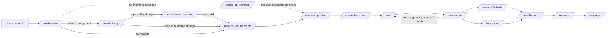

# End-to-End Workflow

## Pipeline

The `acs` plugin implements a multi-step delivery workflow. Every skill is
an independent skill — a directory under `plugins/acs/skills/` — grouped by
**phase** (design, build, test, ship, utility) only as a reader's aid. There
is no registry file and no per-skill manifest: nothing declares what a skill
reads or writes. The ORDER in which a ticket's build/test/ship steps run is
**declared data, not hook code**: it lives in `plugins/acs/workflows/ship.yaml`,
which a consumer repo MAY replace wholesale with
`<repo>/.acs/workflows/ship.yaml` (an override, never a merge).

**`ship.yaml` is a LIST, and deliberately nothing more.** Version 3 carries a
`version`, a list of step entries, and one optional `loops:` entry. A step
entry is a skill name, or a list of two or more skill names — a **parallel
group** (ADR-0110). The
schema REJECTS `when`, `paths`, `requires`, `needs`, `max_parallel`,
`exclusive`, `on_fail`, `boundary`, `delivery`, `id`, `name` and `stop_after`
(ADR-0096). Three requirements follow, and together they are what "pipeline"
now means:

- **Every skill MUST be runnable on its own**, from requirements in any
  container — a ticket id, documents (in the repo or attached from outside
  it), a prompt, or a mix of them
  ([ADR-0128](../../architecture/adr/0128-requirements-from-any-container.md)).
  No skill requires a ticket. A skill's pre-hook MUST NOT refuse it for running before or
  after another skill, or because an upstream artifact is missing; it checks
  only a small set of safety brakes ([hooks.md](hooks.md)). A skill whose
  upstream artifact is absent falls back to the run's requirements
  (`requirements.md`: the ticket's acceptance criteria, the prompt, the
  documents).
- **No workflow construct may decide whether a skill applies.** A predicate in
  the workflow makes a skill untrustworthy standalone: invoked by hand it
  never evaluates the condition the workflow was evaluating for it. Each skill
  decides for itself, from inputs it resolves itself, and records why.
- **The declared order is authoritative for orchestration only.** `/ship`
  walks `ship.yaml` and nothing else; a skill invoked by hand out of that
  order MUST still run, after one advisory line on stderr.

**Every step runs on every run.** A step that owes nothing MUST record an
**evidenced no-op** rather than be skipped: its own pre-hook reads the plan's
`## Contract` block, completes the step from it at no token cost, and carries
the sentence that says why. **Silence is not permission to skip** — a step
with no Contract entry to stand on runs and decides for itself.

**A parallel group is not a condition either.** Each entry of the list is a
**stage**; a group's members MAY all be in progress at once, and the next
stage MUST wait until every member has completed. A group declares only that
its members may overlap — nothing about whether they have work — and it MUST
be written by the workflow's author, never derived: the skills declare nothing
about each other, so nothing could derive it. The shipped workflow declares
one, `[create-e2e-tests, docs-sync]`: both follow the reviewed changeset and
write disjoint files (suites vs docs).

**`loops:` is the only construct that is not a step, and it is not a
condition.** It tests nothing about the change; it declares that two steps
form a cycle and how many times. The shipped workflow has exactly one:
`from: review-code`, `back_to: code`, `max_iterations: 3`,
`on_exhausted: fail`. It cannot live inside a skill because it spans two of
them, which is the test for what belongs in a workflow file at all.

**The list is an orchestrator, not a contract.** It keeps the order the
skills run in and nothing else. `acs.py workflow validate` checks only what a
list can get wrong on its own — every step is a skill that ships and not
another skill's leg (`acs_lib.skills.SKILL_LEGS`), no skill appears twice,
every loop's `back_to` precedes its `from`, and neither end of a loop sits
inside a parallel group (a loop that re-entered half a group would leave the
other half's work neither kept nor redone) — and never what a skill needs. An
out-of-order override validates, and its steps run on their fallbacks.

`/create-ticket`, `/create-design`, `/create-api-contract`, `/create-data-design`
and `/create-flows` are **design** work that runs before `/ship`; `/merge-pr` is **ship** work a
human drives after review.

| Step (`ship.yaml`) | Phase | Purpose (summary) |
|--------------------|-------|-------------------|
| — `/create-ticket` | design | Analyze & clarify requirements from the user prompt, codebase, and docs; create a ticket of type **epic**, **story**, or **task**. Runs before `/ship`. |
| — `/create-design` | design | Analyze the ticket, codebase, and docs; evaluate options with trade-offs and produce an approved design (`design.md`): decision & rationale, architecture, contracts, risks, rollout. For an **epic**, the step that follows is `/acs:create-ticket <epic-id> --fan-out`, not implementation — the epic's own ticket is never implemented. Runs before `/ship`, when `needs_design`. |
| — `/create-data-design` | design | Write the ticket's data low-level design under `lld/<feature>/data/` — logical ERD and physical schema with a migration outline, for the enabled `design.lld_types` only; documents only. Runs before `/ship`, on any ticket that adds or changes persisted data ([ADR-0126](../../architecture/adr/0126-lld-data-design-and-flows.md)). |
| — `/create-api-contract` | design | Design the interfaces a feature or a change adds or changes under `lld/<feature>/api/` — one living, versioned file per interface (a REST resource, a CLI command group, an event topic, a gRPC service), each endpoint, command or message traced to an acceptance criterion — plus the run's `api-contract.md` record linking them; documents only, never the repo's OpenAPI, JSON Schema, proto or AsyncAPI files, which `/code` makes from plan items. Runs before `/ship`, before the plan, on any ticket (an epic included), feature or prompt ([ADR-0134](../../architecture/adr/0134-api-contract-is-a-design-document.md)). |
| — `/create-flows` | design | Write the ticket's behaviour low-level design under `lld/<feature>/flows/` (and `components/` when enabled) — one file per flow and one per entity state machine; documents only. Runs before `/ship` ([ADR-0126](../../architecture/adr/0126-lld-data-design-and-flows.md)). |
| `analyze-requirements` | build | Read the subject, the product docs and the codebase; write the `analysis/` folder ([ADR-0133](../../architecture/adr/0133-analysis-is-a-folder-by-bounded-context.md)) — a `README.md` with the scope, refined acceptance criteria, cross-cutting risks, questions and assumptions and a contexts table (an interface change is named in the report's Next as work for `/create-api-contract`), plus one file per bounded context with its impact map, rules, risks, open questions and API notes. A not-ready analysis returns `needs_input`. |
| `create-impl-plan` | build | The plan phase carved out of `/code`: the planner's survey, the spec fold, the executor file map, and plan approval, ending in an approved `plan.md`. **It also judges the delivery path**, once, from the plan's own scope, and writes it into the plan's `## Contract` block (ADR-0098). |
| `create-test-docs` | build | Write `test-cases.md`: `TC-n` cases typed unit \| integration \| e2e, each traced to an acceptance criterion, with preconditions, steps, expected result and target suite. Every acceptance criterion MUST be covered by at least one case. Records an evidenced no-op when the Contract says `owes.test_cases: false`. |
| `code` | build | Implement features / bug fixes / tasks using the **TDD pattern** against the approved `plan.md`, writing tests from `test-cases.md` when present. It dispatches to the delivery-path leg the plan recorded. **It has no verifier, does not judge the changeset, and never runs the full suite** — targeted tests only. |
| `review-code` | build | The changeset review: five read-only lenses in parallel, one fresh-context adjudicator per candidate finding, then a final gate running build, lint, the full unit suite and coverage. **The only place the full suite runs.** Blocking findings re-enter at `code` through the workflow's single loop — see [Review feedback loop](#review-feedback-loop). |
| `create-e2e-tests` | test | Write the ticket's e2e suites at the repo's configured e2e location, covering the e2e-typed rows of `test-cases.md`, left uncommitted. Records an evidenced no-op when no e2e suite is configured or the Contract says `owes.e2e: false`. |
| `run-e2e-tests` | test | Run this product's configured suites for the subject, scoped from `test-cases.md`. Records an evidenced no-op when there is nothing configured to run. |
| `docs-sync` | build | Re-verify and complete the doc updates a ticket's changeset requires, re-deriving them independently from the run's changeset (`acs.py changes diff`), `/code`'s `result.json` and `/acs:review-code`'s verdict rather than from a hand-off summary; writes into the same working tree, uncommitted, never a branch or a PR of its own. |
| `create-pr` | ship | The one step that branches, commits and pushes ([ADR-0127](../../architecture/adr/0127-only-create-pr-commits.md)): split the working tree's uncommitted changes into small commits (the run's documents, design docs, per plan slice its tests then its code, doc updates, e2e suites), preview them for the user to confirm, commit on the run's branch, push, and open the pull request; takes a ticket id or a prompt. It is the last step in the list, so `/ship` ends there. |
| — `/merge-pr` | ship | Review PR readiness and merge it if possible; when the readiness check fails, it is **report-only** (no automatic fixes). **User-invoked only**, after the user has reviewed the PR themselves — never auto-triggered by the pipeline. |

**There is no predicate vocabulary.** The `when:` / `requires:` kinds, their
closed predicate list (`design_approved`, `api_surface_changed`,
`e2e_configured`, `post_code_test_active`) and the `status: skipped` they
produced are all removed. What each of them decided is now decided by the
skill that owns the question, and recorded by it: an unapproved design is a
brake in `/acs:create-impl-plan`'s own gate, an API surface is designed
before the plan by `/acs:create-api-contract`, which is not a step at all
([ADR-0134](../../architecture/adr/0134-api-contract-is-a-design-document.md)),
and an unconfigured e2e suite is an evidenced no-op that
`/acs:create-e2e-tests` records for itself.

```mermaid
flowchart LR
    U[User prompt] --> T[/create-ticket/]
    T -->|needs design, epic| D[/create-design/]
    D -->|epic: after design| FO[/create-ticket --fan-out/]
    FO -->|per child| A
    D -->|child inherits the design| A
    T -->|otherwise| A[/analyze-requirements/]
    T -.->|an interface changes| AC[/create-api-contract/]
    AC -.->|the plan reads the contract| PL
    A --> PL[/create-impl-plan/]
    PL --> TD[/create-test-docs/]
    TD --> C[/code/]
    C --> RV[/review-code/]
    RV -->|blocking findings, max 3 rounds| C
    RV --> E[/create-e2e-tests/]
    RV --> DS[/docs-sync/]
    E --> RE[/run-e2e-tests/]
    DS --> RE
    RE --> P[/create-pr/]
    P --> M[/merge-pr/]
```

`create-e2e-tests` and `docs-sync` fan out from `review-code` side by side:
they are one parallel group, and `run-e2e-tests` waits for both.

`/create-design` runs only for tickets flagged **`needs_design: true`** —
set for **epics only**; stories/tasks are always `false`. Child tickets of
an epic do **not** repeat design: they inherit the parent epic's `design.md`.

`/create-api-contract`, `/create-data-design` and `/create-flows` carry no
such flag: the SA or Tech Lead runs them on a ticket (or a feature, or a
prompt) whose interfaces, persisted data or behaviour they want designed
before implementation. Neither takes a run position, and neither branches,
commits or opens a PR: each leaves its `lld/` documents as local uncommitted
changes and lists every path it wrote in its result's `states.files`, for
`/create-pr` to commit with the ticket's design documents.

### Where a ticket's artifacts live

The workflow reads and writes two distinct stores, and a requirement in this
document belongs to exactly one of them:

- **The repo's phase folders** hold the **human-facing documents**, one
  folder per phase keyed by the run's feature
  ([ADR-0128](../../architecture/adr/0128-requirements-from-any-container.md)):
  Discovery `<prd_dir>/features/<feature>/analysis/` (the feature's living
  analysis — a folder, `README.md` plus one file per bounded context,
  [ADR-0133](../../architecture/adr/0133-analysis-is-a-folder-by-bounded-context.md)); Design `<architecture_dir>/lld/<feature>/<ticket-id or run-id>/`
  (`design.md`, `api-contract.md`, beside the living LLD the Design skills edit
  in place — `lld/<feature>/{api,data,flows,components}/`, ADR-0126,
  ADR-0134); Development
  `<development_dir>/<feature>/<ticket-id or run-id>/` (the `analysis/`
  folder, `plan.md`, `test-cases.md`). The skills that write them leave them
  uncommitted; `/create-pr` commits them in the PR's documents commits,
  where they are reviewed like any other doc
  ([ADR-0127](../../architecture/adr/0127-only-create-pr-commits.md)). A ticket
  is not among them: it lives in the workspace and the tracker, and nothing
  writes `docs/tickets/<ID>/` — an existing folder there is still read when a
  phase folder has no such document. A repo that keeps run documents
  local ([ADR-0132](../../architecture/adr/0132-share-or-keep-run-documents-local.md))
  keeps a run's own documents in its step folders instead; only the living
  documents then reach the phase folders.
- **The workspace run** — `<workspace>/<repo>/runs/<run-id>/` holds the **run
  ledger**: `run.json` (the run machine), `steps/<skill>/state.json` (the step
  machine), each step's `result.json` and its `iter-<n>/` audit trail,
  `subject/` (`sources.json` and copied documents), `requirements.md`,
  verdicts, `lock.json`, a ticketless run's `clarifications.json` (a ticket
  run's ledger stays in the ticket partition), and the repo-level index files
  ([workspace-and-state.md](workspace-and-state.md)). The run is keyed by the
  **run id**, which is derived from the subject — a ticket id when there is
  one, otherwise a slug of the prompt or document (ADR-0097).

A ticket's `status` is **derived** from the ledger, never stored alongside
the ticket's own fields, so the two can no longer disagree
([workspace-and-state.md](workspace-and-state.md)).

## Step gating

Gating is **safety braking**, not order enforcement and not input
checking. The pipeline's order lives in `ship.yaml` ([Pipeline](#pipeline));
a pre-hook's job is to stop a run that would be unsafe. Whether the skill has
what it needs is the skill's own question, and it answers it by falling back
to the run's subject.

- Each hooked skill MUST be guarded by a **pre-hook**. Readiness means, at
  minimum: the settings validate (no `.acs/settings.json` is needed — every
  key has a default, ADR-0105), the run resolves, and no other session holds
  the run's lock. A pre-hook MUST NOT refuse because an upstream artifact is
  missing: `/code` with no `plan.md` derives an implicit plan from the
  subject, and `/create-architecture` with no PRD works from the subject and
  confirms goals, NFRs and constraints through the clarification ledger.
- **A pre-hook may also COMPLETE its step, from evidence, without running
  it.** When the plan's `## Contract` block says the step owes nothing —
  `owes.e2e: false`, say — the pre-hook records an evidenced no-op
  carrying the Contract's own reason, and the skill does not run. This is not
  a skip: the step is `completed`, with a recorded sentence, by the hook that
  owns it. A step with no Contract entry to stand on MUST run.
- A pre-hook MUST NOT require that a *predecessor skill completed*. The
  primitive that did so was removed with the skills-independence refactor:
  running `/docs-sync` before `/code`, or `/create-pr` before `/run-e2e-tests`,
  is allowed and produces whatever those skills can honestly produce from the
  inputs present.
- **Safety brakes stay**, because they protect correctness rather than
  sequence: epics are never implemented (`/code`, `/analyze-requirements` and
  `/create-impl-plan` refuse an epic with an actionable breakdown message);
  `/create-pr` refuses a run whose recorded `/acs:review-code` step left
  `verifier_passed != true` (a run with **no** recorded review is allowed
  through); `/merge-pr` requires a recorded PR reference; every hooked skill
  refuses while another session holds the lock.
- When a brake fires, the pre-hook MUST exit with code **2**, which blocks
  the skill, and MUST name the brake and what clears it.
- **Out-of-order is an advisory, never a refusal.** When a hooked skill runs
  before a step that precedes it in the resolved `ship.yaml` has completed,
  the pre-hook MUST print exactly one stderr line naming the position — e.g.
  `acs: review-code normally follows code in ship.yaml; the cursor for
  SHOP-123 is code` — and exit **0**. The line is suppressed when
  `settings.workflow.advisories` is `false` (default `true`), when the skill
  is one of the steps due now (a parallel group's member running beside
  another member is not out of order), when the skill
  is not a step of the resolved workflow, and whenever anything it needs
  cannot be read — an advisory MUST never turn into a blocked gate.
- Each hooked skill MUST be followed by a **post-hook** that writes the
  step's own state into the run (e.g. `post-code.py` writes
  `steps/code/state.json`).

See [hooks.md](hooks.md) for hook details and
[workspace-and-state.md](workspace-and-state.md) for state file
requirements.

## Umbrella command: `/ship`

`/ship <ticket-id>` drives the declared pipeline end-to-end for **one
existing ticket**. It takes a **ticket id only**: a non-id argument MUST be
refused with a pointer at the design phase ("ship takes a ticket id; run
/acs:create-ticket \"<prompt>\" and then /acs:ship <id>"), and an epic id
with the design-and-fan-out pointer — an epic's own ticket is never
implemented.

`/ship` MUST NOT hard-code the order. It is a **loop over
`acs.py run next`**:

1. Ask `run next` for the cursor — the first step in `ship.yaml` order that
   the run has not recorded `completed`. The cursor is **derived on every
   call**, never stored, so it cannot disagree with the ledger it is read
   from.
2. Invoke that one skill and handle its handoff (`completed` / `needs_input`
   / `failed` / `interrupted`). When the cursor sits in a parallel group,
   `run next` also reports every unfinished member in `due` (with
   `parallel: true`), and `/ship` MUST invoke all of them rather than one.
3. Ask again. Repeat until `run next` reports the list is done.

Steps overlap **only where the list declares a parallel group**. `/ship` MUST
NOT decide on its own that two steps may overlap: `max_parallel` and
`exclusive` are still rejected by the v3 schema, and a step that owes nothing
costs an evidenced no-op rather than a worktree. A group runs inside `/ship`'s
own session — a step's coordinator runs in the invoking session, so two steps
cannot each get a session of their own inside one run — and `/ship`:

- MUST invoke every member (each through its own pre-hook and its own
  `acs step start`) and advance their coordinators in lockstep, spawning each
  phase's subagents for all members in ONE message;
- MUST gather the questions of every member that needs input into ONE ask,
  each labelled with its step, and hand each member back its own answers;
- MUST let each member write its own result and run its own post-hook — it
  never finishes a member on another's behalf;
- on a member's failure, MUST let the others finish the phase in flight
  (never abandoning a running subagent), record them `interrupted` through
  their own Finish, and stop.

Parallelism inside one step is that skill's own fan-out (see
[Inside each step: Reflection](#inside-each-step-reflection)).

- `/ship` MUST **stop before `/merge-pr`** — the PR is landed separately
  after review; `merge-pr` may not appear in a workflow file at all. It stops
  because `create-pr` is the last name in the list, not because of a
  `stop_after` key.
- Every hook still runs on every step: `/ship` adds orchestration only and
  MUST NOT bypass pre/post hooks. Because gates no longer encode order,
  `/ship`'s walk is the only thing that sequences the pipeline — which is
  precisely why it reads the declared file rather than its own prose.
- SHOULD be resumable: re-running `/ship <ticket-id>` re-derives the cursor
  from the ledger and continues from it.
- **The one loop is the workflow's, not `/ship`'s prose.** When
  `/acs:review-code` records blocking findings the cursor returns to `code`,
  up to `loops[].max_iterations` (3) rounds; a fourth FAILS the run rather
  than passing it with findings. `boundary`, `on_fail` and `on_replan` are
  gone — a `/acs:code` step that finds the plan wrong ends `failed` with a
  summary naming the plan as superseded, and the run re-enters
  `/acs:create-impl-plan`.
- `/ship` has no subagents of its own; each invoked skill
  runs its own reflection cycle.

### Context handoff between steps

`/ship` MUST keep its own context window small — a full pipeline cannot fit
every skill's transcript in one context:

- The `/ship` coordinator **invokes each step skill directly in its own
  context** (it holds the Agent tool the step needs to spawn its own
  subagents). Between steps it reads only `run.json`, the subject's
  requirements (`acs.py requirements show`), the output of
  `acs.py run next`, and
  the step's handoff / `result.json` — never the step's transcript — so its
  own context stays small.
  - A session that runs out of context anyway ends the in-flight step
    `interrupted` with `stop_reason: context_pressure`, and the next session
    resumes from the derived cursor. That replaced the full-verify boundary
    stop, which existed to pre-empt a limit the run can simply record.
- A step returns only a **compact handoff result** in JSON (status, stop
  reason, artifact references — bounded to roughly a kilobyte); full detail
  lives in the run's own files.
- Post-hooks maintain **`steps/<skill>/state.json`**, and `run.json` records
  the run itself. `/ship` reads the derived cursor rather than a stored
  position, so its context can be **cleared or compacted at any step
  boundary** without losing the pipeline.

## Ticket context

Every workflow skill MUST resolve what it works on before doing anything:
this checkout's current run, else the sources in its arguments — ticket ids,
documents and a prompt, parsed into the run's `subject.sources` and
normalised into its `requirements.md`
([workspace-and-state.md](workspace-and-state.md#requirements-of-a-run)). No
skill requires a ticket; a ticket id, where one is used, resolves in this
order:

1. **Explicit argument** — the user passes a ticket id when invoking the
   skill (e.g. `/code SHOP-123`). Always wins.
2. **Session context** — the ticket id is detected from the conversation
   history of the current session (e.g. the ticket was just created or
   discussed there).
3. **Branch name** — the ticket id is parsed from the current git branch
   name, which embeds it by convention (see formats in
   [configuration.md](configuration.md)).

If neither a run nor any source resolves, the skill MUST stop and ask the user.

Note: pre/post **hooks** are deterministic scripts and cannot interpret
conversation history — they resolve the ticket id from the **per-checkout
pointer file** written by the coordinator at skill start
(`<workspace>/<repo>/sessions/<checkout-id>.json`), falling back to the
branch name. See [hooks.md](hooks.md) and
[workspace-and-state.md](workspace-and-state.md).

## Epic fan-out

An epic's own **creation** run MUST NOT propose a child breakdown and MUST
end with `children: []` — no children are minted at epic-creation time. Two
of `/create-ticket`'s modes mint children, and neither is the epic's own
creation run: a later `/acs:create-ticket <epic-id> --fan-out` run, invoked
**after** the epic's `/create-design` has completed, and a split/restructure
run, which mints children at the recorded seams (see
[skills.md](skills.md)). The `--fan-out` run mints children only (it does
not repeat the epic's own Steps 1-3); the proposed breakdown is derived from
the epic's `design.md` slice/seam content when a design exists, and is
presented and user-confirmed at the same Step-2 confirmation gate before any
child is minted. Each child ticket:

- gets its own `<ticket-id>` and its own workspace partition;
- runs its own pipeline (`/code` → … → `/merge-pr`) independently —
  enabling parallel work on children of the same epic.

The epic itself is a grouping/tracking ticket; implementation happens on the
children. The epic's status MUST be auto-managed:

- **In Progress** — as soon as work starts on any child;
- **Done** — when all of its children are merged.

Child hooks perform the parent updates: the first workflow skill run on a
child marks the epic In Progress; the last child's `post-merge-pr` marks it
Done.

## Inside each step: Reflection

Each skill spawns only the subagents its own logic needs, each named for
the work it does (ADR-0109). The eleven **authoring** skills MUST
internally run a **write → judge** cycle with a dedicated subagent per role
(e.g. `docs-sync-doc-updater`, `docs-sync-drift-reviewer`); `create-prd`
adds a read-only `surveyor` that runs on iteration 1 only and freezes the
notes the writer works from. No skill has a plan phase before its writer (ADR 0092): a writer
with no survey role before it surveys first and records the survey in
`iter-<n>/authoring.md`, which the judge judges the deliverable against.
`/create-impl-plan`'s `planner` authors the plan on every run (ADR-0095
removed the TRIVIAL/SMALL fork on which the coordinator authored it itself).
`/acs:code` has **no plan of its own** — its plan phase became
`/create-impl-plan` — and spawns `code-implementer`s against that approved
plan; its review is `/acs:review-code`, a step of its own.
The three **apply-work** skills (`create-ticket`, `create-pr`, `merge-pr`)
run **inline** instead — the coordinator runs the steps from its
`references/` and spawns no subagent in any lane. The coordinator
orchestrates its subagents and communicates with them in a task/result
message format. Wherever a role's work splits into disjoint slices, the
coordinator runs several instances of it at once, joins their outputs with
`acs.py notes merge` and reconciles the seams before the next phase
(ADR-0110). Details in [reflection.md](reflection.md).

## Review feedback loop

Changeset review is **`/acs:review-code`, a step of its own** — not a phase
inside `/code`. An implementer that grades its own output ran the full unit
suite inside an iteration that might be discarded, and gave per-finding
adjudication to only one of four delivery paths (ADR-0099). Every path gets
the review now, and the loop is **automatic**:

- `/acs:code` writes the change and stops. It MUST NOT spawn a verifier, MUST
  NOT judge the changeset, and MUST NOT run the full suite — targeted tests
  only, the tests its change touches.
- `/acs:review-code` runs **five read-only lenses in parallel** over the
  changeset. Between them they cover spec conformance, tests and coverage,
  business logic, features, quality, technical standards, architecture,
  system design, security, and the change's own documentation (affected docs
  updated and consistent with the code).
- **Each candidate finding then goes to ONE fresh-context adjudicator**,
  prompted to refute it. The agent that judges a finding MUST NOT be the
  agent that raised it, and MUST NOT receive the lens's reasoning — which is
  what makes the refutation a second look rather than a re-read.
  Corroboration-by-count is not used: two lenses agreeing is not evidence
  when both read the same diff.
- **A final gate runs the build, the lint, the full unit suite and
  coverage — once per iteration, read last.** This is the ONLY place in the
  pipeline the full suite runs. Its commands start as `acs.py job` jobs beside
  the lenses (the tree is frozen while read-only agents review it,
  [ADR-0125](../../architecture/adr/0125-parallelism-in-skills.md)), and its
  result is read only after the reading dimensions have had their say: an
  iteration already blocked by a finding stops the jobs and records the gate
  as not run, since the tree it measured is about to change.
- When the review records blocking findings, the workflow's single `loops:`
  entry returns the cursor to `code`, which passes every confirmed finding to
  the next iteration's implementer(s) in its context **with no intervening plan
  phase** — a finding already says what is wrong and what would make it
  right, and carries a `resolved_when`. The plan `/create-impl-plan` approved
  is an input, authored before iteration 1.
- A finding MAY be **disputed once**, with the evidence that defeats the
  claim; the next adjudicator receives the dispute and rules again. A finding
  disputed and then confirmed a second time stops the run for a human rather
  than spending the last iteration on the same argument.
- **All confirmed findings block** — there is no severity threshold; the loop
  runs until the review reports zero blocking findings. When an `e2e` layer
  is configured ([configuration.md](configuration.md)), a **green e2e run**
  is part of that bar.
- PRD **G13**'s e2e-integrity metric is validated **read-only** from artifacts this loop already produces: sub-metric (a) — 0 merges with a red e2e suite while the gate is enabled — reads each ticket's `merge-pr` `result.json` `states.readiness.ci` cross-checked against `"E2E suite"` being a required branch-protection status check; sub-metric (b) — 100% of user-facing-surface specs declare e2e impact — is enforced by this loop's own e2e-impact dimension above (no new mechanism). Until a repo wires the gate as a required check, sub-metric (a) holds vacuously (no gate-enabled window to violate); see `docs/product/prd.md`'s G13 line for the latest recorded result.
- The loop runs at most **3 iterations** (execute+verify rounds); if findings
  remain, `/code` stops and records the findings and stop reason in
  `code-state.json`.
- Only when the review passes does the `/create-pr` pre-hook gate open.
- Every iteration is recorded in the workspace state files (findings, fixes,
  stop reasons), so the loop is resumable and auditable like everything else.

## Statelessness between steps

The coordinator MUST NOT need conversation history to move from one step to
the next. Each step's subagents persist everything a later step needs —
states, findings, error details, stop reasons — as JSON files under
`<workspace>/<repo>/<ticket-id>/`. A user MUST be able to run each skill in a fresh
session (or a different worktree) and have the pipeline pick up where it left
off.

## Resuming a ticket

Resume works at three levels, all from workspace state alone:

1. **Between steps** — `run.json` and `steps/<skill>/state.json` record what
   is complete; `acs.py run next` derives the cursor from that ledger and
   names the step now due — every unfinished member when that is a parallel
   group. Running any skill in any fresh session continues
   the pipeline — nothing has to be run in order to be allowed.
2. **Within `/ship`** — re-running `/ship <ticket-id>` re-derives the cursor
   from the same ledger and continues from it
   ([Context handoff](#context-handoff-between-steps)).
3. **Mid-skill** — a run entry is appended with status **`in_progress`** by
   the coordinator at skill start and finalized by the post-hook, and the
   coordinator persists every role's output (authoring notes, writer
   results, judge verdicts) to the partition at each phase boundary. Even a hard crash that
   skips the post-hook therefore leaves evidence: `runs[-1].status ==
   "in_progress"` plus a stale `.lock` — downstream gates read "not
   completed". On re-run, the coordinator enters **reconcile mode**: verify
   which recorded work actually holds (e.g. re-run tests for specs marked
   implemented), then continue from the first unfinished phase. A crash can
   lose at most the in-flight phase.

The `.lock` file is **re-entrant for the same checkout**: resuming from the
same worktree reclaims its own lock; only other sessions are blocked.

## Ticket handoff

A ticket can pass from one team member to another — across machines — in
mid-flight, with its uncommitted work and its pipeline state
([ADR-0131](../../architecture/adr/0131-ticket-handoff-between-members.md)).
The workspace itself stays machine-local in the main checkout's
`.acs/state-machine/` (ADR-0086); what crosses is a package of one ticket.

1. **Send** — `/acs:handoff <ID>` asks ONE grouped question: the handoff note
   (what is done, what is in flight, what is next, decisions not yet in a
   file), each outside-repo attachment of the run (include or skip, one by
   one), and confirmation of the push. `acs.py handoff send` then builds one
   commit on the run's `baseline.base_sha` through a temporary index — the
   sender's HEAD, index, branches and working tree are untouched — and pushes
   it to the hidden ref `refs/acs/handoff/<ID>` on `origin`. An existing ref is
   refused unless `--replace`. An archived ticket is refused.
2. **The package is the resume set** — what a resume reads, nothing else: the
   uncommitted work (`acs changes snapshot`, ignored files excluded); the
   ticket and its clarification ledger; the run's `run.json`,
   `requirements.md`, `requirements-refined.json`, `subject/sources.json`,
   `baseline.json` and `handoff-context.md`; per step the files at its root
   (`state.json`, `result.json`, current artifacts) and its verdicts; the
   trees the state cites (the baseline's, a verdict's `reviewed_sha`); the
   note; and a manifest. Absolute paths travel as tokens and are rewritten to
   the receiver's. The rest of the `iter-*/` audit trails, `jobs/`,
   `agents/`, the lock and its events, session pointers and logs stay behind,
   and so does every outside-repo attachment the sender did not confirm.
3. **The sender keeps everything** — work, run and lock stay as they were. A
   handoff is a copy; the sender decides when to discard.
4. **Receive** — `/acs:handoff receive <ID>` on a **clean working tree**
   fetches the ref, checks the work applies with `git apply --3way` in a
   temporary index first (a receiver whose HEAD has moved on still applies; a
   conflict stops with the paths and the checkout untouched), applies it
   unstaged, restores the resume set with local paths, indexes the ticket and
   the run, raises `counters.next` to at least the sender's, points the
   checkout at the run and deletes the remote ref (`--keep-ref` keeps it; the
   receiver keeps a local `refs/acs/received/<ID>`). A local run or ticket
   with the same id is refused unless `--replace`, which backs it up first. It
   shows the note and prints `continue_with` — the step to resume, else
   `/acs:ship <ID>`.
5. **List** — `/acs:handoff list` names the tickets waiting under
   `refs/acs/handoff/`.

The ref is hidden from a default fetch, not private: anyone with read access
to the remote can fetch it. A **phase handoff** — Design done, Development
takes over — needs no skill: approve the documents with
`/acs:set-doc-status`, open the docs PR with `/acs:create-pr`, and tell the
next team, which starts from the merged documents.

### Session pause

The context-pressure mechanism that used to be the session-handoff skill is
internal and unchanged. It flushes the in-flight soft context to the run
(user clarifications and decisions, partial findings, gotchas), and
every workflow skill's coordinator SHOULD perform the same flush proactively
when it detects its context window running low — never burn the last of the
context on work that would be lost with the session. It then calls
`handoff.py`, which finalizes the in-flight step **`interrupted`** with
`stop_reason: context_pressure` plus a summary (what is done, in flight,
next), releases the run's lock and prints `continue_with`; the `PreCompact`
hook writes `handoff-context.md` before the window shrinks. `handed_off` is
not a status — it was a reason wearing a state's clothes (ADR-0097). In the
new session the user re-runs the same skill (or `/ship`); the coordinator
sees the step's last invocation `interrupted`, reads the summary, runs a
light reconcile (recorded state is trusted but cheaply verified) and
continues. A pause stays on the same checkout; crossing to another member is
a [ticket handoff](#ticket-handoff).

## Parallel work

- The workspace is partitioned by repo, then by `<ticket-id>`
  (`<workspace>/<repo>/<ticket-id>/`), so multiple tickets — across one or
  many consumer repos — can progress independently and in parallel.
- Because the workspace is resolved from the repo's main checkout (`git
  rev-parse --git-common-dir`), every linked worktree resolves to the same
  `.acs/state-machine/` tree, so the same ticket pipeline can run inside a
  dedicated git worktree without state colliding with other worktrees
  (ADR-0086).
- **One checkout, one changeset.** No step commits before `/create-pr`
  (ADR-0127), so a run's changes are the working tree's. Two tickets in flight
  in one checkout share that working tree and so one changeset; the run's
  baseline keeps files that were dirty before it started out of its commits,
  but it cannot tell two concurrent runs' new files apart. Run concurrent
  tickets in a worktree each.
- **Step-level parallelism within one run is declared, never computed.**
  `ship.yaml` v3 rejects `max_parallel` and `exclusive`; the only overlap is a
  parallel group the list itself declares (ADR-0110), whose members
  `acs.py run next` reports together in `due`. Everywhere else the pipeline is
  a straight line. What the old parallel mode bought — not paying for a step
  that had nothing to do — is bought instead by the evidenced no-op, which
  costs no tokens and no worktree.
- **Inside a step, parallelism is the default wherever the work splits.** A
  coordinator runs several instances of one role at once over disjoint slices
  — writers, judges with five or more check dimensions, surveys spanning
  disjoint repo areas — at most four per phase unless the skill sets its own
  cap (`/acs:review-code` fans out its five lenses). The rules are in [reflection.md](reflection.md#decomposition--concurrency-rules).

## Product-level architecture

Tickets flow through the pipeline; the **product architecture doc set** —
bootstrapped by the product-level `/create-architecture` skill
([skills.md](skills.md)) wherever the consumer repo keeps it, else at
`docs/architecture/` — is the stable frame around it. Every skill finds
these documents the way any session does, through `CLAUDE.md` and the repo
itself, rather than through a setting
([ADR-0102](../../architecture/adr/0102-documents-are-found-not-configured.md)).

Above the architecture sits the **PRD** (found the same way, else
`docs/product/prd.md`; bootstrapped and amended by `/create-prd`): vision,
goals with success metrics, prioritized features, and product-level NFRs.
The architecture is designed and verified to satisfy it, and
`/create-ticket` traces tickets to its features — flagging any requested
capability that diverges from it.

- **Input**: `/create-ticket` reads the PRD and the architecture doc set
  when analyzing requirements; `/create-design` designs against the doc
  set; a per-ticket design conforms to the documented architecture or
  explicitly states the architecture changes it requires.
- **Output**: `/code` updates the doc set whenever a change alters the
  architecture — both **HLD** (C4 views, data model, deployment) and
  **LLD**, merging the ticket design's new or changed sequence diagrams
  into `lld/flows/`; `/acs:review-code`'s documentation lens checks
  that consistency.
- **Enforcement (docs current by induction)**: `/acs:review-code` makes a
  positive, evidenced architectural-impact determination from each diff —
  impact without matching doc changes in the same changeset is a blocking
  finding, and "no impact" is a conclusion, never a default. Drift from
  commits that bypassed the pipeline is repaired **boy-scout style**: the
  designer's and implementation planner's surveys check the touched area's docs against current code and
  schedule stale sections for repair with the ticket; widespread drift
  triggers a recommended `/create-architecture` re-run.

The conformance chain is **PRD → architecture → principles → standards → design → code**, each level verified against the one above it.

### Living requirements

Per-ticket specs are change-deltas and are archived with their tickets; the
**current** behavioral contract of the product accumulates in the living
requirements doc set (found in the repo, default `docs/requirements/`, one
markdown file per feature area):

- **Input**: `/create-ticket` reads the touched areas'
  requirements files as the current behavior; a request or spec that
  contradicts standing behavior MUST be flagged (deliberate change vs.
  mistake), like a PRD divergence.
- **Output**: `/code`'s documentation step merges the merged ticket's
  acceptance criteria and behavior-defining clarifications (answered/assumed
  ledger entries that define behavior) into the area's requirements file —
  same changeset, same induction as the architecture doc set; the
  `/acs:review-code`'s documentation lens blocks a behavioral change whose
  requirements file was not updated.
- The set grows organically from ticket #1: `/code`'s documentation step
  accretes acceptance criteria and behavior-defining clarifications into the
  touched area file. acs does not bootstrap the set in one run
  ([ADR-0118](../../architecture/adr/0118-discovery-design-development-phases.md)); a set a
  repo already keeps is optional context its readers use. Brownfield
  repos MAY seed area files during `/create-prd`'s baseline analysis.

## Starting a fresh product

For a greenfield product, the product-level skills run before the first
ticket:

1. Create the empty git repo (user). Nothing else is needed first;
   **`/setup`** is optional, for changing the conventions or installing the
   CI gates.
2. **`/create-prd`** — elicit the product definition from the user: vision,
   problem, personas, goals with success metrics, prioritized features,
   product-level NFRs, constraints; shipped as the PRD doc set.
3. **`/create-architecture`** — design the system to satisfy the PRD;
   produce the high-level design (`hld/`). Then **`/create-pr "Baseline the
   PRD and architecture"`** commits both doc sets, one commit each, and opens
   one PR.
4. **`/create-ticket "Scaffold the repository per the architecture docs"`**,
   then **`/ship`** it — the repo skeleton is ordinary ticket work
   ([ADR-0118](../../architecture/adr/0118-discovery-design-development-phases.md)):
   layout, build, **test framework + coverage tooling**, linters and a
   minimal green vertical slice, planned and implemented from that
   architecture like any other ticket. Without this, the `/code` TDD gates
   have no harness to run against. The CI gates come from `/setup`.
5. **`/create-ticket`** — typically an MVP **epic** derived from the PRD
   roadmap, created childless; its `/create-design` then runs; then
   `/acs:create-ticket <epic-id> --fan-out` mints the child stories/tasks
   ([Epic fan-out](#epic-fan-out)).
6. **`/ship`** each child through the pipeline; **`/merge-pr`** after your
   own review.

A PRD feature can be analysed before any ticket is cut:
`/analyze-requirements` run on its own with the feature, a prompt or a
specification (Discovery, [ADR-0129](../../architecture/adr/0129-discovery-design-development-regroup.md))
writes the feature's living analysis to `<prd_dir>/features/<feature>/analysis/` (a `README.md` plus one file per bounded context, [ADR-0133](../../architecture/adr/0133-analysis-is-a-folder-by-bounded-context.md)),
and every later run on that feature starts from it.

The product-level steps (2–3) run without a ticket and leave their documents
uncommitted; `/create-pr "<prompt>"` delivers them as one PR, one commit per
doc set ([skills.md](skills.md#product-level-delivery-no-ticket)). The
scaffold (4) is the first ticket, with its own PR, so a fresh product's
ticket history starts at ticket #1.

From then on the product is effectively brownfield: the pipeline maintains
the architecture docs as changes land, the PRD is amended via `/create-prd`
re-runs (each amendment delivered through `/create-pr "<prompt>"`) when scope grows, and the scaffold
ticket is never needed again.
